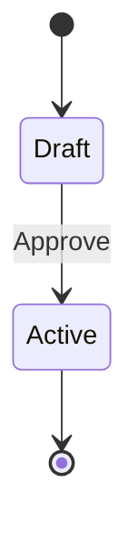

# [Feature Name] — TEMPLATE

Use this template for creating feature files in the `done/` folder for fully implemented features.

---

# Feature Name

## Overview
[1-2 sentence description of what this feature does and why it exists]

## Status
✅ **FULLY IMPLEMENTED**

## Current Implementation

### Key Files
- **Primary File:** `Enrollify.Core/Path/To/File.cs` (lines X-Y)
- **Handler File:** `Enrollify.Application/Path/To/Handler.cs` (lines X-Y)
- **Tests:** `Enrollify.UnitTests/Path/To/Tests.cs`

### How It Works

[Explain the mechanism in 2-3 paragraphs]
- What triggers it?
- What does it do?
- What prevents it from breaking?

[Include a code snippet showing key logic]

```csharp
// Example from actual code
public class Something
{
    public void KeyMethod()
    {
        // Implementation
    }
}
```

## Guard Rules

[If the feature has guards, document them in a table]

| Operation | Guard Condition | Result |
|-----------|-----------------|--------|
| Operation 1 | Condition for when it's blocked | ❌ Forbidden / Invalid |
| Operation 2 | Condition for when allowed | ✅ Allowed |
| Operation 3 | Condition for when it's blocked | ❌ Forbidden / Invalid |

[Explain each guard's purpose in a paragraph]

## Real-World Scenarios

### Scenario 1: Normal/Happy Path
[Describe a realistic use case where the feature works as designed]

**Setup:**
- [Precondition 1]
- [Precondition 2]

**Action:**
- User or system does X

**Result:**
- Expected outcome
- Data state after operation

---

### Scenario 2: Guard Violation
[Describe a scenario where a guard blocks the operation]

**Setup:**
- [Precondition that triggers guard]

**Action:**
- User tries to do something dangerous

**Result:**
- ❌ Operation blocked with error message: "[specific message]"
- Why it was blocked: [explanation]

---

### Scenario 3: Edge Case / Safe Operation
[Describe a non-obvious but valid scenario]

**Setup:**
- [Specific conditions]

**Action:**
- Operation that might seem dangerous but is actually safe

**Result:**
- ✅ Allowed because: [reason]

---

## Implementation Details

### State Machine / Lifecycle (if applicable)

[Include mermaid diagram if entity has states]



### Event-Driven Behavior (if applicable)

[Explain what events are raised and what they trigger]

- **Event:** EventName
  - **File:** `Enrollify.Core/Events/EventName.cs`
  - **Handler:** `Enrollify.Application/Events/EventNameHandler.cs`
  - **Effect:** What happens as a result

### Related Properties / Fields

| Property | Type | Purpose |
|----------|------|---------|
| PropertyName | Type | What it does |

## Related Features

- **[Feature X](../done/02-feature-x.md)** — Related because [explanation]
- **[Feature Y](../pending/01-feature-y.md)** — Depends on / enables this feature
- **[Concept Z](../README.md#concept-z)** — Uses this pattern

## Testing

### Unit Tests

**Location:** `Enrollify.UnitTests/Features/[Path]/[File]Tests.cs`

**Key test scenarios:**
- Guard blocks operation when [condition]
- Guard allows operation when [condition]
- State transition succeeds
- State transition fails when [condition]

**Example test naming:**
```csharp
[Fact(DisplayName = "UpdateCurriculum blocks when Active")]
public async Task UpdateCurriculum_ActiveStatus_ReturnsForbi()
{
    // Arrange: Curriculum in Active state
    var curriculum = new Curriculum(...) { StatusId = CurriculumStatusEnum.Active };
    
    // Act: Try to update it
    var result = await handler.Handle(new UpdateCurriculum { ... }, ct);
    
    // Assert: Should fail
    Assert.True(result.IsForbidden);
}
```

### Integration Tests

**Location:** `Enrollify.IntegrationTests/_Tests/[Layer]/[Feature]Tests.cs`

**Approach:**
- [Describe what integration tests verify]
- [Real database state]
- [End-to-end flow]

**Example scenario:**
```csharp
[Fact(DisplayName = "Feature works with real database")]
public async Task FeatureName_WithDatabaseState_ProducesExpectedResult()
{
    // Arrange: Setup test data in database
    // Act: Execute the operation
    // Assert: Verify database state changed correctly
}
```

## Architecture Decisions

[Why is this designed this way? What alternative was rejected?]

### Copy-On-Creation Pattern (if applicable)
[Explain snapshot/copy strategy if used]

### State Machine Enforced Here (if applicable)
[Why is state management handled at this level?]

### Guard Rules Rationale (if applicable)
[Why these specific guards? What problem do they solve?]

## Performance Considerations

[Any performance implications?]

- **Lookup complexity:** [e.g., O(n) where n = number of sections]
- **When it's slow:** [scenario where performance might be an issue]
- **Optimization used:** [any caching, indexing, batching]

## Troubleshooting

### Common Issues

**Issue:** [Something goes wrong]
- **Cause:** [Why it happens]
- **Solution:** [How to fix]

---

**Issue:** [Something else]
- **Cause:** [Why]
- **Solution:** [Fix]

## Notes

- [Key design decision or important limitation]
- [Gotcha that developers should know about]
- [Future enhancement idea]

## See Also

- **API Endpoint:** `POST /api/path/to/endpoint` (if applicable)
- **WebAPI File:** `Enrollify.WebAPI/Features/[Path]/[Endpoint].cs` (if applicable)
- **Research Reference:** Section X in original research document

---

## Summary

[1 paragraph recap of what this feature does, how it prevents problems, and why it's important]

**Key Takeaway:** [One sentence that captures the essence of this feature]

---

**Feature Status:** ✅ Fully Implemented  
**Last Verified:** [Date code was checked]  
**Maintenance:** Update this file if guard rules or implementation changes  
**Questions?** See README.md for architecture overview or AGENTS.md for project context
