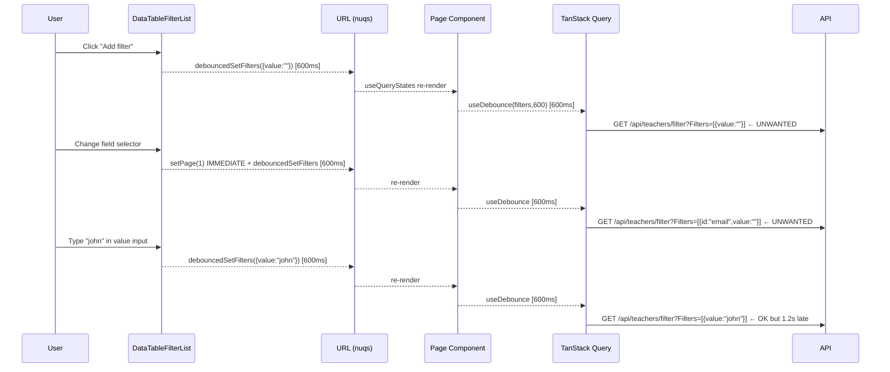
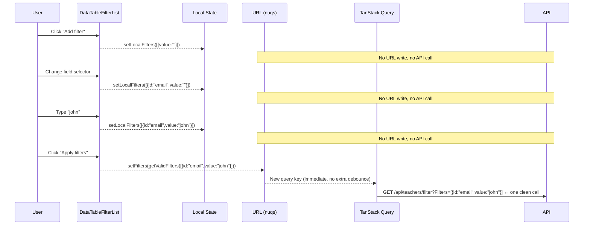

# Why the Filter Component Sends Premature API Requests — Root Cause & Fix

## Executive Summary

The filtering components in **Subjects, Teachers, and Class Sections** management pages share a single shared component (`DataTableFilterList`) that is architected as a **live-write, reactive system**: every filter interaction — clicking "Add filter," changing a field selector, changing an operator, typing a value — immediately serializes filter state to the URL via nuqs, which cascades into a TanStack Query cache-key change and fires a fresh API call. There is no "Apply" or "Submit" step; the URL is the single source of truth, and any mutation to it triggers a server request. The fix requires introducing a **staged local state** inside `DataTableFilterList` so changes only reach the URL (and therefore the API) when the user explicitly clicks "Apply filters." Additionally, `getValidFilters()` — a utility that strips empty-value filters before they reach the API — already exists in the codebase but is never called; this must also be wired in.

---

## Table of Contents

1. [Root Cause Analysis](#root-cause-analysis)
2. [Detailed Data Flow (Current)](#detailed-data-flow-current)
3. [Problem Catalog](#problem-catalog)
4. [Fix Strategy](#fix-strategy)
5. [File-by-File Changes](#file-by-file-changes)
6. [Confidence Assessment](#confidence-assessment)
7. [Footnotes](#footnotes)

---

## Root Cause Analysis

### Issue 1 — Every filter interaction immediately triggers an API call

`DataTableFilterList` holds its filter state **directly** in the URL via a `nuqs` `useQueryState` hook[^1]. All three management pages initialize their data queries by reading from this same URL state[^2][^3][^4]. The chain is:

```
User action
  → onFilterAdd / onFilterUpdate (inside DataTableFilterList)
    → debouncedSetFilters()          [600ms debounce, writes to ?filters= URL param]
      → useQueryStates(searchParams) re-renders page component
        → useDebounce(filters, 600)  [second 600ms debounce at page level]
          → new TanStack Query key
            → API call fires
```

Total minimum latency from first interaction to API call: **~1 200 ms** (600 ms in the filter component + 600 ms in the page). Despite the debouncing, an API call still fires for **every distinct settled filter state**, including states the user never intended to query (e.g., an empty filter row, a partially-configured field, or a mid-edit operator change).

### Issue 2 — "Add filter" sends an API call before the user types anything

`onFilterAdd`[^5] appends a brand-new filter object with `value: ""` to the URL-backed list. After the 600 ms component debounce fires, the URL becomes:

```
?filters=[{"id":"teacherIdentifier","value":"","variant":"text","operator":"iLike","filterId":"abc12345"}]
```

The collection helpers check `filters.length` (not `filter.value`)[^6], so this empty-value filter **is forwarded to the API**:

```
GET /api/teachers/filter/1/10?Filters=[{"id":"teacherIdentifier","value":"","operator":"iLike",...}]&JoinOperator=and
```

A utility function `getValidFilters()`[^7] that strips filters with empty values already exists in `src/lib/data-table.ts` but **is never imported or called anywhere in the application**[^8].

### Issue 3 — Double debounce adds latency but doesn't prevent intermediate calls

Each of the three page components applies a second `useDebounce(filters, 600)` on top of the 600 ms already applied in the filter component[^9]. The combined 1 200 ms delay makes each intermediate state arrive at the API 1.2 seconds after each interaction, so a single filter setup (Add → pick field → pick operator → type value = 4 interactions) can generate up to 4 separate API calls spaced 1.2 s apart.

### Bonus Bug — Stale input values after field change

Filter item components are React-keyed by `filter.filterId` only[^10]. When a user changes the **field selector** in an existing filter row, `onFilterUpdate` updates `filter.id` (the column key) and resets `filter.value` to `""` in state, but `filter.filterId` stays the same[^11]. Because the component is not remounted (same key), and the text input uses `defaultValue` (uncontrolled)[^12], the DOM input still displays the old value — a visual inconsistency even under the current live-write architecture.

---

## Detailed Data Flow (Current)

```
┌──────────────────────────────────────────────────────────────────────┐
│ DataTableFilterList (data-table-filter-list.tsx)                     │
│                                                                      │
│  [filters]  ←──── useQueryState("filters", nuqs) ───→ URL ?filters= │
│                                                                      │
│  onFilterAdd()   ──→ debouncedSetFilters([...filters, {value:""}])  │
│  onFilterUpdate()──→ setPage(1) IMMEDIATE                           │
│                  ──→ debouncedSetFilters(updatedFilters)  (600ms)   │
│  onFilterRemove()──→ setPage(1) IMMEDIATE                           │
│                  ──→ setFilters(updatedFilters)  IMMEDIATE          │
│  joinOperator ────→ setJoinOperator(v)  IMMEDIATE (no debounce)     │
└───────────────────────────────┬──────────────────────────────────────┘
                                │ URL ?filters=... updated (nuqs)
                                ▼
┌──────────────────────────────────────────────────────────────────────┐
│ Page component (index.tsx)                                           │
│                                                                      │
│  const [{filters, ...}] = useQueryStates(searchParams);             │
│  const debouncedFilters = useDebounce(filters, 600);   // 2nd debounce│
│                                                                      │
│  useSuspenseQuery(filterXxxPaginatedOptions(                         │
│    page, perPage,                                                    │
│    debouncedFilters,   ← changes TQ cache key when value settles    │
│    debouncedSort, joinOperator                                       │
│  ));                                                                 │
└───────────────────────────────┬──────────────────────────────────────┘
                                │ TanStack Query detects new key
                                ▼
               GET /api/{entity}/filter/{page}/{pageSize}
               ?Filters=[...JSON...]&JoinOperator=and
```

---

## Problem Catalog

| # | Problem | Root location | Severity |
|---|---------|--------------|----------|
| 1 | Every filter interaction (field, operator, value) triggers an API call | `DataTableFilterList` — no staged state | High |
| 2 | "Add filter" sends empty-value filter to API | `onFilterAdd` writes `{value:""}` via debounce; `getValidFilters` never called | High |
| 3 | Double debounce (1 200 ms) on filter changes | `useDebounce(filters, 600)` in each page + 600 ms in component | Medium |
| 4 | Stale input value after field change | `key={filter.filterId}` only; uncontrolled `defaultValue` inputs | Low |
| 5 | `getValidFilters` dead code | Defined in `src/lib/data-table.ts` but never imported | Low |

---

## Fix Strategy

Introduce a **staged local state** inside `DataTableFilterList`:

- `localFilters` and `localJoinOperator` — React state that buffers edits inside the popover
- On **popover open**, sync local state from the current URL params (`filters`, `joinOperator`)
- All `onFilterAdd`, `onFilterUpdate`, `onFilterRemove`, drag-reorder operations update **local state only** (zero URL writes)
- Add an **"Apply filters"** button that:
  1. Calls `getValidFilters(localFilters)` to strip empty-value rows
  2. Writes the result to URL via `setFilters` and `setJoinOperator`
  3. Closes the popover
- "Reset filters" button clears **both** local state and URL
- Popover trigger badge still shows count of **applied** (URL) filters, not local
- Fix the React key to include both `filterId` and `id` to force remount on field change

In the three page components, remove the now-unnecessary `useDebounce(filters, 600)` and use `filters` directly — since application is now explicit (Apply button), there is no need for an extra reactive debounce layer.

---

## File-by-File Changes

### File 1: `src/components/data-table/data-table-filter-list.tsx`

**Full change description:** Replace URL-backed reactive state with staged local state. Add Apply button.

#### Step A — Add `localFilters` and `localJoinOperator` state

Insert after the existing URL state declarations (after line ~128):

```tsx
// Staged local state — only committed to URL on Apply
const [localFilters, setLocalFilters] = React.useState<
  ExtendedColumnFilter<TData>[]
>(filters);
const [localJoinOperator, setLocalJoinOperator] =
  React.useState<JoinOperator>((joinOperator as JoinOperator) ?? "and");
```

#### Step B — Sync local state on popover open

Replace the `<Popover open={open} onOpenChange={setOpen}>` call (line ~231) with:

```tsx
const handleOpenChange = React.useCallback(
  (newOpen: boolean) => {
    if (newOpen) {
      // Sync local draft state from the currently-applied URL state
      setLocalFilters(filters);
      setLocalJoinOperator((joinOperator as JoinOperator) ?? "and");
    }
    setOpen(newOpen);
  },
  [filters, joinOperator],
);

// In JSX:
<Popover open={open} onOpenChange={handleOpenChange}>
```

#### Step C — Rewrite `onFilterAdd` to use local state only

```tsx
const onFilterAdd = React.useCallback(() => {
  const column = columns[0];
  if (!column) return;
  setLocalFilters((prev) => [
    ...prev,
    {
      id: column.id as Extract<keyof TData, string>,
      value: "",
      variant: column.columnDef.meta?.variant ?? "text",
      operator: getDefaultFilterOperator(
        column.columnDef.meta?.variant ?? "text",
      ),
      filterId: generateId({ length: 8 }),
    },
  ]);
}, [columns]);
```

#### Step D — Rewrite `onFilterUpdate` to use local state only

```tsx
const onFilterUpdate = React.useCallback(
  (
    filterId: string,
    updates: Partial<Omit<ExtendedColumnFilter<TData>, "filterId">>,
  ) => {
    setLocalFilters((prev) =>
      prev.map((filter) =>
        filter.filterId === filterId ? { ...filter, ...updates } : filter,
      ),
    );
  },
  [],
);
```

#### Step E — Rewrite `onFilterRemove` to use local state only

```tsx
const onFilterRemove = React.useCallback(
  (filterId: string) => {
    setLocalFilters((prev) => prev.filter((f) => f.filterId !== filterId));
    requestAnimationFrame(() => addButtonRef.current?.focus());
  },
  [],
);
```

#### Step F — Update `onFiltersReset` to clear both local state and URL

```tsx
const onFiltersReset = React.useCallback(() => {
  setLocalFilters([]);
  setLocalJoinOperator("and");
  void setPage(1);
  void setFilters(null);
  void setJoinOperator("and");
}, [setFilters, setJoinOperator, setPage]);
```

#### Step G — Add `onApplyFilters` handler

```tsx
const onApplyFilters = React.useCallback(() => {
  const validFilters = getValidFilters(localFilters);
  void setPage(1);
  void setFilters(validFilters.length ? validFilters : null);
  void setJoinOperator(
    localJoinOperator === "and" ? null : localJoinOperator,
  ); // "and" is default → clearOnDefault removes it from URL
  setOpen(false);
}, [localFilters, localJoinOperator, setFilters, setJoinOperator, setPage]);
```

> **Note:** `getValidFilters` is already exported from `src/lib/data-table.ts`. Add it to the import at the top of the file:
> ```tsx
> import { getDefaultFilterOperator, getFilterOperators, getValidFilters } from "@/lib/data-table";
> ```

#### Step H — Update the Sortable list to use `localFilters`

The current `<Sortable value={filters} onValueChange={setFilters} ...>` (line ~228) becomes:

```tsx
<Sortable
  value={localFilters}
  onValueChange={setLocalFilters}
  getItemValue={(item) => item.filterId}
>
```

#### Step I — Pass `localFilters` and `localJoinOperator` to `DataTableFilterItem`

In the `.map()` call (lines ~280–292), replace `filters.map(...)` with `localFilters.map(...)`:

```tsx
{localFilters.map((filter, index) => (
  <DataTableFilterItem<TData>
    key={`${filter.filterId}-${filter.id}`}  {/* ← add filter.id to key */}
    filter={filter}
    index={index}
    filterItemId={`${id}-filter-${filter.filterId}`}
    joinOperator={localJoinOperator}          {/* ← use local */}
    setJoinOperator={setLocalJoinOperator}    {/* ← use local */}
    columns={columns}
    onFilterUpdate={onFilterUpdate}
    onFilterRemove={onFilterRemove}
  />
))}
```

> **Key fix:** `key={`${filter.filterId}-${filter.id}`}` forces React to unmount and remount the filter item whenever the column field changes. This resets the uncontrolled `defaultValue` inputs automatically.

#### Step J — Update the popover footer: add "Apply" button, fix badge

**Trigger badge** — keep showing count of **applied** (URL) filters, not draft:

```tsx
{/* Still uses URL `filters`, not localFilters */}
{filters.length > 0 && (
  <Badge variant="secondary" ...>
    {filters.length}
  </Badge>
)}
```

**Footer buttons** — add Apply button (lines ~296–315):

```tsx
<div className="flex w-full items-center gap-2">
  <Button
    size="sm"
    className="rounded"
    ref={addButtonRef}
    onClick={onFilterAdd}
  >
    Add filter
  </Button>
  {localFilters.length > 0 ? (
    <Button
      variant="outline"
      size="sm"
      className="rounded"
      onClick={onFiltersReset}
    >
      Reset filters
    </Button>
  ) : null}
  {/* NEW: Apply button — only writes to URL when clicked */}
  <Button
    size="sm"
    className="ml-auto rounded"
    onClick={onApplyFilters}
  >
    Apply filters
  </Button>
</div>
```

#### Step K — Remove `debouncedSetFilters` (no longer needed)

Delete the `const debouncedSetFilters = useDebouncedCallback(setFilters, debounceMs);` line — this debounce is replaced by explicit user intent (Apply button). The `debounceMs` prop may remain in the interface for backward compatibility but can be ignored internally, or removed if desired.

---

### File 2: `src/page-components/subjects-management-page/index.tsx`

**Change:** Remove the two `useDebounce` calls and use `filters`/`sort` directly in the query.

```tsx
// BEFORE (lines 62–73):
const debouncedFilters = useDebounce(filters, 600);
const debouncedSort = useDebounce(sort, 600);

const { data: pagedSubjects } = useSuspenseQuery(
  filterSubjectsPaginatedOptions(
    currentPage,
    currentPageSize,
    debouncedFilters,
    debouncedSort,
    joinOperator,
  ),
);

// AFTER:
const { data: pagedSubjects } = useSuspenseQuery(
  filterSubjectsPaginatedOptions(
    currentPage,
    currentPageSize,
    filters,    // applied directly — changes only when Apply is clicked
    sort,
    joinOperator,
  ),
);
```

Remove the `useDebounce` import if it is no longer used elsewhere in the file.

---

### File 3: `src/page-components/teachers-management-page/index.tsx`

Same change as File 2 — remove `debouncedFilters` and `debouncedSort`, use `filters` and `sort` directly.

```tsx
// BEFORE (index.tsx lines ~28–39):
const debouncedFilters = useDebounce(filters, 600);
const debouncedSort = useDebounce(sort, 600);

const { data: pagedTeachers } = useSuspenseQuery(
  filterTeachersPaginatedOptions(
    currentPage, currentPageSize, debouncedFilters, debouncedSort, joinOperator
  )
);

// AFTER:
const { data: pagedTeachers } = useSuspenseQuery(
  filterTeachersPaginatedOptions(
    currentPage, currentPageSize, filters, sort, joinOperator
  )
);
```

---

### File 4: `src/page-components/sections-management-page/index.tsx`

Same change as Files 2 & 3 — remove `debouncedFilters` and `debouncedSort`.

```tsx
// BEFORE (index.tsx lines ~38–52):
const debouncedFilters = useDebounce(filters, 600);
const debouncedSort = useDebounce(sort, 600);

const { data: pagedSections } = useSuspenseQuery(
  filterClassSectionsPaginatedOptions(
    currentPage, currentPageSize,
    academicYearId ?? 0,
    debouncedFilters, debouncedSort, joinOperator
  )
);

// AFTER:
const { data: pagedSections } = useSuspenseQuery(
  filterClassSectionsPaginatedOptions(
    currentPage, currentPageSize,
    academicYearId ?? 0,
    filters, sort, joinOperator
  )
);
```

---

## Architecture Diagram: Current vs. Fixed

### Current (Live-Write, Premature Requests)



### Fixed (Staged State, Explicit Apply)



---

## Summary of All Changes

| File | Change | Lines affected |
|------|--------|----------------|
| `src/components/data-table/data-table-filter-list.tsx` | Add `localFilters`/`localJoinOperator` state; `handleOpenChange` sync; rewrite `onFilterAdd/Update/Remove`; add `onApplyFilters`; update Sortable; add Apply button; fix `key` prop | ~95–315 |
| `src/page-components/subjects-management-page/index.tsx` | Remove `useDebounce(filters,600)` and `useDebounce(sort,600)`; use `filters`/`sort` directly | ~62–73 |
| `src/page-components/teachers-management-page/index.tsx` | Same as above | ~28–39 |
| `src/page-components/sections-management-page/index.tsx` | Same as above | ~38–52 |

No backend changes are required. No other frontend components are affected.

---

## Confidence Assessment

| Claim | Confidence | Basis |
|-------|-----------|-------|
| `DataTableFilterList` is the shared component for all three pages | **Certain** | Direct file reads of all three `*-table.tsx` files[^13][^14][^15] |
| Opening the popover does NOT trigger API calls | **Certain** | `open` is `React.useState(false)`; only `useEffect` is keyboard shortcut[^16] |
| `onFilterAdd` writes `value:""` to URL after debounce | **Certain** | Lines 129–145 of `data-table-filter-list.tsx`[^5] |
| `getValidFilters` is never called anywhere | **Certain** | Grep across codebase returned zero import/call sites[^8] |
| Double debounce (600ms + 600ms) is present | **Certain** | Component debounce[^1] + page-level `useDebounce`[^9] |
| React key only contains `filterId`, not `filter.id` | **Certain** | Line ~280 `key={filter.filterId}`[^10] |
| Text inputs use uncontrolled `defaultValue` | **Certain** | Lines 620–637 of `data-table-filter-list.tsx`[^12] |

---

## Footnotes

[^1]: [`src/components/data-table/data-table-filter-list.tsx:109-119`](src/components/data-table/data-table-filter-list.tsx) — nuqs `useQueryState` for `filters` with `throttleMs:50` and `debouncedSetFilters` wrapping it at 300ms (600ms when passed from `useDataTable`)

[^2]: [`src/page-components/subjects-management-page/index.tsx:62-73`](src/page-components/subjects-management-page/index.tsx) — `useDebounce(filters, 600)` + `useSuspenseQuery(filterSubjectsPaginatedOptions(..., debouncedFilters, ...))`

[^3]: [`src/page-components/teachers-management-page/index.tsx:28-39`](src/page-components/teachers-management-page/index.tsx) — `useDebounce(filters, 600)` + `useSuspenseQuery(filterTeachersPaginatedOptions(...))`

[^4]: [`src/page-components/sections-management-page/index.tsx:38-52`](src/page-components/sections-management-page/index.tsx) — `useDebounce(filters, 600)` + `useSuspenseQuery(filterClassSectionsPaginatedOptions(...))`

[^5]: [`src/components/data-table/data-table-filter-list.tsx:129-145`](src/components/data-table/data-table-filter-list.tsx) — `onFilterAdd` creates `{value:"", operator:"iLike", ...}` and calls `debouncedSetFilters([...filters, newFilter])`

[^6]: [`src/api/collections/teacher-collection.ts:101-105`](src/api/collections/teacher-collection.ts) — `Filters: filters.length ? JSON.stringify(filters) : undefined` — sends serialized filter array to API if `length > 0`, even if all values are `""`

[^7]: [`src/lib/data-table.ts:65-78`](src/lib/data-table.ts) — `getValidFilters<TData>(filters)` returns only filters where `operator === "isEmpty"/"isNotEmpty"` OR `value` is non-empty (not `""`, not `null`, not `undefined`, not empty array)

[^8]: `src/lib/data-table.ts` exports `getValidFilters` but grep across entire `src/` directory found zero import or call sites — it is dead code

[^9]: [`src/page-components/subjects-management-page/index.tsx:62-63`](src/page-components/subjects-management-page/index.tsx) + equivalent in teachers and sections pages — `useDebounce(filters, 600)` adds a second 600ms delay before the TanStack Query key changes, compounding the first 600ms from the filter component

[^10]: [`src/components/data-table/data-table-filter-list.tsx:280-292`](src/components/data-table/data-table-filter-list.tsx) — `key={filter.filterId}` only; `filter.id` (column field) is NOT included in the key, so React reuses the same component instance when the field changes

[^11]: [`src/components/data-table/data-table-filter-list.tsx:148-165`](src/components/data-table/data-table-filter-list.tsx) — `onFilterUpdate` signature: `(filterId, updates: Partial<Omit<ExtendedColumnFilter, "filterId">>)` — `filterId` is never changed by an update, only `id`/`value`/`variant`/`operator` are mutated

[^12]: [`src/components/data-table/data-table-filter-list.tsx:620-638`](src/components/data-table/data-table-filter-list.tsx) — text/number `<Input defaultValue={typeof filter.value === "string" ? filter.value : undefined} onChange={...}>` — uncontrolled input; DOM value diverges from React state after field changes

[^13]: [`src/page-components/teachers-management-page/teachers-table.tsx:242-249`](src/page-components/teachers-management-page/teachers-table.tsx) — `<DataTableFilterList table={table} shallow={shallow} debounceMs={debounceMs} throttleMs={throttleMs} align="start" />`

[^14]: [`src/page-components/subjects-management-page/subjects-table.tsx:195-201`](src/page-components/subjects-management-page/subjects-table.tsx) — identical invocation

[^15]: [`src/page-components/sections-management-page/sections-table.tsx:226-232`](src/page-components/sections-management-page/sections-table.tsx) — identical invocation

[^16]: [`src/components/data-table/data-table-filter-list.tsx:95,187-210,231`](src/components/data-table/data-table-filter-list.tsx) — `const [open, setOpen] = React.useState(false)`; the only `useEffect` is a keyboard shortcut listener for `Ctrl+Shift+F`; `<Popover onOpenChange={setOpen}>` — opening writes to local state only, zero URL writes
