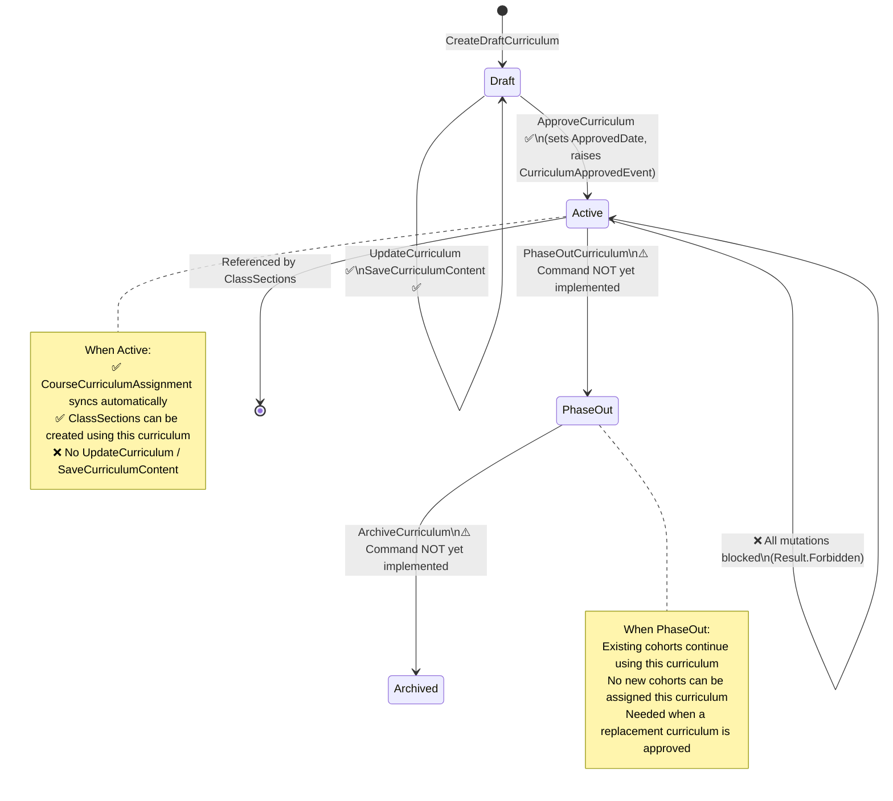
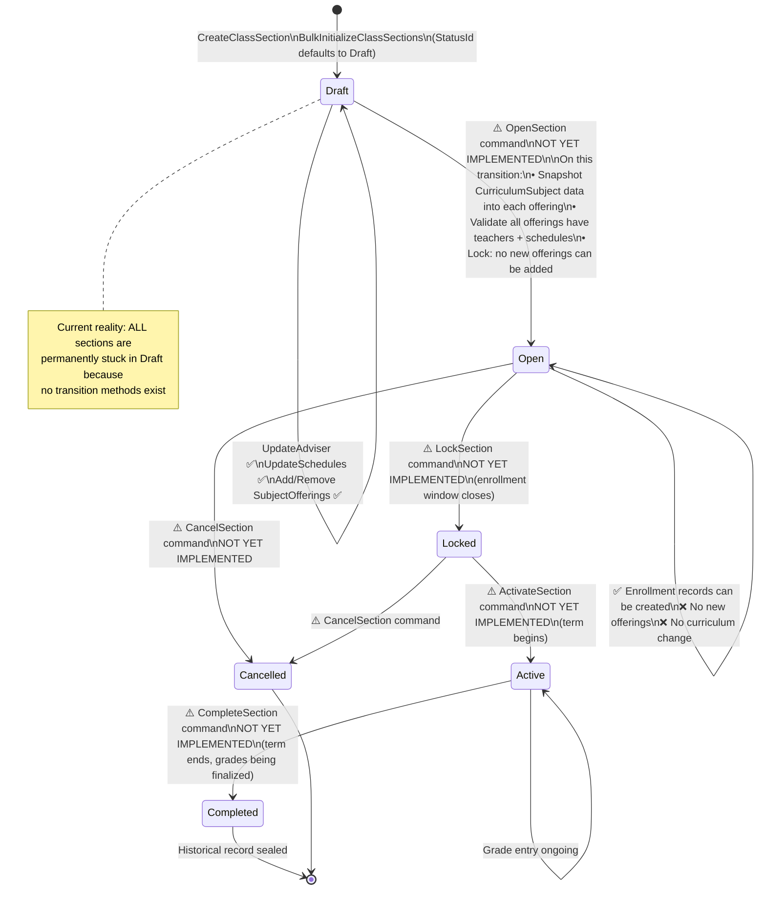
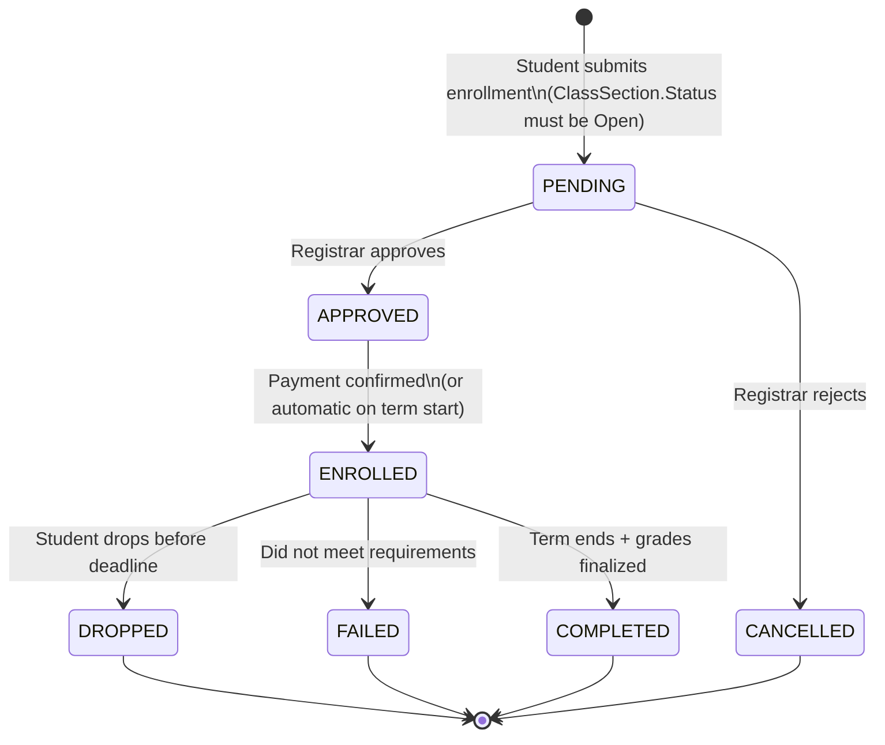
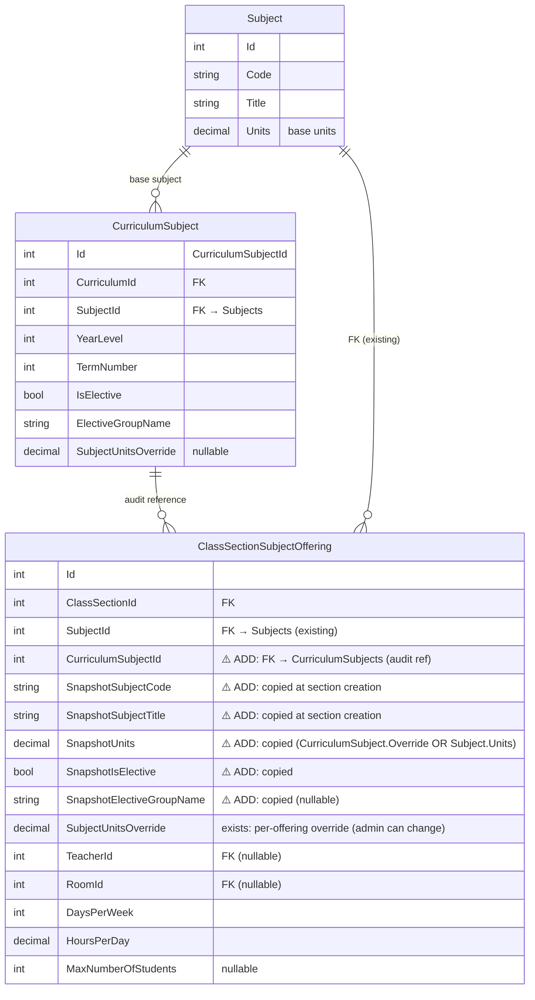
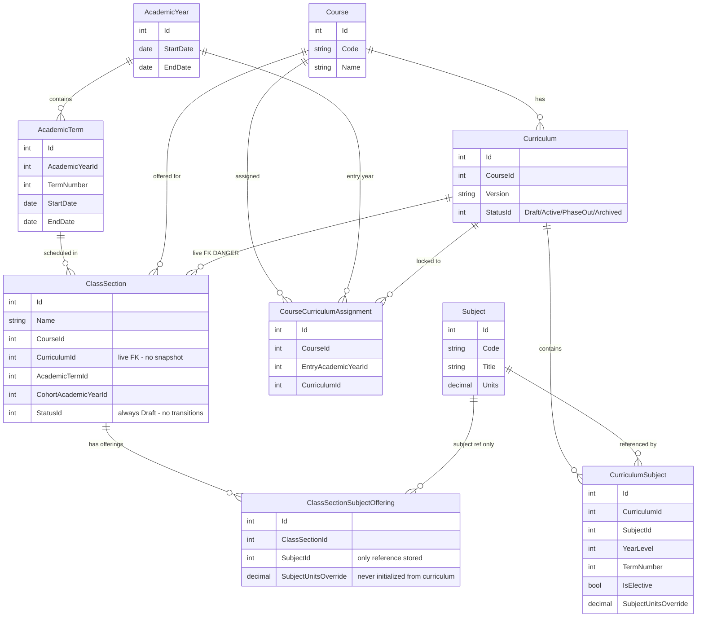
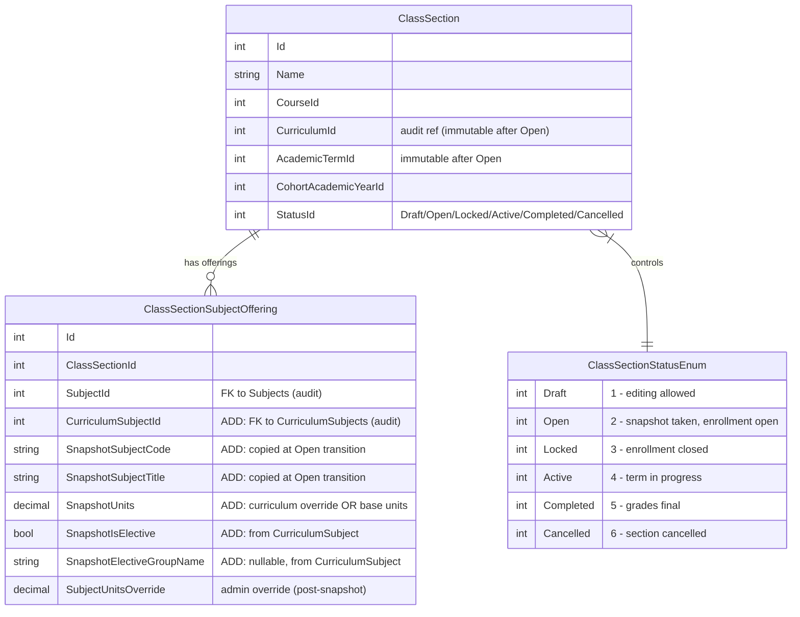
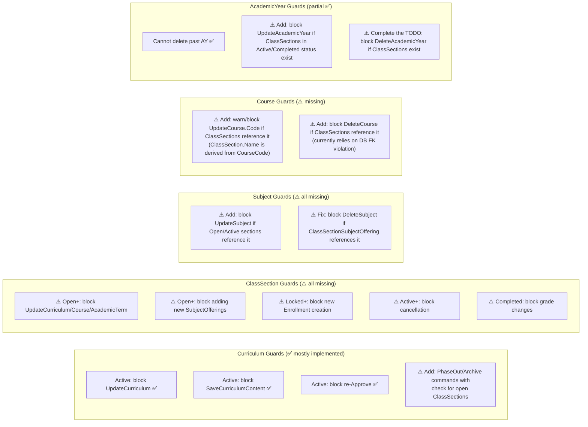

# Data Locking Strategy for the Enrollify Enrollment System

> **Research Report** — How to properly lock Curriculum, Course, Academic Year, Class Sections, and Subject Offerings when enrollment starts, and at what point in the enrollment lifecycle these locks should be applied.

---

## Executive Summary

The Enrollify codebase already has a partial data-locking architecture — notably the `CurriculumStatusEnum` (Active = locked) and the `CourseCurriculumAssignment` cohort-curriculum binding. However, **critical gaps remain**: `ClassSectionSubjectOffering` stores only a bare `SubjectId` FK with no snapshot of the curriculum data that was used to create it; `ClassSection` has a fully designed 6-state lifecycle enum but zero state-transition enforcement; and `UpdateCourse`, `UpdateAcademicYear`, and `UpdateSubject` commands have no guards to prevent breaking changes after class sections have been created referencing that data.

The industry-standard solution — validated by the canonical eShopOnContainers DDD reference, the Fowler temporal patterns catalog, and real academic SIS systems (Banner, PeopleSoft, Oracle Campus Solutions) — is the **copy-on-enrollment (snapshot) pattern** combined with **status-gated lifecycle state machines** on each enrollable entity. This report describes exactly where locks belong in Enrollify's enrollment process, what data must be snapshotted, and how to implement the missing enforcement.

---

## Confidence Assessment

| Claim | Confidence | Source |
|---|---|---|
| ClassSectionSubjectOffering stores only SubjectId, no snapshot | ✅ Verified from source | ClassSectionSubjectOffering.cs, Script0016 |
| No status-transition methods exist on ClassSection | ✅ Verified from source | ClassSection.cs:65-119, ClassSectionStatusEnum.cs |
| CurriculumStatusEnum.Active prevents mutations (Curriculum) | ✅ Verified from source | UpdateCurriculum.cs:41-44, SaveCurriculumContent.cs:57 |
| CourseCurriculumAssignment locks curriculum to cohort | ✅ Verified from source | CourseCurriculumAssignment.cs, SyncCourseCurriculumAssignments.cs |
| No EnrollmentPeriod date-range entity exists | ✅ Verified from source | All 19 migration scripts searched |
| SubjectUnitsOverride never copied from CurriculumSubject | ✅ Verified from source | CreateClassSection.cs:143-158, BulkInitialize.cs:161 |
| eShopOnContainers OrderItem copy pattern is the canonical .NET DDD approach | ✅ Verified in research | dotnet-architecture/eShopOnContainers, OrderItem.cs |
| Banner/PeopleSoft effective-date patterns | ⚠️ Inferred from public docs | Vendor documentation — source code is proprietary |
| CurriculumSubjectId retroactive lookup viable (with caveats) | ✅ Verified by analysis | CurriculumSubject.cs:36-64, ClassSection.cs:30-62 |

---

## Table of Contents

1. [Current Architecture Audit](#1-current-architecture-audit)
2. [The Stale Data Problem Explained](#2-the-stale-data-problem-explained)
3. [Lock Points in the Enrollment Lifecycle](#3-lock-points-in-the-enrollment-lifecycle)
4. [State Machines for Each Entity](#4-state-machines-for-each-entity)
5. [The Snapshot Pattern — What Data Must Be Copied](#5-the-snapshot-pattern--what-data-must-be-copied)
6. [Entity Relationship — Current vs. Recommended](#6-entity-relationship--current-vs-recommended)
7. [Recommended Implementation Changes](#7-recommended-implementation-changes)
8. [Guard Rules by Entity](#8-guard-rules-by-entity)
9. [Open Questions and Future Considerations](#9-open-questions-and-future-considerations)
10. [Footnotes / Citations](#10-footnotes--citations)

---

## 1. Current Architecture Audit

### What Already Exists ✅

| Mechanism | Entity | Status |
|---|---|---|
| `CurriculumStatusEnum` (Draft → Active → PhaseOut → Archived) | Curriculum | ✅ Implemented; Active blocks `UpdateCurriculum`, `SaveCurriculumContent`, `ApproveCurriculum` |
| `CourseCurriculumAssignment` cohort-curriculum binding | CourseCurriculumAssignment | ✅ Implemented; links `(CourseId, EntryAcademicYearId)` → `CurriculumId` |
| Curriculum approval event sync | CurriculumApprovedEvent | ✅ Implemented; triggers `SyncCourseCurriculumAssignmentsForCurrentAcademicYear` |
| `AcademicYear` overlap check | AcademicYear | ✅ Implemented; prevents overlapping academic years |
| `ClassSectionStatusEnum` lifecycle enum definition | ClassSection | ✅ Defined (6 states) — but not yet enforced |

### Critical Gaps ❌

| Gap | Affected Entity | Risk |
|---|---|---|
| No data snapshot in ClassSectionSubjectOffering — only bare `SubjectId` FK | ClassSectionSubjectOffering | 🔴 If Subject.Units or Subject.Title changes, ALL active offerings retroactively change |
| `SubjectUnitsOverride` from CurriculumSubject never copied to offering | ClassSectionSubjectOffering | 🔴 Curriculum-level unit overrides are silently ignored |
| No `CurriculumSubjectId` reference stored in offering | ClassSectionSubjectOffering | 🔴 Cannot reliably trace back which CurriculumSubject defined the offering |
| No `ClassSection.TransitionStatus()` / `Open()` / `Lock()` method | ClassSection | 🔴 StatusId defaults to Draft and can never be changed; all 5 other statuses are unreachable |
| `UpdateCourse` has no guard for existing ClassSections | Course | 🟡 Changing CourseCode would silently break ClassSection.Name display |
| `UpdateAcademicYear` has no guard for existing ClassSections | AcademicYear | 🟡 Changing term dates after sections are created is unchecked |
| `UpdateSubject` has no guard for active ClassSectionSubjectOfferings | Subject | 🟡 Silent retroactive changes to enrolled students' subject data |
| `DeleteSubject` only checks Curriculum membership, not ClassSectionSubjectOffering | Subject | 🔴 DB FK violation (not application-level `Result.Forbidden`) if subject is in an active offering |
| `PhaseOut` and `Archived` curriculum transitions have no commands | Curriculum | 🟡 Statuses defined but unreachable |
| No `EnrollmentPeriod` date-range entity | — | 🟡 Enrollment window managed only via manual section status changes |

---

## 2. The Stale Data Problem Explained

The core problem is: **`ClassSection` and `ClassSectionSubjectOffering` hold live FK references to mutable data, not frozen copies.**

```
CURRENT STATE (dangerous):

ClassSection
├── CurriculumId ──────FK──► Curriculum (MUTABLE — Active lock prevents direct edit,
│                             but PhaseOut/Archive can be triggered, or Draft edited before approval)
├── CourseId ───────────FK──► Course (MUTABLE — UpdateCourse has no guards)
└── AcademicTermId ─────FK──► AcademicTerm (MUTABLE — UpdateAcademicYear has no guards)

ClassSectionSubjectOffering
└── SubjectId ──────────FK──► Subject (MUTABLE — UpdateSubject has no guards!)
    (no CurriculumSubjectId, no Units copy, no Title copy)
```

**Concrete stale data scenario**:
1. Admin creates class section BSCS-1A for Term 1 AY 2025-2026
2. BSCS-1A gets 8 subject offerings: CS101, CS102, MATH101, ENG101, …
3. Admin updates `Subject.Units` for CS101 from 3 to 4 (correcting a data entry error)
4. **Result**: Every existing ClassSectionSubjectOffering for CS101 now silently shows 4 units — including already-enrolled students' records for past terms

**The student's transcript would show different units depending on when you query it.** This is the stale data problem.[^1]

---

## 3. Lock Points in the Enrollment Lifecycle

The following diagram shows the complete enrollment planning lifecycle and exactly **at what point each type of data must be locked**.

```mermaid
flowchart TD
    A([🏫 START: New Academic Year Planning]) --> B

    subgraph PHASE1["PHASE 1 — Master Data Setup\n(Can be edited freely)"]
        B[Define Courses / Programs] --> C
        C[Define Subjects Catalog] --> D
        D[Build Curriculum + Approve it] --> E
        E[Set up Academic Year + Terms] --> F
        F[CourseCurriculumAssignment auto-sync\nby domain event] --> LOCK1
    end

    LOCK1{{🔒 LOCK POINT 1\nCurriculumStatusEnum.Active\nCurriculum content is frozen}} --> G

    subgraph PHASE2["PHASE 2 — Class Section Planning\n(Can be edited while status=Draft)"]
        G[Create Class Sections\nStatus = Draft] --> H
        H[Assign Teachers + Rooms\nto Subject Offerings] --> I
        I[Build Weekly Schedules\nfor each Offering] --> J
        J[Validate section completeness] --> LOCK2
    end

    LOCK2{{🔒 LOCK POINT 2\nClassSection.StatusId = Open\nSubject data SNAPSHOTTED at creation\nNo new subject offerings after Open}} --> K

    subgraph PHASE3["PHASE 3 — Enrollment Window\n(Students enroll)"]
        K[Students view open sections\nand subject offerings] --> L
        L[Student submits enrollment request\nEnrollment.Status = PENDING] --> M
        M[Registrar approves enrollment\nEnrollment.Status = APPROVED] --> LOCK3
    end

    LOCK3{{🔒 LOCK POINT 3\nClassSection.StatusId = Locked\nEnrollment window CLOSED\nNo new enrollments}} --> N

    subgraph PHASE4["PHASE 4 — Academic Term"]
        N[Term begins\nClassSection.StatusId = Active] --> O
        O[Grading occurs\nMidterm grades recorded] --> P
        P[Term ends\nFinal grades recorded] --> LOCK4
    end

    LOCK4{{🔒 LOCK POINT 4\nClassSection.StatusId = Completed\nEnrollmentAcademicRecords sealed}} --> Q([🎓 END: Term Complete])

    style LOCK1 fill:#ff9900,color:#000
    style LOCK2 fill:#ff9900,color:#000
    style LOCK3 fill:#ff9900,color:#000
    style LOCK4 fill:#ff9900,color:#000
    style PHASE1 fill:#e8f4f8
    style PHASE2 fill:#e8f8e8
    style PHASE3 fill:#f8f0e8
    style PHASE4 fill:#f0e8f8
```



### Lock Point Summary

| Lock Point | Trigger                                   | What Gets Locked                                                                                                                                                                                                     |
| ---------- | ----------------------------------------- | -------------------------------------------------------------------------------------------------------------------------------------------------------------------------------------------------------------------- |
| **Lock 1** | `ApproveCurriculum` command               | Curriculum content (subjects, units, prerequisites, year/term placement) is frozen. `CurriculumStatusEnum.Active` prevents any further edits.                                                                        |
| **Lock 2** | `ClassSection` transitions to `Open`      | At this moment: subject data (units, title, CurriculumSubjectId) is snapshotted in the offering. No new subject offerings can be added. Course, AcademicTerm, and CurriculumId on the ClassSection become immutable. |
| **Lock 3** | `ClassSection` transitions to `Locked`    | Enrollment window closes. No new Enrollment records can be created for this section. Existing PENDING/APPROVED enrollments may still be processed.                                                                   |
| **Lock 4** | `ClassSection` transitions to `Completed` | EnrollmentAcademicRecords (grades) become read-only. The section's historical snapshot is archived permanently.                                                                                                      |

---

## 4. State Machines for Each Entity

### 4.1 Curriculum State Machine (already implemented, needs PhaseOut/Archive)



### 4.2 ClassSection State Machine (defined but NOT yet enforced)



### 4.3 Enrollment Status Machine (schema only — no C# implementation yet)



---

## 5. The Snapshot Pattern — What Data Must Be Copied

This section answers the core question: **what curriculum/subject data needs to be snapshotted into `ClassSectionSubjectOffering` at creation time?**

### The eShopOnContainers Canonical Pattern

The industry-standard DDD reference in .NET (eShopOnContainers) uses the **copy-at-creation pattern** in `OrderItem`: when an order is placed, the product's name, price, and picture URL are **physically copied** into the `OrderItem` record. Only the `ProductId` is kept as a reference.[^2]

This maps directly to Enrollify:

| eShopOnContainers | Enrollify |
|---|---|
| `Order` | `ClassSection` |
| `OrderItem` | `ClassSectionSubjectOffering` |
| `Product` (catalog) | `CurriculumSubject` (via `Subject`) |
| `ProductId` (reference) | `SubjectId` + `CurriculumSubjectId` (references) |
| `_productName` (copy) | `SubjectTitle` (copy) |
| `_unitPrice` (copy) | **`Units`** (copy — the critical field) |

### What to Copy into ClassSectionSubjectOffering



### Priority of Units Calculation

When snapshotting units at ClassSection creation time, the priority order should be:

```
Units to use = CurriculumSubject.SubjectUnitsOverride  (if set — curriculum-level override)
             ?? Subject.Units                           (fallback — base subject units)
```

This must be calculated and stored in `SnapshotUnits` (or you can initialize `SubjectUnitsOverride` from the curriculum override at creation time, which is simpler but slightly different semantics).

---

## 6. Entity Relationship — Current vs. Recommended

### Current State (No Snapshots)



### Recommended State (With Snapshots and Guards)



---

## 7. Recommended Implementation Changes

### Change 1: Store CurriculumSubjectId in ClassSectionSubjectOffering

Add a `CurriculumSubjectId` property and FK column to `ClassSectionSubjectOffering`. This is an **audit reference** that allows the system to know exactly which `CurriculumSubject` row was used when the offering was created.[^3]

**Domain entity change:**
```csharp
// ClassSectionSubjectOffering.cs — add these properties
public CurriculumSubjectId? CurriculumSubjectId { get; private set; }  // audit reference
public string? SnapshotSubjectCode { get; private set; }               // copied at Open
public string? SnapshotSubjectTitle { get; private set; }              // copied at Open
public decimal? SnapshotUnits { get; private set; }                    // copied at Open
public bool? SnapshotIsElective { get; private set; }                  // copied at Open
public string? SnapshotElectiveGroupName { get; private set; }        // copied at Open
```

**Constructor change:**
```csharp
public ClassSectionSubjectOffering(
    ClassSectionId classSectionId,
    SubjectId subjectId,
    CurriculumSubjectId curriculumSubjectId,  // ADD: pass from CreateClassSection handler
    decimal? curriculumUnitsOverride,          // ADD: from CurriculumSubject.SubjectUnitsOverride
    bool isElective,                           // ADD: from CurriculumSubject.IsElective
    string? electiveGroupName,                 // ADD: from CurriculumSubject.ElectiveGroupName
    // ... existing params ...
)
```

**CreateClassSection handler change:**
```csharp
// Before (current - loses curriculum data):
new ClassSectionSubjectOffering(classSectionId, curriculumSubject.SubjectId, ...)

// After (recommended):
new ClassSectionSubjectOffering(
    classSectionId,
    curriculumSubject.SubjectId,
    curriculumSubject.Id,                      // CurriculumSubjectId audit reference
    curriculumSubject.SubjectUnitsOverride,    // curriculum-level unit override
    curriculumSubject.IsElective,
    curriculumSubject.ElectiveGroupName,
    maxNumberOfStudents: command.StudentCapacity)
```

### Change 2: Take Data Snapshot When Section Transitions to Open

When `ClassSection` transitions from `Draft` to `Open`, snapshot the subject data into each offering. This follows the eShopOnContainers principle: capture reference data at the moment the transactional record becomes active.[^2]

```csharp
// ClassSection.cs — add status transition method
public ClassSection OpenForEnrollment(IEnumerable<SubjectSnapshotData> subjectSnapshots)
{
    Guard.Against.InvalidInput(StatusId, nameof(StatusId),
        s => s == ClassSectionStatusEnum.Draft,
        "Only Draft sections can be opened for enrollment.");

    // Apply snapshots to each offering before locking
    foreach (var offering in _offerings)  // need offerings nav if section owns them
    {
        var snapshot = subjectSnapshots.FirstOrDefault(s => s.SubjectId == offering.SubjectId);
        if (snapshot != null)
            offering.TakeSnapshot(snapshot);
    }

    StatusId = ClassSectionStatusEnum.Open;
    return this;
}
```

Alternatively (simpler): snapshot at creation time in `CreateClassSection` by reading the `Subject.Title` and computing the effective units. The `Open` transition then only needs to validate completeness, not re-snapshot. This is the simpler approach.

### Change 3: Implement ClassSection Status Transition Methods

All 5 transitions need domain methods with appropriate guards:

```csharp
// ClassSection.cs — add these methods (currently ZERO transition methods exist)

public ClassSection OpenForEnrollment()
{
    Guard.Against.InvalidInput(StatusId, nameof(StatusId),
        s => s == ClassSectionStatusEnum.Draft,
        "Section must be in Draft status to open for enrollment.");
    StatusId = ClassSectionStatusEnum.Open;
    AddDomainEvent(new ClassSectionOpenedForEnrollmentEvent(Id));
    return this;
}

public ClassSection LockEnrollment()
{
    Guard.Against.InvalidInput(StatusId, nameof(StatusId),
        s => s == ClassSectionStatusEnum.Open,
        "Section must be Open to lock enrollment.");
    StatusId = ClassSectionStatusEnum.Locked;
    return this;
}

public ClassSection Activate()
{
    Guard.Against.InvalidInput(StatusId, nameof(StatusId),
        s => s == ClassSectionStatusEnum.Locked,
        "Section must be Locked before it can be Activated.");
    StatusId = ClassSectionStatusEnum.Active;
    return this;
}

public ClassSection Complete()
{
    Guard.Against.InvalidInput(StatusId, nameof(StatusId),
        s => s == ClassSectionStatusEnum.Active,
        "Section must be Active to be completed.");
    StatusId = ClassSectionStatusEnum.Completed;
    return this;
}

public ClassSection Cancel(string reason)
{
    Guard.Against.InvalidInput(StatusId, nameof(StatusId),
        s => s == ClassSectionStatusEnum.Draft
          || s == ClassSectionStatusEnum.Open
          || s == ClassSectionStatusEnum.Locked,
        "Section cannot be cancelled in its current state.");
    StatusId = ClassSectionStatusEnum.Cancelled;
    return this;
}
```

### Change 4: Add Status Guards to Mutation Methods

Once a section is `Open` or beyond, its structural data must be immutable:

```csharp
// ClassSection.cs — update existing Update* methods to check status
public ClassSection UpdateAdviser(TeacherId adviserId)
{
    Guard.Against.InvalidInput(StatusId, nameof(StatusId),
        s => s == ClassSectionStatusEnum.Draft || s == ClassSectionStatusEnum.Open,
        "Adviser can only be changed while the section is Draft or Open.");
    // ... existing logic ...
}

// Block course/curriculum/term changes once Open
public ClassSection UpdateCurriculum(CurriculumId curriculumId)
{
    Guard.Against.InvalidInput(StatusId, nameof(StatusId),
        s => s == ClassSectionStatusEnum.Draft,
        "Curriculum can only be changed while the section is in Draft status.");
    // ... existing logic ...
}
```

### Change 5: Add Guard in UpdateSubject to Prevent Breaking Active Sections

```csharp
// UpdateSubject.cs — add check before updating units
var activeOfferings = await _classSectionSubjectOfferingRepo
    .ListAsync(new GetActiveOfferingsBySubjectIdSpec(command.Id), ct);

if (activeOfferings.Any(o => o.ClassSection.StatusId >= ClassSectionStatusEnum.Open))
    return Result.Forbidden(
        $"Subject {existing.Code} is used in {activeOfferings.Count} open or active class section(s). " +
        "Deactivate or complete those sections before updating the subject.");
```

### Change 6: Add Guard in DeleteSubject for ClassSectionSubjectOffering

```csharp
// DeleteSubject.cs — add offering check alongside existing curriculum check
var offerings = await _offeringRepo
    .ListAsync(new GetOfferingsBySubjectIdSpec(command.id), ct);

if (offerings.Any())
    return Result.Forbidden(
        $"Cannot delete subject because it is referenced in {offerings.Count} class section subject offering(s).");
```

### Change 7: Block Curriculum Changes When ClassSections Reference It

Once class sections in `Open`, `Locked`, `Active`, or `Completed` status exist for a cohort using a curriculum, that curriculum's subjects should not be modifiable. The existing `CurriculumStatusEnum.Active` lock already prevents this for the content (subjects/prerequisites). The remaining gap is for `PhaseOut` transitions — implement `PhaseOutCurriculum` and `ArchiveCurriculum` commands that check for active sections before allowing the transition.

---

## 8. Guard Rules by Entity

This table summarizes all recommended guard rules, organized by entity and lifecycle phase.



### Detailed Guard Matrix

| Entity | Operation | Guard Condition | Action When Violated |
|---|---|---|---|
| **Curriculum** | `UpdateCurriculum` | StatusId = Active | `Result.Forbidden` ✅ already implemented |
| **Curriculum** | `SaveCurriculumContent` | StatusId = Active | `Result.Forbidden` ✅ already implemented |
| **Curriculum** | `ApproveCurriculum` | StatusId = Active | `Result.Forbidden` ✅ already implemented |
| **Curriculum** | `PhaseOutCurriculum` | Has ClassSections with Open/Active/Locked status | `Result.Forbidden` with section count ⚠️ not implemented |
| **Curriculum** | `ArchiveCurriculum` | Has any non-Completed ClassSection | `Result.Forbidden` ⚠️ not implemented |
| **ClassSection** | `OpenForEnrollment` | StatusId ≠ Draft | `Result.Invalid` ⚠️ not implemented |
| **ClassSection** | `OpenForEnrollment` | All offerings have a schedule | `Result.Invalid` (completeness check) ⚠️ not implemented |
| **ClassSection** | `UpdateCurriculum` | StatusId ≥ Open | `Result.Forbidden` ⚠️ not implemented |
| **ClassSection** | `UpdateAcademicTerm` | StatusId ≥ Open | `Result.Forbidden` ⚠️ not implemented |
| **ClassSection** | `DeleteClassSection` | StatusId ≥ Open | `Result.Forbidden` ⚠️ not implemented |
| **Subject** | `UpdateSubject` (units/code) | Referenced by Open/Active sections | `Result.Forbidden` ⚠️ not implemented |
| **Subject** | `DeleteSubject` | Referenced by any ClassSectionSubjectOffering | `Result.Forbidden` ⚠️ partially implemented (only checks Curriculum) |
| **Course** | `UpdateCourse.Code` | Referenced by ClassSections | `Result.Conflict` warning ⚠️ not implemented |
| **Course** | `DeleteCourse` | Referenced by ClassSections | `Result.Forbidden` ⚠️ DB FK only — no application guard |
| **AcademicYear** | `UpdateAcademicYear` | Has Active/Completed ClassSections | `Result.Forbidden` ⚠️ not implemented |
| **AcademicYear** | `DeleteAcademicYear` | Has any ClassSections | `Result.Forbidden` ⚠️ TODO comment exists in `DeleteAcademicYearAndTerms` |

---

## 9. Open Questions and Future Considerations

### 9.1 Should There Be an Explicit EnrollmentPeriod Entity?

Currently there is no `EnrollmentPeriod` table — the enrollment window is managed implicitly through the ClassSection status machine. Industry systems (Banner, PeopleSoft) use an explicit enrollment period entity.[^4]

**Recommendation for Enrollify**: In the short term, managing enrollment through `ClassSection.StatusId` (Draft→Open→Locked) is sufficient and already designed. An explicit `EnrollmentPeriod` would be valuable when:
- Enrollment dates need to be date-based (auto-open/close based on calendar)
- Enrollment priority windows are needed (e.g., senior students enroll first)
- Cross-section enrollment caps need to be managed at the term level

**For now**: Keep the `ClassSection` state machine and implement the missing transitions before adding a new entity.

### 9.2 PhaseOut and Archive of Curriculums

The `CurriculumStatusEnum.PhaseOut` and `.Archived` statuses are defined but unreachable (no commands exist).[^5]

**Recommendation**: Implement these when a newer curriculum version replaces an older one:
- `PhaseOut`: the curriculum is no longer used for new cohorts but existing students continue with it
- `Archive`: all students using this curriculum have graduated or transferred

The `CourseCurriculumAssignment` binding ensures that existing cohorts always reference their original curriculum even after phaseout.

### 9.3 Concurrent Curriculum Changes and ClassSections

**Scenario**: Admin approves a new curriculum (Curriculum 2025-B) → sync runs → `CourseCurriculumAssignment` for current AY is updated to 2025-B → but ClassSections were already created using Curriculum 2025-A.

**Current behavior**: The sync **does not** cascade to update existing `ClassSection.CurriculumId` records. ClassSections retain their original `CurriculumId` reference.[^6]

**Recommendation**: This is actually **correct behavior** — class sections should never retroactively change their curriculum reference. The concern is more about:
1. If 2025-B is approved *after* sections are created for 2025-A, those sections should continue using 2025-A.
2. The `CourseCurriculumAssignment` skip guard (`if (existing?.Curriculum?.StatusId == CurriculumStatusEnum.Active) continue`) handles this — once a section is created referencing an Active curriculum, the assignment won't change.
3. The issue is only if the `CourseCurriculumAssignment` is updated before sections are created. The answer: sections should be created before a replacement curriculum is approved, or the old assignment should be explicitly protected.

### 9.4 Snapshot Strategy — When Exactly to Snapshot?

There are two valid approaches:

**Option A (Simpler — Recommended)**: Snapshot at `CreateClassSection` time.
- The section is created, and immediately the `SubjectCode`, `SubjectTitle`, `SnapshotUnits` are populated.
- Even in `Draft` status, the snapshot exists.
- The `Open` transition just validates completeness, not re-snapshots.

**Option B (Stricter)**: Snapshot at `OpenForEnrollment` transition.
- `Draft` offerings have no snapshot yet — they rely on live joins.
- The `Open` transition reads live data and creates the snapshot atomically.
- More complex but ensures the snapshot represents exactly what was true when enrollment opened.

**Recommendation**: Use Option A for simplicity. The key is that the snapshot exists *before* students can see and enroll in the section (i.e., before `Open`).

---

## 10. Footnotes / Citations

[^1]: `Enrollify.Core/Aggregates/ClassSectionSubjectOfferingAggregate/ClassSectionSubjectOffering.cs:37-45` — SubjectId is the only FK stored; no subject title, units, or curriculum data is copied.

[^2]: `dotnet-architecture/eShopOnContainers` — `src/Services/Ordering/Ordering.Domain/AggregatesModel/OrderAggregate/OrderItem.cs` — the canonical .NET DDD reference for copy-at-creation: `_productName`, `_unitPrice`, `_pictureUrl` are all physically copied from the product catalog, not referenced via FK.

[^3]: `Enrollify.Application/Features/ClassSections/Commands/CreateClassSection.cs:143-158` — Only `curriculumSubject.SubjectId` is passed to the ClassSectionSubjectOffering constructor. `curriculumSubject.Id` (CurriculumSubjectId), `curriculumSubject.SubjectUnitsOverride`, `curriculumSubject.IsElective`, and `curriculumSubject.ElectiveGroupName` are all silently discarded.

[^4]: `Enrollify.DatabaseMigration/Scripts/Script0013__AcademicYears.sql` — `AcademicTerms` table has `TermNumber, AcademicYearId, StartDate, EndDate` only — no enrollment open/close date fields exist. Confirmed by searching all 19 migration scripts for `EnrollmentPeriod`, `enrollmentStartDate`, `enrollmentEndDate` (zero matches).

[^5]: `Enrollify.Core/Constants/CurriculumStatusEnum.cs:7-10` — `PhaseOut (3)` and `Archived (4)` are defined in the SmartEnum. `Enrollify.WebAPI/Features/Curriculums/` — only 7 endpoints exist; no `PhaseOutCurriculumEndpoint` or `ArchiveCurriculumEndpoint` found.

[^6]: `Enrollify.Application/Features/CourseCurriculumAssignments/Commands/SyncCourseCurriculumAssignmentsForAcademicYear.cs:63-129` — The sync creates/updates `CourseCurriculumAssignment` records only. No cascade to `ClassSection.CurriculumId` exists anywhere in the codebase.

[^7]: `Enrollify.Core/Aggregates/ClassSectionAggregate/ClassSection.cs:50` — `StatusId` defaults to `ClassSectionStatusEnum.Draft`. No `OpenForEnrollment()`, `Lock()`, `Activate()`, `Complete()`, or `Cancel()` methods exist in the entity.

[^8]: `Enrollify.Application/Features/Subjects/Commands/DeleteSubject.cs:26-33` — The `GetCurriculumBySubjectIdSpec` checks only `CurriculumSubjects` membership, not `ClassSectionSubjectOffering` references. A subject used in a class section offering but removed from all curriculums would reach the DB FK and fail with an unhandled exception.

[^9]: `Enrollify.Application/Features/AcademicYearAndTerm/Commands/DeleteAcademicYearAndTerms.cs:37-40` — Contains a `// TODO: GetClassSectionsByAcademicTermIdsSpec` comment acknowledging the missing guard but the check is not implemented.

[^10]: `martinfowler.com/eaaDev/Snapshot.html` — Fowler Snapshot pattern: "In most cases they [snapshots] should be immutable." The enrollment `SubjectSnapshot` value object should follow this principle.

[^11]: `Enrollify.Core/Aggregates/CurriculumAggregate/CurriculumSubject.cs:36-64` — `CurriculumSubject` has `Id (CurriculumSubjectId)`, `SubjectId`, `YearLevel`, `TermNumber`, `IsElective`, `ElectiveGroupName`, `SubjectUnitsOverride`, and `Prerequisites`. All of this data is lost when `CreateClassSection` only passes `curriculumSubject.SubjectId`.

[^12]: `Enrollify.Infrastructure/Services/ApplicableCurriculumQueryService.cs:44-47` — SQL window function `ROW_NUMBER() OVER (PARTITION BY CourseId ORDER BY EffectiveYear DESC, Version DESC, ApprovedDate DESC, Id DESC)` selects exactly one Active curriculum per course as of the academic year start date.
