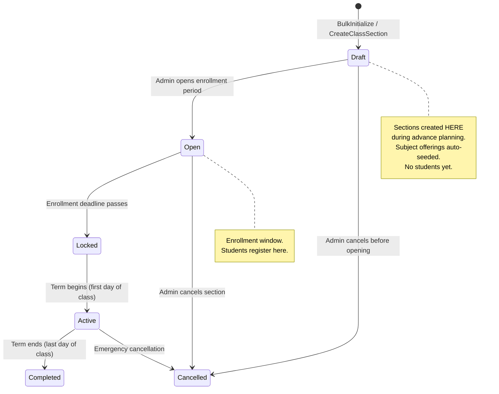

# Class Section Lifecycle (Correct Advance Creation Flow)

```mermaid
stateDiagram-v2
    [*] --> Draft : BulkInitialize / CreateClassSection
    Draft --> Open : Admin opens enrollment period
    Draft --> Cancelled : Admin cancels before opening
    Open --> Locked : Enrollment deadline passes
    Open --> Cancelled : Admin cancels section
    Locked --> Active : Term begins (first day of class)
    Active --> Completed : Term ends (last day of class)
    Active --> Cancelled : Emergency cancellation

    note right of Draft
        Sections created HERE
        during advance planning.
        Subject offerings auto-seeded.
        No students yet.
    end note

    note right of Open
        Enrollment window.
        Students register here.
    end note
```
