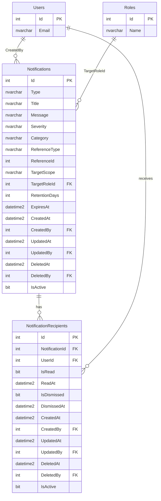

# Enrollify Notification System — Design Plan

## Executive Summary

**Recommendation: Yes, create a dedicated notifications table with a junction table for recipients.**

The Enrollify system currently has no notification infrastructure. This plan introduces a hybrid two-table design:
- `Notifications` — stores the notification message, type, severity, and targeting metadata
- `NotificationRecipients` — junction table tracking per-user delivery and read state

Automated data retention is handled by a SQL Server Agent job (`Script0016`) that runs daily and purges records in configurable tiers.

---

## Architecture Diagram



---

## Real-World Pattern Comparison

| System | Stack | Read State | Junction Table | Polymorphic Ref | Retention |
|--------|-------|-----------|----------------|-----------------|-----------|
| Chatwoot | Rails | Per-recipient | Yes | Yes (primary_actor) | Manual |
| Discourse | Rails | `topic_users` | Yes | Partial | SQL cleanup |
| Forem | Rails | Yes | Yes | Yes | Background job |
| Supabase | Postgres | Per-row | No | No | TTL column |
| Cal.com | Prisma | Per-recipient | Yes | No | Manual |
| Twenty CRM | TypeORM | Per-recipient | Yes | Yes | Soft-delete |
| Snipe-IT | Laravel | Morph | Yes | Yes (Morph) | Manual |
| Bagisto | Laravel | Per-recipient | Yes | No | Manual |

**Conclusion:** 6 of 8 production systems use a junction table for per-user read-state tracking. Polymorphic reference (`ReferenceType` + `ReferenceId`) is used in 4 of 8. This plan adopts both patterns.

---

## Recommended Schema

### Target Scope Values

| Scope | Description |
|-------|-------------|
| `User` | Direct FK to a specific user |
| `Role` | FK to a role — fans out to all users in that role |
| `Broadcast` | All active users |

### Severity Levels

| Value | Usage |
|-------|-------|
| `Info` | Informational only |
| `Success` | Positive event confirmation |
| `Warning` | Requires user attention |
| `Error` | Critical failure or issue |

### Category Values (extensible)

| Value | Description |
|-------|-------------|
| `Academic` | Curriculum, course, subject changes |
| `Enrollment` | Student enrollment events |
| `System` | Background job completions, health |
| `Admin` | Admin-level operations |
| `Audit` | Compliance-relevant actions |

### Retention Tiers

| Category | Active Retention | Hard-Delete After |
|----------|-----------------|-------------------|
| General / Info | 30 days | 90 days from soft-delete |
| Academic events | 90 days | 90 days from soft-delete |
| Enrollment events | 90 days | 90 days from soft-delete |
| Admin / Audit | 365 days | 90 days from soft-delete |
| Error / Warning | 90 days | 90 days from soft-delete |

---

## Migration Scripts

### Script0015__Notifications.sql

```sql
-- =============================================================================
-- Script0015__Notifications.sql
-- Creates the Notifications and NotificationRecipients tables with full audit
-- columns, performance indexes, and foreign key constraints.
-- =============================================================================

-- ---------------------------------------------------------------------------
-- 1. Notifications (main table)
-- ---------------------------------------------------------------------------
CREATE TABLE [dbo].[Notifications]
(
    [Id]            INT             NOT NULL IDENTITY(1,1),
    [Type]          NVARCHAR(100)   NOT NULL,           -- e.g. 'CurriculumCreated', 'BackgroundJobCompleted'
    [Title]         NVARCHAR(500)   NOT NULL,
    [Message]       NVARCHAR(MAX)   NOT NULL,
    [Severity]      NVARCHAR(20)    NOT NULL DEFAULT 'Info',   -- Info | Success | Warning | Error
    [Category]      NVARCHAR(50)    NOT NULL DEFAULT 'System', -- Academic | Enrollment | System | Admin | Audit
    [ReferenceType] NVARCHAR(100)   NULL,               -- Polymorphic: 'Curriculum', 'Subject', 'Schedule', etc.
    [ReferenceId]   INT             NULL,               -- FK value (not enforced — polymorphic)
    [TargetScope]   NVARCHAR(20)    NOT NULL DEFAULT 'Broadcast', -- User | Role | Broadcast
    [TargetUserId]  INT             NULL,               -- Populated when TargetScope = 'User'
    [TargetRoleId]  INT             NULL,               -- Populated when TargetScope = 'Role'
    [RetentionDays] INT             NOT NULL DEFAULT 30,
    [ExpiresAt]     DATETIME2(7)    NULL,               -- Computed at insert: CreatedAt + RetentionDays

    -- Standard Enrollify audit columns
    [CreatedAt]     DATETIME2(7)    NOT NULL DEFAULT SYSUTCDATETIME(),
    [CreatedBy]     INT             NOT NULL,
    [UpdatedAt]     DATETIME2(7)    NOT NULL DEFAULT SYSUTCDATETIME(),
    [UpdatedBy]     INT             NOT NULL,
    [DeletedAt]     DATETIME2(7)    NULL,
    [DeletedBy]     INT             NULL,
    [IsActive]      BIT             NOT NULL DEFAULT 1,

    CONSTRAINT [PK_Notifications] PRIMARY KEY CLUSTERED ([Id] ASC),

    CONSTRAINT [FK_Notifications_CreatedBy_Users]
        FOREIGN KEY ([CreatedBy]) REFERENCES [dbo].[Users] ([Id]),

    CONSTRAINT [FK_Notifications_UpdatedBy_Users]
        FOREIGN KEY ([UpdatedBy]) REFERENCES [dbo].[Users] ([Id]),

    CONSTRAINT [FK_Notifications_DeletedBy_Users]
        FOREIGN KEY ([DeletedBy]) REFERENCES [dbo].[Users] ([Id]),

    CONSTRAINT [FK_Notifications_TargetUserId_Users]
        FOREIGN KEY ([TargetUserId]) REFERENCES [dbo].[Users] ([Id]),

    CONSTRAINT [FK_Notifications_TargetRoleId_Roles]
        FOREIGN KEY ([TargetRoleId]) REFERENCES [dbo].[Roles] ([Id]),

    CONSTRAINT [CK_Notifications_Severity]
        CHECK ([Severity] IN ('Info', 'Success', 'Warning', 'Error')),

    CONSTRAINT [CK_Notifications_TargetScope]
        CHECK ([TargetScope] IN ('User', 'Role', 'Broadcast')),

    CONSTRAINT [CK_Notifications_TargetScope_User]
        CHECK ([TargetScope] <> 'User' OR [TargetUserId] IS NOT NULL),

    CONSTRAINT [CK_Notifications_TargetScope_Role]
        CHECK ([TargetScope] <> 'Role' OR [TargetRoleId] IS NOT NULL)
);
GO

-- ---------------------------------------------------------------------------
-- 2. NotificationRecipients (junction / read-state table)
-- ---------------------------------------------------------------------------
CREATE TABLE [dbo].[NotificationRecipients]
(
    [Id]             INT          NOT NULL IDENTITY(1,1),
    [NotificationId] INT          NOT NULL,
    [UserId]         INT          NOT NULL,
    [IsRead]         BIT          NOT NULL DEFAULT 0,
    [ReadAt]         DATETIME2(7) NULL,
    [IsDismissed]    BIT          NOT NULL DEFAULT 0,
    [DismissedAt]    DATETIME2(7) NULL,

    -- Standard Enrollify audit columns
    [CreatedAt]      DATETIME2(7) NOT NULL DEFAULT SYSUTCDATETIME(),
    [CreatedBy]      INT          NOT NULL,
    [UpdatedAt]      DATETIME2(7) NOT NULL DEFAULT SYSUTCDATETIME(),
    [UpdatedBy]      INT          NOT NULL,
    [DeletedAt]      DATETIME2(7) NULL,
    [DeletedBy]      INT          NULL,
    [IsActive]       BIT          NOT NULL DEFAULT 1,

    CONSTRAINT [PK_NotificationRecipients] PRIMARY KEY CLUSTERED ([Id] ASC),

    CONSTRAINT [FK_NotificationRecipients_NotificationId_Notifications]
        FOREIGN KEY ([NotificationId]) REFERENCES [dbo].[Notifications] ([Id]),

    CONSTRAINT [FK_NotificationRecipients_UserId_Users]
        FOREIGN KEY ([UserId]) REFERENCES [dbo].[Users] ([Id]),

    CONSTRAINT [FK_NotificationRecipients_CreatedBy_Users]
        FOREIGN KEY ([CreatedBy]) REFERENCES [dbo].[Users] ([Id]),

    CONSTRAINT [FK_NotificationRecipients_UpdatedBy_Users]
        FOREIGN KEY ([UpdatedBy]) REFERENCES [dbo].[Users] ([Id]),

    CONSTRAINT [FK_NotificationRecipients_DeletedBy_Users]
        FOREIGN KEY ([DeletedBy]) REFERENCES [dbo].[Users] ([Id])
);
GO

-- ---------------------------------------------------------------------------
-- 3. Performance indexes
-- ---------------------------------------------------------------------------

-- Most common query: unread notifications for a user
CREATE NONCLUSTERED INDEX [IX_NotificationRecipients_UserId_IsRead]
    ON [dbo].[NotificationRecipients] ([UserId] ASC, [IsRead] ASC)
    INCLUDE ([NotificationId], [IsDismissed], [CreatedAt])
    WHERE [IsActive] = 1;
GO

-- Cleanup job: find expired active notifications
CREATE NONCLUSTERED INDEX [IX_Notifications_ExpiresAt_IsActive]
    ON [dbo].[Notifications] ([ExpiresAt] ASC, [IsActive] ASC)
    INCLUDE ([Id], [RetentionDays]);
GO

-- Polymorphic lookups: e.g. "all notifications about Curriculum #5"
CREATE NONCLUSTERED INDEX [IX_Notifications_ReferenceType_ReferenceId]
    ON [dbo].[Notifications] ([ReferenceType] ASC, [ReferenceId] ASC)
    WHERE [IsActive] = 1;
GO

-- Archive queries: find soft-deleted notifications
CREATE NONCLUSTERED INDEX [IX_Notifications_DeletedAt]
    ON [dbo].[Notifications] ([DeletedAt] ASC)
    WHERE [DeletedAt] IS NOT NULL;
GO

-- Role-targeted notifications
CREATE NONCLUSTERED INDEX [IX_Notifications_TargetRoleId]
    ON [dbo].[Notifications] ([TargetRoleId] ASC)
    WHERE [IsActive] = 1 AND [TargetRoleId] IS NOT NULL;
GO
```

---

### Script0016__NotificationCleanupJob.sql

```sql
-- =============================================================================
-- Script0016__NotificationCleanupJob.sql
-- Creates the stored procedure for notification data retention cleanup and
-- a SQL Server Agent job to run it daily at 2 AM.
-- =============================================================================

-- ---------------------------------------------------------------------------
-- 1. Stored procedure: usp_PurgeExpiredNotifications
-- ---------------------------------------------------------------------------
IF OBJECT_ID('dbo.usp_PurgeExpiredNotifications', 'P') IS NOT NULL
    DROP PROCEDURE [dbo].[usp_PurgeExpiredNotifications];
GO

CREATE PROCEDURE [dbo].[usp_PurgeExpiredNotifications]
    @BatchSize          INT = 10000,
    @HardDeleteAfterDays INT = 90     -- Days after soft-delete before hard purge
AS
BEGIN
    SET NOCOUNT ON;

    DECLARE @Now           DATETIME2(7) = SYSUTCDATETIME();
    DECLARE @RowsAffected  INT;
    DECLARE @SystemUserId  INT = 1;   -- system@enrollify.local

    -- -----------------------------------------------------------------------
    -- Phase 1: Soft-delete expired active notifications
    -- -----------------------------------------------------------------------
    SET @RowsAffected = @BatchSize;
    WHILE @RowsAffected = @BatchSize
    BEGIN
        UPDATE TOP (@BatchSize) [dbo].[Notifications]
        SET
            [IsActive]   = 0,
            [DeletedAt]  = @Now,
            [DeletedBy]  = @SystemUserId,
            [UpdatedAt]  = @Now,
            [UpdatedBy]  = @SystemUserId
        WHERE
            [IsActive]   = 1
            AND [ExpiresAt] IS NOT NULL
            AND [ExpiresAt] < @Now;

        SET @RowsAffected = @@ROWCOUNT;
    END;

    -- -----------------------------------------------------------------------
    -- Phase 2: Soft-delete recipient rows whose parent notification is gone
    -- -----------------------------------------------------------------------
    SET @RowsAffected = @BatchSize;
    WHILE @RowsAffected = @BatchSize
    BEGIN
        UPDATE TOP (@BatchSize) r
        SET
            r.[IsActive]  = 0,
            r.[DeletedAt] = @Now,
            r.[DeletedBy] = @SystemUserId,
            r.[UpdatedAt] = @Now,
            r.[UpdatedBy] = @SystemUserId
        FROM [dbo].[NotificationRecipients] r
        INNER JOIN [dbo].[Notifications] n ON r.[NotificationId] = n.[Id]
        WHERE
            r.[IsActive] = 1
            AND n.[IsActive] = 0;

        SET @RowsAffected = @@ROWCOUNT;
    END;

    -- -----------------------------------------------------------------------
    -- Phase 3: Hard-delete recipients soft-deleted longer than threshold
    -- -----------------------------------------------------------------------
    SET @RowsAffected = @BatchSize;
    WHILE @RowsAffected = @BatchSize
    BEGIN
        DELETE TOP (@BatchSize) FROM [dbo].[NotificationRecipients]
        WHERE
            [IsActive]  = 0
            AND [DeletedAt] < DATEADD(DAY, -@HardDeleteAfterDays, @Now);

        SET @RowsAffected = @@ROWCOUNT;
    END;

    -- -----------------------------------------------------------------------
    -- Phase 4: Hard-delete notifications soft-deleted longer than threshold
    --          (only after all recipients are gone)
    -- -----------------------------------------------------------------------
    SET @RowsAffected = @BatchSize;
    WHILE @RowsAffected = @BatchSize
    BEGIN
        DELETE TOP (@BatchSize) n
        FROM [dbo].[Notifications] n
        WHERE
            n.[IsActive]  = 0
            AND n.[DeletedAt] < DATEADD(DAY, -@HardDeleteAfterDays, @Now)
            AND NOT EXISTS (
                SELECT 1 FROM [dbo].[NotificationRecipients] r
                WHERE r.[NotificationId] = n.[Id]
            );

        SET @RowsAffected = @@ROWCOUNT;
    END;
END;
GO

-- ---------------------------------------------------------------------------
-- 2. SQL Server Agent Job (runs daily at 02:00 AM UTC)
--    NOTE: Requires SQL Server Agent to be running.
--    For Azure SQL Database, use an Azure Function or Elastic Job instead.
-- ---------------------------------------------------------------------------
IF EXISTS (
    SELECT 1 FROM msdb.dbo.sysjobs WHERE name = N'Enrollify_PurgeExpiredNotifications'
)
    EXEC msdb.dbo.sp_delete_job @job_name = N'Enrollify_PurgeExpiredNotifications';
GO

EXEC msdb.dbo.sp_add_job
    @job_name       = N'Enrollify_PurgeExpiredNotifications',
    @enabled        = 1,
    @description    = N'Purges expired and orphaned notification records per the retention policy.',
    @owner_login_name = N'sa';
GO

EXEC msdb.dbo.sp_add_jobstep
    @job_name       = N'Enrollify_PurgeExpiredNotifications',
    @step_name      = N'Execute usp_PurgeExpiredNotifications',
    @subsystem      = N'TSQL',
    @command        = N'EXEC [dbo].[usp_PurgeExpiredNotifications] @BatchSize = 10000, @HardDeleteAfterDays = 90;',
    @database_name  = N'EnrollifyDb';
GO

EXEC msdb.dbo.sp_add_schedule
    @schedule_name      = N'Enrollify_Daily_2AM',
    @freq_type          = 4,            -- Daily
    @freq_interval      = 1,
    @active_start_time  = 020000;       -- 02:00:00 UTC
GO

EXEC msdb.dbo.sp_attach_schedule
    @job_name      = N'Enrollify_PurgeExpiredNotifications',
    @schedule_name = N'Enrollify_Daily_2AM';
GO

EXEC msdb.dbo.sp_add_jobserver
    @job_name   = N'Enrollify_PurgeExpiredNotifications',
    @server_name = N'(local)';
GO
```

---

## User Targeting Query Patterns

### 1. Get unread notifications for a specific user (dashboard feed)

```sql
SELECT
    n.[Id],
    n.[Type],
    n.[Title],
    n.[Message],
    n.[Severity],
    n.[Category],
    n.[ReferenceType],
    n.[ReferenceId],
    n.[CreatedAt],
    r.[IsRead],
    r.[ReadAt]
FROM [dbo].[NotificationRecipients] r
INNER JOIN [dbo].[Notifications] n ON r.[NotificationId] = n.[Id]
WHERE
    r.[UserId]      = @UserId
    AND r.[IsActive]    = 1
    AND r.[IsRead]      = 0
    AND r.[IsDismissed] = 0
    AND n.[IsActive]    = 1
ORDER BY n.[CreatedAt] DESC;
```

### 2. Send a notification to all users in a role (fan-out at insert time)

```sql
-- Step A: Insert the notification header
INSERT INTO [dbo].[Notifications]
    ([Type], [Title], [Message], [Severity], [Category], [ReferenceType], [ReferenceId],
     [TargetScope], [TargetRoleId], [RetentionDays], [ExpiresAt], [CreatedBy], [UpdatedBy])
VALUES
    ('CurriculumCreated', 'New Curriculum Published', 'Curriculum "BSCS 2024" was created by Admin.',
     'Success', 'Academic', 'Curriculum', @CurriculumId,
     'Role', @RoleId, 90, DATEADD(DAY, 90, SYSUTCDATETIME()), @ActorUserId, @ActorUserId);

DECLARE @NotifId INT = SCOPE_IDENTITY();

-- Step B: Fan out to all active users in the role
INSERT INTO [dbo].[NotificationRecipients]
    ([NotificationId], [UserId], [CreatedBy], [UpdatedBy])
SELECT
    @NotifId,
    ura.[UserId],
    @ActorUserId,
    @ActorUserId
FROM [dbo].[UserRoleAssignment] ura
INNER JOIN [dbo].[Users] u ON ura.[UserId] = u.[Id]
WHERE
    ura.[RoleId]   = @RoleId
    AND ura.[IsActive] = 1
    AND u.[IsActive]   = 1;
```

### 3. Mark a notification as read

```sql
UPDATE [dbo].[NotificationRecipients]
SET
    [IsRead]    = 1,
    [ReadAt]    = SYSUTCDATETIME(),
    [UpdatedAt] = SYSUTCDATETIME(),
    [UpdatedBy] = @UserId
WHERE
    [UserId]         = @UserId
    AND [NotificationId] = @NotificationId
    AND [IsActive]       = 1;
```

### 4. Get all notifications about a specific entity (polymorphic lookup)

```sql
SELECT n.*, r.[IsRead], r.[UserId]
FROM [dbo].[Notifications] n
LEFT JOIN [dbo].[NotificationRecipients] r
    ON r.[NotificationId] = n.[Id] AND r.[UserId] = @UserId AND r.[IsActive] = 1
WHERE
    n.[ReferenceType] = 'Curriculum'
    AND n.[ReferenceId]   = @CurriculumId
    AND n.[IsActive]      = 1
ORDER BY n.[CreatedAt] DESC;
```

---

## C# Domain Layer (Enrollify Integration)

### Value Objects (Vogen)

```csharp
[ValueObject<int>]
public partial struct NotificationId { }

[ValueObject<int>]
public partial struct NotificationRecipientId { }
```

### Notification Aggregate (Enrollify.Core)

```csharp
public class Notification : EntityBase<NotificationId>, IAuditable, IAggregateRoot
{
    public string Type { get; private set; } = default!;
    public string Title { get; private set; } = default!;
    public string Message { get; private set; } = default!;
    public NotificationSeverity Severity { get; private set; }
    public NotificationCategory Category { get; private set; }
    public string? ReferenceType { get; private set; }
    public int? ReferenceId { get; private set; }
    public NotificationTargetScope TargetScope { get; private set; }
    public UserId? TargetUserId { get; private set; }
    public RoleId? TargetRoleId { get; private set; }
    public int RetentionDays { get; private set; }
    public DateTime? ExpiresAt { get; private set; }

    private readonly List<NotificationRecipient> _recipients = [];
    public IReadOnlyCollection<NotificationRecipient> Recipients => _recipients.AsReadOnly();

    public static Notification Create(
        string type, string title, string message,
        NotificationSeverity severity, NotificationCategory category,
        NotificationTargetScope scope, int retentionDays,
        UserId createdBy,
        UserId? targetUserId = null, RoleId? targetRoleId = null,
        string? referenceType = null, int? referenceId = null)
    {
        var notif = new Notification
        {
            Type          = type,
            Title         = title,
            Message       = message,
            Severity      = severity,
            Category      = category,
            TargetScope   = scope,
            TargetUserId  = targetUserId,
            TargetRoleId  = targetRoleId,
            RetentionDays = retentionDays,
            ReferenceType = referenceType,
            ReferenceId   = referenceId,
            ExpiresAt     = DateTime.UtcNow.AddDays(retentionDays)
        };
        notif.SetAudit(createdBy);
        return notif;
    }

    public void AddRecipient(UserId userId, UserId addedBy)
    {
        if (_recipients.Any(r => (int)r.UserId == (int)userId && r.IsActive))
            return;

        _recipients.Add(NotificationRecipient.Create(userId, addedBy));
    }
}

public enum NotificationSeverity { Info, Success, Warning, Error }
public enum NotificationCategory { Academic, Enrollment, System, Admin, Audit }
public enum NotificationTargetScope { User, Role, Broadcast }
```

### Example Mediator Command

```csharp
public static class CreateNotification
{
    public record Command(
        string Type,
        string Title,
        string Message,
        NotificationSeverity Severity,
        NotificationCategory Category,
        NotificationTargetScope TargetScope,
        int RetentionDays,
        UserId ActorUserId,
        UserId? TargetUserId = null,
        RoleId? TargetRoleId = null,
        string? ReferenceType = null,
        int? ReferenceId = null
    ) : ICommand<Result<NotificationId>>;

    public class Handler(
        IRepository<Notification> repo,
        IReadRepository<User> userRepo
    ) : ICommandHandler<Command, Result<NotificationId>>
    {
        public async ValueTask<Result<NotificationId>> Handle(Command cmd, CancellationToken ct)
        {
            var notif = Notification.Create(
                cmd.Type, cmd.Title, cmd.Message,
                cmd.Severity, cmd.Category, cmd.TargetScope,
                cmd.RetentionDays, cmd.ActorUserId,
                cmd.TargetUserId, cmd.TargetRoleId,
                cmd.ReferenceType, cmd.ReferenceId);

            if (cmd.TargetScope == NotificationTargetScope.User && cmd.TargetUserId.HasValue)
            {
                notif.AddRecipient(cmd.TargetUserId.Value, cmd.ActorUserId);
            }
            else if (cmd.TargetScope == NotificationTargetScope.Role && cmd.TargetRoleId.HasValue)
            {
                var usersInRole = await userRepo.ListAsync(
                    new UsersByRoleSpec(cmd.TargetRoleId.Value), ct);
                foreach (var user in usersInRole)
                    notif.AddRecipient(user.Id, cmd.ActorUserId);
            }
            // Broadcast: fan-out handled separately (background job)

            await repo.AddAsync(notif, ct);
            return Result.Success(notif.Id);
        }
    }
}
```

---

## Implementation Phases

### Phase 1 — Database (Script0015 + Script0016)
- [ ] Create `Script0015__Notifications.sql` in `Enrollify.DatabaseMigration/Scripts/`
- [ ] Create `Script0016__NotificationCleanupJob.sql` in `Enrollify.DatabaseMigration/Scripts/`
- [ ] Run DbUp migration runner to apply scripts

### Phase 2 — Domain Layer (Enrollify.Core)
- [ ] Add `NotificationId`, `NotificationRecipientId` Vogen value objects
- [ ] Add `Notification` aggregate with `NotificationRecipient` child entity
- [ ] Add `NotificationSeverity`, `NotificationCategory`, `NotificationTargetScope` enums
- [ ] Add `INotificationRepository` interface

### Phase 3 — Application Layer (Enrollify.Application)
- [ ] `CreateNotification` command + handler
- [ ] `MarkNotificationAsRead` command + handler
- [ ] `DismissNotification` command + handler
- [ ] `GetUserNotifications` query + handler (paged, filterable)
- [ ] `GetUnreadNotificationCount` query + handler

### Phase 4 — Infrastructure Layer (Enrollify.Infrastructure)
- [ ] EF Core entity configurations for `Notification` and `NotificationRecipient`
- [ ] `NotificationRepository` implementation
- [ ] Add `DbSet`s to `EnrollifyDbContext`

### Phase 5 — WebAPI Layer (Enrollify.WebAPI)
- [ ] `GET /notifications` — paged list for authenticated user
- [ ] `GET /notifications/unread-count` — badge count
- [ ] `PUT /notifications/{id}/read` — mark as read
- [ ] `PUT /notifications/{id}/dismiss` — dismiss
- [ ] `POST /notifications` — admin-only create endpoint
- [ ] Authorization policies (`HasCreateNotificationPermission`, etc.)

### Phase 6 — Frontend (enrollify-frontend)
- [ ] Regenerate API types (`npm run generate:api:win`)
- [ ] Create `notifications` API collection (`src/api/collections/notifications.ts`)
- [ ] Notification bell icon in top nav with unread badge
- [ ] Notification dropdown panel (latest 10 unread)
- [ ] Full notifications page with filters

### Phase 7 — Real-time (Optional)
- [ ] SignalR hub for push notifications
- [ ] Frontend SignalR client integration
- [ ] Background service to push on notification insert

---

## Assumptions & Open Questions

| Item | Assumption | Risk |
|------|-----------|------|
| SQL Server Agent availability | Assumed available (not Azure SQL Database) | If on Azure SQL, switch cleanup to Azure Functions / Elastic Jobs |
| SQL Server version | Not declared in codebase | Temporal Tables (SQL Server 2016+) could replace soft-delete for audit trail |
| Broadcast scale | Fan-out at insert time (write-heavy) | At scale (>10K users), switch to lazy fan-out (query at read time) |
| FERPA compliance | Institution-specific | Audit-category notifications should have minimum 365-day retention |
| Hangfire availability | Backend uses Mediator but no job scheduler | Consider Hangfire for async fan-out at scale |

---

## References

- Chatwoot notification pattern: `app/models/notification.rb`
- Discourse read-state pattern: `topic_users` table
- Enrollify audit column convention: `Script0014__InitialCoreTables.sql`
- Enrollify system user: `Id = 1`, `email = system@enrollify.local`
- DbUp naming convention: `Script####__Description.sql` (4-digit, double underscore)
- Next available script number: **Script0015**
