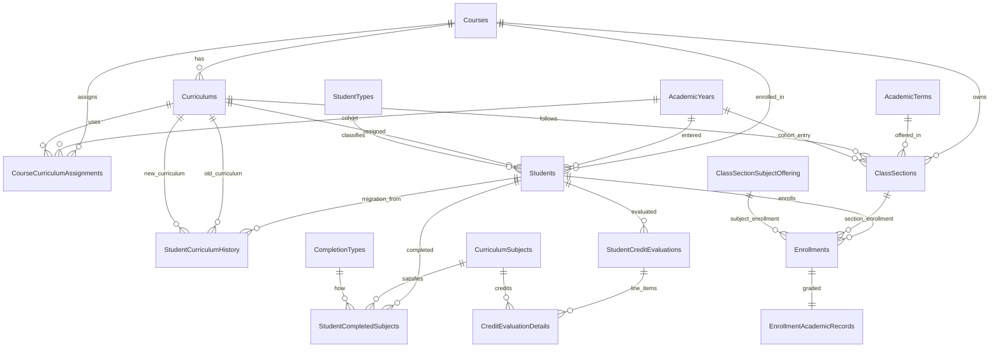
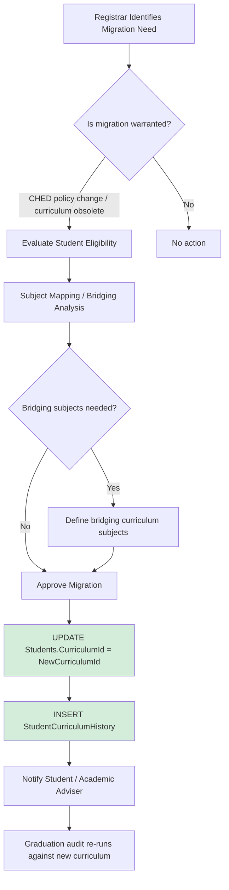
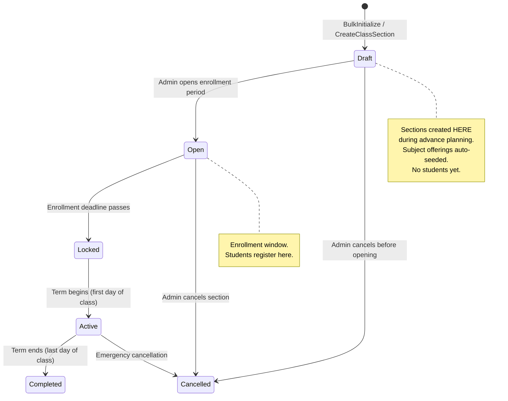

# Enrollify: Curriculum Architecture Gap Analysis & Schema Change Report

**Date:** 2026-05-23  
**Scope:** `research/enrollment-curriculum-architecture-specification.md` vs. `Enrollify.DatabaseMigration/Scripts/` (Scripts 0001–0015)  
**Analysis covers:** 34 existing tables, 15 C# aggregates, EF Core config layer, Application CQRS layer

---

## Executive Summary

The Enrollify backend has a **well-architected curriculum foundation** — the core tables (`Curriculums`, `CourseCurriculumAssignments`, `ClassSections`, `Students`, `Enrollments`) are correctly designed for cohort-based curriculum assignment and already encode the most important principle from the spec: `Students.CurriculumId` is stored explicitly, not derived from year level.

However, three categories of work remain before the system can fully support all nine features:

1. **Two runtime-breaking schema mismatches in `ClassSections`** — EF Core will throw `Invalid column name` exceptions immediately because the DB has `AcademicYearId`/`IntendedYearLevel` while the C# domain model expects `AcademicTermId`/`YearLevel`.
2. **Missing tables for curriculum migration audit and graduation audit** — `StudentCurriculumHistory`, `StudentCompletedSubjects`, `StudentCreditEvaluations` are fully designed in spec/plans but have no migration scripts or domain models.
3. **Entire Phase 2 (Student + Enrollment) domain layer is blank** — The DB tables exist but no `StudentAggregate`, `EnrollmentAggregate`, or repository infrastructure has been built.

Creating class sections in advance is **correct, intended, and fully supported** by the existing `Draft → Open → Locked → Active → Completed` lifecycle — sections should always be created as `Draft` during the planning phase.

---

## Table of Contents

1. [Current Schema Overview](#1-current-schema-overview)
2. [Critical: Breaking Schema Mismatches](#2-critical-breaking-schema-mismatches)
3. [Feature Gap Analysis](#3-feature-gap-analysis)
   - 3.1 Curriculum Versioning
   - 3.2 Cohort-Based Curriculum Assignment
   - 3.3 Irregular Students
   - 3.4 Delayed Students
   - 3.5 Returnees
   - 3.6 Curriculum Migration
   - 3.7 Graduation Audit
   - 3.8 Historical Data Integrity
   - 3.9 Registrar Operations
4. [Class Section Creation: Advance vs. On-Demand](#4-class-section-creation-advance-vs-on-demand)
5. [Required Migration Scripts](#5-required-migration-scripts)
6. [Required Domain Model Changes](#6-required-domain-model-changes)
7. [Required Permission Scope Additions](#7-required-permission-scope-additions)
8. [Consolidated Gap Summary](#8-consolidated-gap-summary)
9. [Architecture Diagrams](#9-architecture-diagrams)
10. [Confidence Assessment](#10-confidence-assessment)

---

## 1. Current Schema Overview

### 34 Tables Across 16 Scripts

| Script | Tables Created |
|--------|---------------|
| 0000 | Snapshot isolation config |
| 0001 | `ScriptVersion` (migration tracking) |
| 0002 | `Users`, `Roles`, `UserRolesAssignments`, `PermissionScopes`, `RolePermissions` |
| 0003 | `RoomTypes` |
| 0004 | `Colleges` |
| 0005 | `Buildings` |
| 0006 | `Rooms` |
| 0007 | `Departments` |
| 0008 | `Courses` |
| 0009 | `CurriculumStatuses` (lookup), `Curriculums` |
| 0010 | `Subjects`, `SubjectEquivalenceGroups`, `SubjectEquivalences` |
| 0011 | `CurriculumSubjects`, `CurriculumSubjectPrerequisites` |
| 0012 | `Teachers`, `TeacherSubjects` |
| 0013 | `AcademicYears`, `AcademicTerms` |
| 0014 | `CourseCurriculumAssignments` |
| 0015 | `ClassSectionStatuses`, `ClassSections`, `ClassSectionSubjectOffering`, `ClassSchedules`, `StudentStatuses`, `Students`, `EnrollmentStatuses`, `Enrollments`, `EnrollmentAcademicRecords`, `EnrollmentPayments` |

### Universal Patterns (Correctly Applied Throughout)

- **Soft-delete everywhere:** Every domain table has `IsActive BIT DEFAULT 1`, `DeletedAt`, `DeletedBy` — hard deletes are never used.[^1]
- **Filtered unique indexes:** Uniqueness is enforced `WHERE IsActive = 1`, preserving historical duplicate-key records as soft-deleted rows.[^2]
- **3-level unit overrides:** `Subjects.Units` → `CurriculumSubjects.SubjectUnitsOverride` → `ClassSectionSubjectOffering.SubjectUnitsOverride`.[^3]
- **Composite FK integrity:** `Curriculums(Id, CourseId)` unique constraint is the anchor for composite FKs from `CourseCurriculumAssignments` and `ClassSections` — guarantees at the DB level that a curriculum belongs to the same course as the assignment.[^4]
- **Cohort-centric design:** `EntryAcademicYearId` appears on `CourseCurriculumAssignments`, `ClassSections`, and `Students` as the cohort key.[^5]

---

## 2. Critical: Breaking Schema Mismatches

These are **runtime-breaking issues** — EF Core will throw `SqlException: Invalid column name` the moment any ClassSection is read or written.

### 2.1 `ClassSections.AcademicYearId` ≠ `ClassSection.AcademicTermId`

The SQL migration was written when sections were keyed to an academic year. The codebase subsequently evolved (per `plans/bulk-initialize-class-sections.md`) to key sections to a specific academic **term** for finer granularity.

| Layer | Column/Property | FK Target |
|-------|-----------------|-----------|
| **DB (Script0015:14)** | `AcademicYearId INT NOT NULL` | `AcademicYears(Id)` |
| **C# Domain (ClassSection.cs:39)** | `AcademicTermId AcademicTermId` | `AcademicTerms` |
| **EF Core Config (ClassSectionConfiguration.cs:31-34)** | `HasForeignKey(e => e.AcademicTermId)` | looks for column `AcademicTermId` |

EF Core queries for column `AcademicTermId` — that column does not exist.[^6]

### 2.2 `ClassSections.IntendedYearLevel` ≠ `ClassSection.YearLevel`

| Layer | Column/Property |
|-------|----------------|
| **DB (Script0015:15)** | `IntendedYearLevel INT NOT NULL` |
| **C# Domain (ClassSection.cs:31)** | `YearLevel YearLevel { get; }` |
| **EF Core Config (ClassSectionConfiguration.cs:19)** | `builder.Property(e => e.YearLevel).IsRequired()` — no `HasColumnName` override |

EF Core maps property `YearLevel` → column `YearLevel`. The DB column is `IntendedYearLevel` — second breaking mismatch.[^7]

### 2.3 `ClassSections.EntryAcademicYearId` Has No Domain Model Representation

The DB has `EntryAcademicYearId INT NOT NULL` with a dedicated FK and index[^8], but the C# `ClassSection` aggregate has no corresponding property. The spec explicitly calls this out as a recommended column for cohort tracking.[^9] This is not breaking but the cohort data is **silently inaccessible** through the aggregate.

**Fix required:** Script0016 (column renames + FK swap) — see [Section 5](#5-required-migration-scripts).

---

## 3. Feature Gap Analysis

### 3.1 Curriculum Versioning

**Status: ✅ Implemented**

The `Curriculums` table fully supports versioning via `EffectiveYear`, `Version`, and `StatusId`.[^10]

- `CurriculumStatuses` lookup: `Draft(1) → Active(2) → PhaseOut(3) → Archived(4)`
- `UNIQUE (Id, CourseId)` constraint on `Curriculums` enables composite FK references[^11]
- `UIdx_Curriculums_Course_Version_IsActive` ensures only one active version per `(CourseId, Version)` pair[^12]
- `CurriculumSubjects` and `CurriculumSubjectPrerequisites` are fully curriculum-scoped — the same subject can have different prerequisites in different curriculum versions[^13]
- `ApproveCurriculum` command fires `CurriculumApprovedEvent`, which triggers auto-sync of `CourseCurriculumAssignments`[^14]

**No changes needed for this feature.**

---

### 3.2 Cohort-Based Curriculum Assignment

**Status: ✅ Implemented**

The `CourseCurriculumAssignments` table locks a curriculum to a cohort defined by `(CourseId, EntryAcademicYearId)`.[^15]

- Filtered unique index: `UNIQUE (CourseId, EntryAcademicYearId) WHERE IsActive = 1` — only one active curriculum assignment per cohort[^16]
- Composite FK: `(CurriculumId, CourseId) → Curriculums(Id, CourseId)` — DB-level curriculum-course consistency[^17]
- Auto-sync: `SyncCourseCurriculumAssignmentsForAcademicYear` and `SyncCourseCurriculumAssignmentsForCurrentAcademicYear` commands keep assignments current[^18]
- `IApplicableCurriculumQueryService` resolves the most applicable active curriculum per course for a given AY start year using a SQL window function (`ROW_NUMBER() OVER (PARTITION BY CourseId ORDER BY EffectiveYear DESC)`)[^19]
- `Students.CurriculumId` and `Students.EntryAcademicYearId` are stored explicitly — cohort curriculum is the student's authoritative curriculum[^20]

**Minor gap:** `PermissionScopeEnum` has no scope for `CourseCurriculumAssignments` — the sync commands run via events but manual registrar management of assignments is currently un-permissioned. See [Section 7](#7-required-permission-scope-additions).

---

### 3.3 Irregular Students

**Status: ⚠️ Schema ready, Application layer missing**

The enrollment model already handles irregular students by design: `Enrollments.ClassSectionId` is `INT NULL`.[^21]

The SQL comment documents the intent explicitly:
```sql
-- Regular students - auto-selects Section-based offerings
-- Irregular students - Manual selection of ANY open subject offerings
```

**What works:**
- Schema correctly allows enrollment without a section
- `Enrollments` table links to `ClassSectionSubjectOffering` directly (students can cross-enroll into any open offering)

**What's missing:**
- **No `StudentTypeId`/`StudentClassification` column on `Students`** — there is no way to *mark* a student as irregular. The only flags are `Status` (Active/LOA/etc.) which tracks academic standing, not student type.[^22]
- **No `StudentAggregate` in Core** — the entire domain model for students has not been built[^23]
- **No enrollment application feature** — no `EnrollStudent` command, no enrollment validation[^24]

**Required changes:**
- Add `StudentTypeId INT NOT NULL DEFAULT 1` column to `Students` referencing a new `StudentTypes` lookup table (Regular, Irregular, Returning, Transferee, Shifter)
- Build `StudentAggregate` with appropriate domain methods
- Build `Enrollments` application feature with irregular enrollment flow

---

### 3.4 Delayed Students

**Status: ⚠️ Architecturally correct, no classification**

The spec's core principle — that `Students.CurriculumId` and `Students.EntryAcademicYearId` are stored explicitly rather than derived from year level — **correctly solves** the delayed student problem.[^25]

The spec documents the failure scenario:

> A delayed student in Year 2 for two consecutive AYs would have dynamic derivation (`CurrentAY - (YearLevel - 1)`) resolve an incorrect cohort. Explicit `EntryAcademicYearId` and `CurriculumId` are immune to this.[^26]

**What works:**
- The schema stores explicit `EntryAcademicYearId` and `CurriculumId` on students — delays do not corrupt curriculum assignment
- `YearLevel` on `Students` is display/grouping metadata only

**What's missing:**
- **No StudentType classification** — delayed students look the same as regular students in the schema; there is no flag to track that a student is "delayed" vs. progressing normally
- **No `StudentAggregate`** to contain domain rules about year level progression
- **No year-level promotion logic** — there is no command to advance a student's `YearLevel` at the end of each term

**Required changes:**
- `StudentTypeId` with value `Delayed` (or derive it via a computed view/flag based on expected vs. actual progression)
- Year-level progression commands in the `Student` aggregate

---

### 3.5 Returnees

**Status: ⚠️ Status exists, workflow missing**

`StudentStatusEnum.LOA` (Leave of Absence, value=3) is a first-class status in the system, seeded to the `StudentStatuses` table.[^27] This is the correct state for a student who has stopped attending.

**What works:**
- `LOA` status correctly models students who are temporarily absent
- `Students.CurriculumId` is preserved during LOA (the spec mandates this — curriculum does not change during absence[^28])
- Credit evaluation plan (`plans/transferee-credit-evaluation-design.md`) proposes `EvaluationType: 'RETURNEE'` on a `StudentCreditEvaluations` table for returnees who need subject bridging

**What's missing:**
- **No re-enrollment workflow** — there is no command to transition a student from `LOA` back to `Active`
- **No returnee curriculum evaluation** — the `StudentCreditEvaluations` and `CreditEvaluationDetails` tables do not exist yet[^29]
- **No `StudentCurriculumHistory`** — if a registrar decides to migrate a returnee to a newer curriculum, this change cannot be audited[^30]

**Required changes (beyond Student/Enrollment foundation):**
- Script0019: `StudentCreditEvaluations` + `CreditEvaluationDetails` tables (see Section 5)
- `MigrateCurriculum` command with `StudentCurriculumHistory` insertion
- Re-enrollment (`ReturnFromLOA`) command on the `Student` aggregate

---

### 3.6 Curriculum Migration

**Status: ❌ Designed only, not implemented**

The spec dedicates an entire section to this: curriculum migration must be **explicit, registrar-controlled, auditable, and historically traceable**.[^31]

> "Curriculum migration must NEVER occur automatically solely because a new curriculum exists."[^32]

**What works:**
- `Students.CurriculumId` is the correct place to record the student's current curriculum — changing this is the migration operation
- `Curriculums.StatusId` supports `PhaseOut` and `Archived` lifecycle states

**What's missing:**
- **`StudentCurriculumHistory` table does not exist** — no migration audit trail[^33]
- **No `MigrateCurriculum` application command** — no registrar-controlled migration workflow
- **No subject equivalency mapping** during migration (the spec recommends `SubjectEquivalenceTables` but the existing `SubjectEquivalenceGroups` covers only cross-curriculum equivalence, not migration bridging subjects)

**Required changes:**
- Script0018: Create `StudentCurriculumHistory` table (detailed SQL in [Section 5](#5-required-migration-scripts))
- New `StudentCurriculumHistoryAggregate` in Core
- `MigrateStudentCurriculum` command with `ApprovedBy` (registrar), `OldCurriculumId`, `NewCurriculumId`, `EffectiveAcademicYearId`

---

### 3.7 Graduation Audit

**Status: ❌ Designed only, not implemented**

The spec's Rule 4 states: *"Graduation audits must always use the student's assigned curriculum."*[^34]

The graduation audit flow requires:
```
Students.CurriculumId
  → CurriculumSubjects (all subjects required by that curriculum)
  → StudentCompletedSubjects (what the student has completed or been credited for)
  → Gap analysis: remaining deficiencies
  → Eligibility: zero deficiencies AND all passing grades
```

**What works:**
- `StudentStatusEnum.Graduated` (value=4) is defined and seeded[^35]
- `CurriculumSubjects` table correctly maps all required subjects per curriculum per year/term
- `Enrollments` + `EnrollmentAcademicRecords` capture grades per enrollment

**What's missing:**
- **`StudentCompletedSubjects` table does not exist** — cannot consolidate completion across enrolled subjects, transfer credits, and validation exams[^36]
- **No graduation audit query** — no command/query to compute a student's completion status against their curriculum
- **No graduation promotion handler** — no command to transition `Students.StatusId = Graduated` after passing audit

**Required changes:**
- Script0020: Create `StudentCompletedSubjects` table (see Section 5)
- `GraduationAuditQuery` — compute deficiencies for a student vs. their curriculum
- `ApproveGraduation` command — transitions `Students.StatusId` to `Graduated`, records audit result

---

### 3.8 Historical Data Integrity

**Status: ✅ Foundation complete, enforcement gaps exist**

The `IAuditable` marker interface is applied universally to every entity in the system.[^37] The spec's 5 rules are matched by the existing design:

| Rule | Status | Evidence |
|------|--------|----------|
| **Rule 1:** Curriculum changes must be auditable | ⚠️ Partial | `IAuditable` covers field-level audit; `StudentCurriculumHistory` for migration audit is missing |
| **Rule 2:** Soft deletion for assignment records | ✅ Complete | Universal `IsActive BIT DEFAULT 1` + filtered unique indexes[^38] |
| **Rule 3:** Historical records never physically deleted | ✅ Complete | Soft-delete pattern is universal; even seed re-runs soft-delete before MERGE[^39] |
| **Rule 4:** Graduation audits use `Students.CurriculumId` | ⚠️ Partial | Column exists; graduation audit feature is absent |
| **Rule 5:** Registrar controlled override capability | ⚠️ Partial | `Registrar` role exists in `RolesEnum`; no override commands implemented yet |

**What's missing:**
- `StudentCurriculumHistory` for migration audit (Rule 1 gap)
- Registrar override commands for enrollment capacity, prerequisite bypass, grade correction (Rule 5 gap)
- `US-031` system audit logs (full before/after snapshots) — user story defined, Phase 5 item

---

### 3.9 Registrar Operations

**Status: ⚠️ RBAC defined, operations not implemented**

`RolesEnum.Registrar` exists with corresponding permission scopes. `US-019` (grades), `US-015` (student status), `US-018` (enrollment overrides) are all defined user stories.

| Operation | Current Status | Blocking Dependency |
|-----------|---------------|---------------------|
| Student admission | ❌ Not implemented | `StudentAggregate` missing |
| Student status management (LOA, Graduated, etc.) | ❌ Not implemented | `StudentAggregate` missing |
| Grade lock/unlock windows | ❌ Not implemented | `EnrollmentAggregate` missing |
| Grade override with audit | ❌ Not implemented | `EnrollmentAcademicRecord` aggregate missing |
| Enrollment capacity override | ❌ Not implemented | Enrollment feature missing |
| Prerequisite bypass | ❌ Not implemented | Enrollment feature missing |
| Curriculum migration approval | ❌ Not implemented | `StudentCurriculumHistory` + migration command missing |
| Credit evaluation approval (transferees) | ❌ Not implemented | `StudentCreditEvaluations` table missing |

**Required changes:**
All of the above operations require the student and enrollment domain foundation to be built first. The RBAC infrastructure is ready — new `PermissionScopes` just need to be added (see Section 7).

---

## 4. Class Section Creation: Advance vs. On-Demand

### ✅ Creating Class Sections in Advance is Correct and Intended

The `ClassSectionStatusEnum` defines a 6-step lifecycle that was explicitly designed for advance creation:[^40]

```
Draft (1) → Open (2) → Locked (3) → Active (4) → Completed (5)
                                                 ↘ Cancelled (6)
```

| Status | Meaning | When |
|--------|---------|------|
| **Draft** | Incomplete — offerings/rooms/schedules not yet assigned | Advance planning phase (weeks/months before term) |
| **Open** | Fully configured, accepting enrollments | Enrollment period opens |
| **Locked** | Enrollment closed, term imminent | After enrollment deadline |
| **Active** | Term in progress | First day of class |
| **Completed** | Term ended, grades being finalized | After last day of class |
| **Cancelled** | Section removed (low enrolment, room issue) | Any pre-Active stage |

**Every new section defaults to `Draft` by code:**[^41]
```csharp
// ClassSection.cs:27
StatusId = ClassSectionStatusEnum.Draft;
```

**The `BulkInitializeClassSectionsForAcademicYear` command** is explicitly designed for advance creation — it creates all sections for all courses for a given term in one operation, without requiring adviser assignments or final schedules.[^42] This is the correct registrar workflow: bulk-create sections in `Draft` early in the academic planning cycle, then progressively configure them (room, teacher, schedules) before opening to enrollment.

### Why Advance Creation is the Industry-Standard Pattern

1. **Enrollment planning requires known sections** — students need to see available sections before the enrollment period opens
2. **Room and teacher scheduling happens before enrollment** — conflicts are resolved during the `Draft → Open` transition
3. **Curriculum subject auto-seeding** — the `CreateClassSection` command auto-creates `ClassSectionSubjectOffering` records for all curriculum subjects at section creation time[^43]; this seeding must happen before enrollment
4. **Capacity management** — `MaxNumberOfStudents` per offering must be set before enrollment opens

### Current Implementation Gap

While the lifecycle is designed, **no status transition methods exist on the `ClassSection` aggregate yet**.[^44] The `StatusId` is set in the constructor but no `Open()`, `Lock()`, `Activate()`, `Complete()`, `Cancel()` methods have been implemented. This is the next required development step — a `TransitionClassSectionStatus` command is needed.

---

## 5. Required Migration Scripts

These scripts must be created in sequence after `Script0015`.

---

### Script0016 — Fix `ClassSections` Column Mismatches (BREAKING — Build Blocker)

**File:** `Script0016__ClassSections_ColumnFixes.sql`

```sql
-- ============================================================
-- Script0016: Fix ClassSections schema to match C# domain model
-- Problem: AcademicYearId → AcademicTermId, IntendedYearLevel → YearLevel
-- ============================================================

-- Step 1: Drop stale FK on AcademicYearId
ALTER TABLE ClassSections DROP CONSTRAINT FK_ClassSections_AcademicYear;
GO

-- Step 2: Drop stale index on AcademicYearId (if named index exists)
IF EXISTS (SELECT 1 FROM sys.indexes WHERE name = 'IX_ClassSections_AcademicYearId' 
           AND object_id = OBJECT_ID('ClassSections'))
    DROP INDEX IX_ClassSections_AcademicYearId ON ClassSections;
GO

-- Step 3: Rename AcademicYearId → AcademicTermId
EXEC sp_rename 'ClassSections.AcademicYearId', 'AcademicTermId', 'COLUMN';
GO

-- Step 4: Add new FK pointing to AcademicTerms (not AcademicYears)
ALTER TABLE ClassSections
    ADD CONSTRAINT FK_ClassSections_AcademicTerm
    FOREIGN KEY (AcademicTermId) REFERENCES AcademicTerms(Id);
GO

-- Step 5: Add new index on AcademicTermId
CREATE NONCLUSTERED INDEX IX_ClassSections_AcademicTermId
    ON ClassSections(AcademicTermId);
GO

-- Step 6: Drop stale CHECK on IntendedYearLevel
ALTER TABLE ClassSections DROP CONSTRAINT CHK_ClassSections_IntendedYearLevel_Valid;
GO

-- Step 7: Rename IntendedYearLevel → YearLevel
EXEC sp_rename 'ClassSections.IntendedYearLevel', 'YearLevel', 'COLUMN';
GO

-- Step 8: Re-add CHECK constraint with new column name
ALTER TABLE ClassSections
    ADD CONSTRAINT CHK_ClassSections_YearLevel_Valid
    CHECK (YearLevel BETWEEN 1 AND 6);
GO
```

**Blocked by:** None — can run independently.  
**Unblocks:** All EF Core ClassSection CRUD operations.

---

### Script0017 — Fix `Students` Missing FK Constraints

**File:** `Script0017__Students_FK_Fixes.sql`

```sql
-- ============================================================
-- Script0017: Add missing FK constraints on Students table
-- ============================================================

-- Fix 1: Add missing FK on EntryAcademicYearId (column exists, FK was never added)
ALTER TABLE Students
    ADD CONSTRAINT FK_Students_EntryAcademicYear
    FOREIGN KEY (EntryAcademicYearId) REFERENCES AcademicYears(Id);
GO

-- Fix 2: Upgrade CurriculumId from simple FK to composite FK
-- (Guarantees at DB level that curriculum belongs to student's enrolled course)
ALTER TABLE Students DROP CONSTRAINT FK_Students_Curriculum;
GO

ALTER TABLE Students
    ADD CONSTRAINT FK_Students_Curriculum
    FOREIGN KEY (CurriculumId, CourseId) REFERENCES Curriculums(Id, CourseId);
GO
```

**Blocked by:** None (`UQ_Curriculums_Id_CourseId` composite unique key already exists since Script0009).  
**Unblocks:** DB-level curriculum-course integrity for students (matches `CourseCurriculumAssignments` and `ClassSections`).

---

### Script0018 — Add `StudentTypes` Lookup + `Students.StudentTypeId` Column

**File:** `Script0018__StudentTypes.sql`

This script introduces the student classification concept needed for irregular, delayed, returnee, transferee, and shifter workflows.

```sql
-- ============================================================
-- Script0018: StudentTypes lookup table + Students.StudentTypeId
-- ============================================================

CREATE TABLE StudentTypes
(
    Id          INT NOT NULL PRIMARY KEY,
    Code        VARCHAR(20) NOT NULL,
    Name        VARCHAR(50) NOT NULL,
    Description VARCHAR(255) NULL,
    DisplayOrder INT DEFAULT 0,
    IsActive    BIT NOT NULL DEFAULT 1,
    CreatedAt   DATETIMEOFFSET DEFAULT SYSDATETIMEOFFSET(),
    CreatedBy   INT NOT NULL,
    CONSTRAINT UQ_StudentTypes_Code UNIQUE (Code),
    CONSTRAINT FK_StudentTypes_CreatedBy FOREIGN KEY (CreatedBy) REFERENCES Users(Id)
);
GO

-- Seed standard student type values
INSERT INTO StudentTypes (Id, Code, Name, Description, DisplayOrder, CreatedBy)
VALUES
    (1, 'REGULAR',    'Regular',    'Standard first-year admission; follows cohort curriculum',      1, 1),
    (2, 'IRREGULAR',  'Irregular',  'Not following standard year-term progression; enrolls per subject', 2, 1),
    (3, 'TRANSFEREE', 'Transferee', 'Transferred from another institution; subject crediting required',  3, 1),
    (4, 'SHIFTER',    'Shifter',    'Changed degree program within same institution',                 4, 1),
    (5, 'RETURNEE',   'Returnee',   'Returned after Leave of Absence; may require curriculum bridging', 5, 1),
    (6, 'CROSS_ENROLLEE', 'Cross-Enrollee', 'Enrolled from another institution for specific subjects', 6, 1);
GO

-- Add StudentTypeId column to Students (defaults to Regular)
ALTER TABLE Students
    ADD StudentTypeId INT NOT NULL DEFAULT 1;
GO

ALTER TABLE Students
    ADD CONSTRAINT FK_Students_StudentType
    FOREIGN KEY (StudentTypeId) REFERENCES StudentTypes(Id);
GO

CREATE NONCLUSTERED INDEX IX_Students_StudentTypeId
    ON Students(StudentTypeId);
GO
```

---

### Script0019 — `StudentCurriculumHistory` Table (Curriculum Migration Audit)

**File:** `Script0019__StudentCurriculumHistory.sql`

This is the most critical missing table from the architecture spec.[^45]

```sql
-- ============================================================
-- Script0019: StudentCurriculumHistory — Curriculum migration audit trail
-- Required by: enrollment-curriculum-architecture-specification.md Section 8
-- ============================================================

CREATE TABLE StudentCurriculumHistory
(
    Id                      INT NOT NULL IDENTITY(1,1) PRIMARY KEY,
    StudentId               INT NOT NULL,
    OldCurriculumId         INT NOT NULL,
    NewCurriculumId         INT NOT NULL,
    EffectiveAcademicYearId INT NOT NULL,    -- The AY from which the new curriculum applies
    Remarks                 VARCHAR(500) NULL,
    ApprovedBy              INT NOT NULL,    -- Must be a Registrar or Admin user

    CreatedAt   DATETIMEOFFSET DEFAULT SYSDATETIMEOFFSET(),
    CreatedBy   INT NOT NULL,
    UpdatedAt   DATETIMEOFFSET NULL,
    UpdatedBy   INT NULL,
    DeletedAt   DATETIMEOFFSET NULL,
    DeletedBy   INT NULL,
    IsActive    BIT NOT NULL DEFAULT 1,

    CONSTRAINT FK_StudentCurriculumHistory_Student
        FOREIGN KEY (StudentId) REFERENCES Students(Id),
    CONSTRAINT FK_StudentCurriculumHistory_OldCurriculum
        FOREIGN KEY (OldCurriculumId) REFERENCES Curriculums(Id),
    CONSTRAINT FK_StudentCurriculumHistory_NewCurriculum
        FOREIGN KEY (NewCurriculumId) REFERENCES Curriculums(Id),
    CONSTRAINT FK_StudentCurriculumHistory_EffectiveYear
        FOREIGN KEY (EffectiveAcademicYearId) REFERENCES AcademicYears(Id),
    CONSTRAINT FK_StudentCurriculumHistory_ApprovedBy
        FOREIGN KEY (ApprovedBy) REFERENCES Users(Id),
    CONSTRAINT FK_StudentCurriculumHistory_CreatedBy
        FOREIGN KEY (CreatedBy) REFERENCES Users(Id),
    CONSTRAINT FK_StudentCurriculumHistory_UpdatedBy
        FOREIGN KEY (UpdatedBy) REFERENCES Users(Id),
    CONSTRAINT FK_StudentCurriculumHistory_DeletedBy
        FOREIGN KEY (DeletedBy) REFERENCES Users(Id),
    CONSTRAINT CHK_StudentCurriculumHistory_NoDuplicateCurriculum
        CHECK (OldCurriculumId <> NewCurriculumId)
);
GO

CREATE NONCLUSTERED INDEX IX_StudentCurriculumHistory_StudentId
    ON StudentCurriculumHistory(StudentId);
GO

CREATE NONCLUSTERED INDEX IX_StudentCurriculumHistory_EffectiveAcademicYearId
    ON StudentCurriculumHistory(EffectiveAcademicYearId);
GO
```

---

### Script0020 — `StudentCompletedSubjects` Table (Graduation Audit Source)

**File:** `Script0020__StudentCompletedSubjects.sql`

This table consolidates all subject completions — whether through enrollment, transfer credit, or validation exam — into a single queryable source for graduation audit.[^46]

```sql
-- ============================================================
-- Script0020: StudentCompletedSubjects
-- Source table for graduation audit queries
-- CompletionType tracks HOW the subject was completed
-- ============================================================

CREATE TABLE CompletionTypes
(
    Id   INT NOT NULL PRIMARY KEY,
    Code VARCHAR(30) NOT NULL,
    Name VARCHAR(50) NOT NULL,
    CONSTRAINT UQ_CompletionTypes_Code UNIQUE (Code)
);
GO

INSERT INTO CompletionTypes (Id, Code, Name) VALUES
    (1, 'ENROLLED',         'Enrolled'),
    (2, 'TRANSFER_CREDIT',  'Transfer Credit'),
    (3, 'SHIFT_CREDIT',     'Shift Credit'),
    (4, 'VALIDATION_EXAM',  'Validation Exam');
GO

CREATE TABLE StudentCompletedSubjects
(
    Id                          INT NOT NULL IDENTITY(1,1) PRIMARY KEY,
    StudentId                   INT NOT NULL,
    CurriculumSubjectId         INT NOT NULL,   -- FK → CurriculumSubjects(Id): which curriculum slot this satisfies
    CompletionTypeId            INT NOT NULL,   -- FK → CompletionTypes(Id)
    SourceEnrollmentId          INT NULL,       -- FK → Enrollments(Id): populated when CompletionType = ENROLLED
    SourceCreditEvaluationDetailId INT NULL,    -- FK → CreditEvaluationDetails(Id): populated for transfer/shift credits
    Grade                       DECIMAL(5,2) NULL,
    CompletedAt                 DATETIMEOFFSET NULL,

    IsActive    BIT NOT NULL DEFAULT 1,
    CreatedAt   DATETIMEOFFSET DEFAULT SYSDATETIMEOFFSET(),
    CreatedBy   INT NOT NULL,
    UpdatedAt   DATETIMEOFFSET NULL,
    UpdatedBy   INT NULL,
    DeletedAt   DATETIMEOFFSET NULL,
    DeletedBy   INT NULL,

    CONSTRAINT FK_StudentCompletedSubjects_Student
        FOREIGN KEY (StudentId) REFERENCES Students(Id),
    CONSTRAINT FK_StudentCompletedSubjects_CurriculumSubject
        FOREIGN KEY (CurriculumSubjectId) REFERENCES CurriculumSubjects(Id),
    CONSTRAINT FK_StudentCompletedSubjects_CompletionType
        FOREIGN KEY (CompletionTypeId) REFERENCES CompletionTypes(Id),
    CONSTRAINT FK_StudentCompletedSubjects_Enrollment
        FOREIGN KEY (SourceEnrollmentId) REFERENCES Enrollments(Id),
    CONSTRAINT FK_StudentCompletedSubjects_CreatedBy
        FOREIGN KEY (CreatedBy) REFERENCES Users(Id),
    CONSTRAINT FK_StudentCompletedSubjects_UpdatedBy
        FOREIGN KEY (UpdatedBy) REFERENCES Users(Id),
    CONSTRAINT FK_StudentCompletedSubjects_DeletedBy
        FOREIGN KEY (DeletedBy) REFERENCES Users(Id),
    -- A student can only complete each curriculum subject slot once (active)
    CONSTRAINT UIdx_StudentCompletedSubjects_Active
        UNIQUE (StudentId, CurriculumSubjectId) -- consider filtered WHERE IsActive = 1 if allowing replacements
);
GO

CREATE NONCLUSTERED INDEX IX_StudentCompletedSubjects_StudentId
    ON StudentCompletedSubjects(StudentId);
GO

CREATE NONCLUSTERED INDEX IX_StudentCompletedSubjects_CurriculumSubjectId
    ON StudentCompletedSubjects(CurriculumSubjectId);
GO
```

---

### Script0021 — `StudentCreditEvaluations` (Transferee/Returnee/Shifter)

**File:** `Script0021__StudentCreditEvaluations.sql`

From `plans/transferee-credit-evaluation-design.md`.[^47]

```sql
-- ============================================================
-- Script0021: Credit evaluation for transferees, shifters, returnees
-- ============================================================

CREATE TABLE CreditEvaluationStatuses
(
    Id   INT NOT NULL PRIMARY KEY,
    Code VARCHAR(20) NOT NULL,
    Name VARCHAR(50) NOT NULL,
    CONSTRAINT UQ_CreditEvaluationStatuses_Code UNIQUE (Code)
);
GO

INSERT INTO CreditEvaluationStatuses (Id, Code, Name) VALUES
    (1, 'PENDING_REVIEW',   'Pending Review'),
    (2, 'UNDER_EVALUATION', 'Under Evaluation'),
    (3, 'PENDING_APPROVAL', 'Pending Approval'),
    (4, 'APPROVED',         'Approved'),
    (5, 'REJECTED',         'Rejected');
GO

CREATE TABLE StudentCreditEvaluations
(
    Id                  INT NOT NULL IDENTITY(1,1) PRIMARY KEY,
    StudentId           INT NOT NULL,
    EvaluationType      VARCHAR(20) NOT NULL, -- 'TRANSFEREE' | 'SHIFTER' | 'RETURNEE'
    AcademicYearId      INT NOT NULL,         -- AY being evaluated for
    StatusId            INT NOT NULL DEFAULT 1,
    EvaluatedBy         INT NULL,             -- FK → Users(Id)
    ApprovedBy          INT NULL,             -- FK → Users(Id)
    Remarks             VARCHAR(500) NULL,

    IsActive    BIT NOT NULL DEFAULT 1,
    CreatedAt   DATETIMEOFFSET DEFAULT SYSDATETIMEOFFSET(),
    CreatedBy   INT NOT NULL,
    UpdatedAt   DATETIMEOFFSET NULL,
    UpdatedBy   INT NULL,
    DeletedAt   DATETIMEOFFSET NULL,
    DeletedBy   INT NULL,

    CONSTRAINT FK_StudentCreditEvaluations_Student
        FOREIGN KEY (StudentId) REFERENCES Students(Id),
    CONSTRAINT FK_StudentCreditEvaluations_AcademicYear
        FOREIGN KEY (AcademicYearId) REFERENCES AcademicYears(Id),
    CONSTRAINT FK_StudentCreditEvaluations_Status
        FOREIGN KEY (StatusId) REFERENCES CreditEvaluationStatuses(Id),
    CONSTRAINT FK_StudentCreditEvaluations_EvaluatedBy
        FOREIGN KEY (EvaluatedBy) REFERENCES Users(Id),
    CONSTRAINT FK_StudentCreditEvaluations_ApprovedBy
        FOREIGN KEY (ApprovedBy) REFERENCES Users(Id),
    CONSTRAINT FK_StudentCreditEvaluations_CreatedBy
        FOREIGN KEY (CreatedBy) REFERENCES Users(Id),
    CONSTRAINT CHK_StudentCreditEvaluations_EvaluationType
        CHECK (EvaluationType IN ('TRANSFEREE', 'SHIFTER', 'RETURNEE'))
);
GO

CREATE TABLE CreditEvaluationDetails
(
    Id                          INT NOT NULL IDENTITY(1,1) PRIMARY KEY,
    StudentCreditEvaluationId   INT NOT NULL,
    CurriculumSubjectId         INT NOT NULL,    -- The curriculum slot being credited
    ExternalSubjectName         VARCHAR(100) NULL, -- From external institution (transferee)
    ExternalSubjectUnits        DECIMAL(3,1) NULL,
    ExternalInstitution         VARCHAR(200) NULL,
    Grade                       DECIMAL(5,2) NULL,
    IsApproved                  BIT NOT NULL DEFAULT 0,
    Remarks                     VARCHAR(255) NULL,

    IsActive    BIT NOT NULL DEFAULT 1,
    CreatedAt   DATETIMEOFFSET DEFAULT SYSDATETIMEOFFSET(),
    CreatedBy   INT NOT NULL,
    UpdatedAt   DATETIMEOFFSET NULL,
    UpdatedBy   INT NULL,

    CONSTRAINT FK_CreditEvaluationDetails_Evaluation
        FOREIGN KEY (StudentCreditEvaluationId) REFERENCES StudentCreditEvaluations(Id),
    CONSTRAINT FK_CreditEvaluationDetails_CurriculumSubject
        FOREIGN KEY (CurriculumSubjectId) REFERENCES CurriculumSubjects(Id),
    CONSTRAINT FK_CreditEvaluationDetails_CreatedBy
        FOREIGN KEY (CreatedBy) REFERENCES Users(Id)
);
GO
```

---

### Script0022 — Add `EntryAcademicYearId` to `ClassSection` Domain Model

No new SQL table needed — this is already in the DB. The domain model needs to expose this column. The only schema change is ensuring the existing `EntryAcademicYearId` column is surfaced in EF Core (currently it's an unmapped shadow property).[^48]

This is a **domain model and EF config change only** (see Section 6).

---

## 6. Required Domain Model Changes

### Priority 1 — Fix `ClassSection` Aggregate (BREAKING)

**Files to change:**
- `Enrollify.Core/Aggregates/ClassSectionAggregate/ClassSection.cs`
- `Enrollify.Core/Aggregates/ClassSectionAggregate/Models/ClassSectionForCreation.cs`
- `Enrollify.Infrastructure/Data/Config/AggregateConfigs/ClassSectionConfigs/ClassSectionConfiguration.cs`

**Changes:**

1. Add `EntryAcademicYearId` property (already in DB, just missing in C#):
```csharp
public AcademicYearId EntryAcademicYearId { get; private set; }
public AcademicYear? EntryAcademicYear { get; private set; }
```

2. Add status transition methods (enable lifecycle management):
```csharp
public Result Open()  // Draft → Open
public Result Lock()  // Open → Locked
public Result Activate()  // Locked → Active
public Result Complete()  // Active → Completed
public Result Cancel()    // Any pre-Active → Cancelled
```

3. Update EF config to add `EntryAcademicYear` relationship and ensure `HasColumnName` overrides match DB.

---

### Priority 2 — Create `StudentAggregate` (All Student Features Blocked On This)

**Files to create:**
```
Enrollify.Core/Aggregates/StudentAggregate/
  Student.cs
  StudentId.cs                  (Vogen [ValueObject<int>])
  StudentNumber.cs              (Vogen [ValueObject<string>])
  StudentEmail.cs               (Vogen [ValueObject<string>])
  Models/StudentForCreation.cs
  Models/StudentForAdmission.cs

Enrollify.Infrastructure/Data/Config/AggregateConfigs/StudentConfigs/
  StudentConfiguration.cs
  StudentVogenEfCoreConverters.cs
```

**Minimum `Student.cs` structure** (maps to existing `Students` table in Script0015):
```csharp
public class Student : EntityBase<Student, StudentId>, IAggregateRoot, IAuditable
{
    public StudentNumber StudentNumber { get; private set; }    // VARCHAR(13) NOT NULL
    public string FirstName { get; private set; }
    public string LastName { get; private set; }
    public StudentEmail Email { get; private set; }
    public CourseId CourseId { get; private set; }
    public Course? Course { get; private set; }
    public CurriculumId CurriculumId { get; private set; }      // The authoritative curriculum
    public Curriculum? Curriculum { get; private set; }
    public AcademicYearId EntryAcademicYearId { get; private set; }  // Cohort key
    public AcademicYear? EntryAcademicYear { get; private set; }
    public YearLevel YearLevel { get; private set; }            // Display metadata only
    public StudentStatusEnum StatusId { get; private set; }     // Active/LOA/Graduated...
    public int StudentTypeId { get; private set; }              // Regular/Irregular/Returnee...

    // Domain methods
    public Result AssignCurriculum(CurriculumId newCurriculumId, UserId approvedBy);
    public Result PromoteYearLevel();
    public Result SetStatus(StudentStatusEnum newStatus);
    public Result ReturnFromLOA();
}
```

Also add `DbSet<Student>` to `EnrollifyDbContext`.

---

### Priority 3 — Create `EnrollmentAggregate` + Related Aggregates

Required for the entire enrollment module (US-018 through US-019):

```
Enrollify.Core/Aggregates/EnrollmentAggregate/
  Enrollment.cs
  EnrollmentId.cs

Enrollify.Core/Aggregates/EnrollmentAcademicRecordAggregate/
  EnrollmentAcademicRecord.cs
  EnrollmentAcademicRecordId.cs
```

Note: The `Enrollments.ClassSectionId` **must remain nullable** to support irregular student enrollment.[^49]

---

### Priority 4 — Create `StudentCurriculumHistory` Aggregate

```csharp
// Enrollify.Core/Aggregates/StudentAggregate/StudentCurriculumHistory.cs
public class StudentCurriculumHistory : EntityBase<StudentCurriculumHistory, StudentCurriculumHistoryId>, IAuditable
{
    public StudentId StudentId { get; private set; }
    public CurriculumId OldCurriculumId { get; private set; }
    public CurriculumId NewCurriculumId { get; private set; }
    public AcademicYearId EffectiveAcademicYearId { get; private set; }
    public string? Remarks { get; private set; }
    public UserId ApprovedBy { get; private set; }
}
```

---

## 7. Required Permission Scope Additions

**File:** `Enrollify.Core/Constants/Authorization/PermissionScopeEnum.cs`

Current last value is `ClassSections = 14`. Add:

```csharp
public static readonly PermissionScopeEnum ClassSectionSubjectOfferings  = new("ClassSectionSubjectOfferings", 15);
public static readonly PermissionScopeEnum Students                      = new("Students",                     16);
public static readonly PermissionScopeEnum Enrollments                   = new("Enrollments",                  17);
public static readonly PermissionScopeEnum GraduationAudit               = new("GraduationAudit",              18);
public static readonly PermissionScopeEnum CurriculumMigration           = new("CurriculumMigration",          19);
public static readonly PermissionScopeEnum CourseCurriculumAssignments   = new("CourseCurriculumAssignments",  20);
public static readonly PermissionScopeEnum CreditEvaluations             = new("CreditEvaluations",            21);
```

> ⚠️ **Critical:** The permission scope enum comment notes: *"This enum must be kept in sync with `AuthorizationScope.ts` in the client application."*[^50] Add corresponding values to the frontend TypeScript enum after updating the C# enum.

Also add a new seed: `Seed0010__NewPermissionScopes.cs` to seed these into the `PermissionScopes` table and grant `SuperAdmin` full permissions.

---

## 8. Consolidated Gap Summary

### Schema Changes Required

| Script | Type | Severity | Purpose |
|--------|------|----------|---------|
| **Script0016** | Column rename + FK swap | 🔴 BREAKING | Fix `ClassSections.AcademicYearId→AcademicTermId` and `IntendedYearLevel→YearLevel` |
| **Script0017** | ADD CONSTRAINT | 🟡 High | Add missing FK on `Students.EntryAcademicYearId`; upgrade simple→composite FK on `Students.CurriculumId` |
| **Script0018** | NEW TABLE + ALTER TABLE | 🟠 Medium | `StudentTypes` lookup + `Students.StudentTypeId` column |
| **Script0019** | NEW TABLE | 🟠 High | `StudentCurriculumHistory` — curriculum migration audit log |
| **Script0020** | NEW TABLE | 🟠 High | `StudentCompletedSubjects` — graduation audit source |
| **Script0021** | NEW TABLES | 🟠 Medium | `StudentCreditEvaluations` + `CreditEvaluationDetails` — transferee/returnee/shifter |

### Domain Model Changes Required

| Component | Priority | Status |
|-----------|----------|--------|
| `ClassSection` — add `EntryAcademicYearId` + status transition methods | 🔴 Critical | Not built |
| `StudentAggregate` — complete aggregate with all properties | 🔴 Critical | Not built |
| `EnrollmentAggregate` — complete aggregate | 🔴 Critical | Not built |
| `EnrollmentAcademicRecord` aggregate | 🟡 High | Not built |
| `EnrollmentPayment` aggregate | 🟡 High | Not built |
| `StudentCurriculumHistory` aggregate | 🟠 Medium | Not built |
| `StudentCreditEvaluation` aggregate | 🟠 Medium | Not built |

### Application Layer Changes Required

| Feature | Blocked By |
|---------|-----------|
| Student CRUD (US-015, US-016) | `StudentAggregate` + `IStudentRepository` |
| `MigrateStudentCurriculum` command | `StudentAggregate` + `StudentCurriculumHistory` |
| `EnrollStudent` command (regular + irregular) | `EnrollmentAggregate` |
| `TransitionClassSectionStatus` command | Domain status methods |
| `GraduationAuditQuery` | `StudentCompletedSubjects` table |
| `ApproveGraduation` command | `GraduationAuditQuery` |
| `EvaluateCreditForReturnee/Transferee/Shifter` | `StudentCreditEvaluations` aggregate |

---

## 9. Architecture Diagrams

### Complete Target Entity Relationship Diagram



### Curriculum Migration Workflow



### Class Section Lifecycle (Correct Advance Creation Flow)



---

## 10. Confidence Assessment

| Finding | Confidence | Basis |
|---------|-----------|-------|
| `ClassSections.AcademicYearId` vs `AcademicTermId` breaking mismatch | 🟢 Very High | Direct inspection of `Script0015__InitialCoreTables.sql:14`, `ClassSection.cs:39`, `ClassSectionConfiguration.cs:31-34` |
| `ClassSections.IntendedYearLevel` vs `YearLevel` breaking mismatch | 🟢 Very High | Direct inspection of `Script0015__InitialCoreTables.sql:15`, `ClassSection.cs:31`, `ClassSectionConfiguration.cs:19` |
| `StudentAggregate` completely missing from Core | 🟢 Very High | Directory listing of `Enrollify.Core/Aggregates/` — no `StudentAggregate/` folder |
| `EnrollmentAggregate` completely missing | 🟢 Very High | `Enrollify.Application/Features/` directory listing — no `Enrollments/` folder |
| `StudentCurriculumHistory` table missing | 🟢 Very High | All 16 migration scripts read; no such table found |
| Advance class section creation is correct/intended | 🟢 Very High | `ClassSection.cs:27` (`StatusId = Draft`), `ClassSectionStatusEnum` descriptions, bulk-initialize design |
| `Students.EntryAcademicYearId` missing FK constraint | 🟢 Very High | `Script0015__InitialCoreTables.sql:198` — column present, FK absent (all other FKs are declared) |
| `Students.CurriculumId` needs composite FK | 🟡 High | Confirmed `Script0015:211`; composite FK pattern confirmed on `CourseCurriculumAssignments` and `ClassSections` as the established pattern |
| `StudentCreditEvaluations` table structure | 🟡 High | `plans/transferee-credit-evaluation-design.md` — detailed design doc, not yet scripted |
| `StudentCompletedSubjects` graduation audit approach | 🟡 Medium | Design inferred from `research/enrollment-curriculum-architecture-specification.md` + transferee plan; exact column structure is a recommendation |

---

## Footnotes

[^1]: `Script0015__InitialCoreTables.sql:6` — universal `IsActive BIT NOT NULL DEFAULT 1` + `DeletedAt/DeletedBy` pattern
[^2]: `Script0002__UsersTables.sql`, `Script0006__Rooms.sql` — filtered unique index pattern: `WHERE IsActive = 1`
[^3]: `Script0010__Subjects.sql:Units`, `Script0011__CurriculumSubjects.sql:SubjectUnitsOverride`, `Script0015__InitialCoreTables.sql:ClassSectionSubjectOffering.SubjectUnitsOverride`
[^4]: `Script0009__Curriculums.sql:39` — `CONSTRAINT UQ_Curriculums_Id_CourseId UNIQUE (Id, CourseId)`
[^5]: `Script0014__CourseCurriculumAssignment.sql`, `Script0015__InitialCoreTables.sql:ClassSections.EntryAcademicYearId`, `Script0015__InitialCoreTables.sql:Students.EntryAcademicYearId`
[^6]: `ClassSection.cs:39-40` — `public AcademicTermId AcademicTermId { get; private set; }`; `Script0015__InitialCoreTables.sql:14` — `AcademicYearId INT NOT NULL`
[^7]: `Script0015__InitialCoreTables.sql:15` — `IntendedYearLevel INT NOT NULL`; `ClassSectionConfiguration.cs:19` — `builder.Property(e => e.YearLevel).IsRequired()` with no `HasColumnName`
[^8]: `Script0015__InitialCoreTables.sql:31,46` — `CONSTRAINT FK_ClassSections_EntryAcademicYear` and `IX_ClassSections_EntryAcademicYearId`
[^9]: `research/enrollment-curriculum-architecture-specification.md:228` — `EntryAcademicYearId | Intended cohort` in ClassSections recommended columns
[^10]: `Script0009__Curriculums.sql:9-42` — `Curriculums` table with `EffectiveYear`, `Version`, `StatusId`
[^11]: `Script0009__Curriculums.sql:39` — `CONSTRAINT UQ_Curriculums_Id_CourseId UNIQUE (Id, CourseId)`
[^12]: `Script0009__Curriculums.sql` — `UIdx_Curriculums_Course_Version_IsActive`
[^13]: `Script0011__CurriculumSubjects.sql:CurriculumSubjectPrerequisites` — composite PK `(CurriculumSubjectId, PrerequisiteCurriculumSubjectId)`; `CurriculumSubjectPrerequisite.cs:10-61`
[^14]: `Enrollify.Application/Features/Curriculums/EventHandlers/CurriculumApprovedEventSyncCourseCurriculumAssignmentsHandler.cs`
[^15]: `Script0014__CourseCurriculumAssignment.sql:9-40`
[^16]: `Script0014__CourseCurriculumAssignment.sql` — `UIdx_CourseCurriculumAssignments_Course_Year_IsActive`
[^17]: `Script0014__CourseCurriculumAssignment.sql:24` — `CONSTRAINT FK_CourseCurriculumAssignments_Curriculum FOREIGN KEY (CurriculumId, CourseId) REFERENCES Curriculums(Id, CourseId)`
[^18]: `Enrollify.Application/Features/CourseCurriculumAssignments/Commands/SyncCourseCurriculumAssignmentsForAcademicYear.cs`
[^19]: `Enrollify.Infrastructure/Services/ApplicableCurriculumQueryService.cs:9-59` — `ROW_NUMBER() OVER (PARTITION BY c.CourseId ORDER BY c.EffectiveYear DESC, c.Version DESC, c.ApprovedDate DESC, c.Id DESC)`
[^20]: `Script0015__InitialCoreTables.sql:189-215` — `Students` table: `CourseId`, `CurriculumId`, `EntryAcademicYearId`
[^21]: `Script0015__InitialCoreTables.sql:285` — `ClassSectionId INT NULL`
[^22]: `Script0015__InitialCoreTables.sql:189-215` — `Students` table has no `StudentTypeId` column
[^23]: `Enrollify.Core/Aggregates/` directory listing — no `StudentAggregate/` folder found
[^24]: `Enrollify.Application/Features/` directory listing — no `Enrollments/` folder found
[^25]: `research/enrollment-curriculum-architecture-specification.md:39-70` — "Year Level is NOT Curriculum Identity"
[^26]: `research/enrollment-curriculum-architecture-specification.md:332-352` — Delayed Student failure scenario table
[^27]: `Enrollify.Core/Constants/StudentStatusEnum.cs:8` — `StudentStatusEnum.LOA = new("Leave of Absence", "LOA", "Temporarily not attending", 3)`
[^28]: `research/enrollment-curriculum-architecture-specification.md:25-34` — "Curriculum is Historical"
[^29]: `plans/transferee-credit-evaluation-design.md` — designed but no migration script
[^30]: `research/enrollment-curriculum-architecture-specification.md:413-430` — `StudentCurriculumHistory` recommended structure
[^31]: `research/enrollment-curriculum-architecture-specification.md:385-469` — Curriculum Migration section
[^32]: `research/enrollment-curriculum-architecture-specification.md:393-397` — "Curriculum migration must NEVER occur automatically"
[^33]: All 16 migration scripts inspected; no `StudentCurriculumHistory` table exists
[^34]: `research/enrollment-curriculum-architecture-specification.md:542` — Rule 4
[^35]: `Enrollify.Core/Constants/StudentStatusEnum.cs:13` — `StudentStatusEnum.Graduated`; `Enrollify.DatabaseMigration/Seeds/Seed0006__StudentStatuses.cs`
[^36]: `plans/transferee-credit-evaluation-design.md:256-264` — `StudentCompletedSubjects` proposed structure
[^37]: `Enrollify.Core/IAuditable.cs:1-15` — `CreatedAt/By`, `UpdatedAt/By`, `DeletedAt/By`, `IsActive`
[^38]: `Script0002__UsersTables.sql` — `UIdx_UserRolesAssignments_User_Role_IsActive WHERE IsActive = 1`
[^39]: `Enrollify.DatabaseMigration/Mocks/Dev/MockDev0006__Curriculums.cs:202-213` — soft-delete before MERGE for prerequisite re-seeding
[^40]: `Enrollify.Core/Constants/ClassSectionStatusEnum.cs:1-31`
[^41]: `Enrollify.Core/Aggregates/ClassSectionAggregate/ClassSection.cs:27` — `StatusId = ClassSectionStatusEnum.Draft`
[^42]: `Enrollify.Application/Features/ClassSections/Commands/BulkInitializeClassSectionsForAcademicYear.cs:55-182`
[^43]: `Enrollify.Application/Features/ClassSections/Commands/CreateClassSection.cs:94-103` — auto-creates `ClassSectionSubjectOffering` per curriculum subject
[^44]: `ClassSection.cs:1-110` — no `Open()`, `Lock()`, `Activate()`, `Complete()`, `Cancel()` methods exist
[^45]: `research/enrollment-curriculum-architecture-specification.md:413-430`
[^46]: `plans/transferee-credit-evaluation-design.md:256-264`
[^47]: `plans/transferee-credit-evaluation-design.md:148-265`
[^48]: `ClassSection.cs:1-110` — no `EntryAcademicYearId` property; `Script0015__InitialCoreTables.sql:16` — column exists in DB
[^49]: `Script0015__InitialCoreTables.sql:285` — `ClassSectionId INT NULL` — irregular student support
[^50]: `Enrollify.Core/Constants/Authorization/PermissionScopeEnum.cs` — comment warning about TypeScript sync
