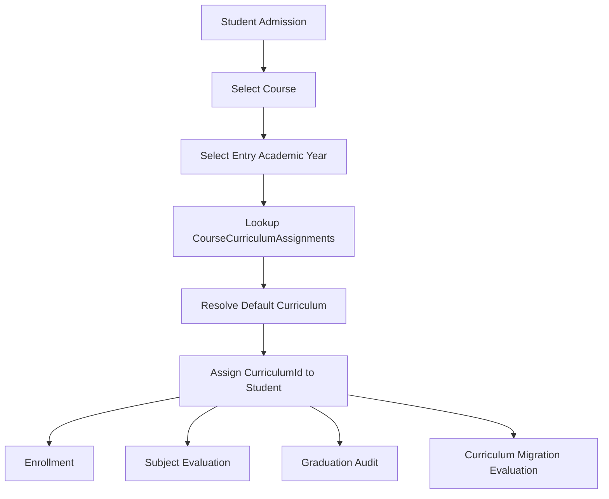
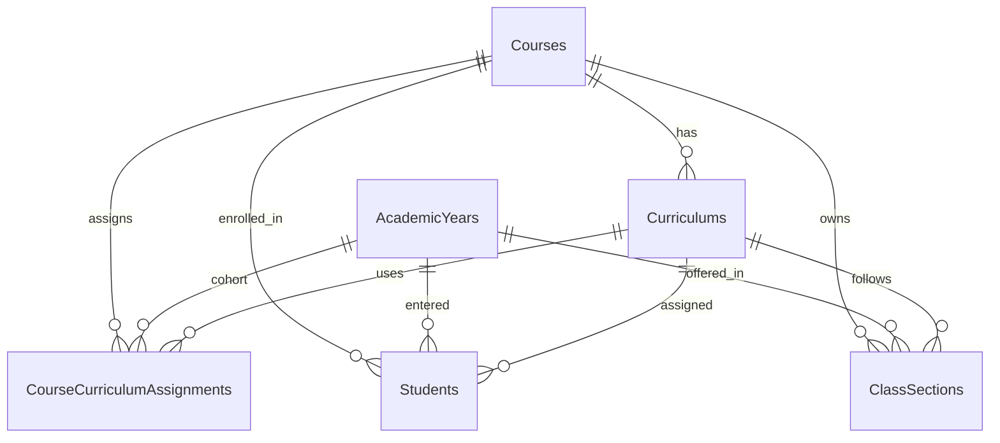
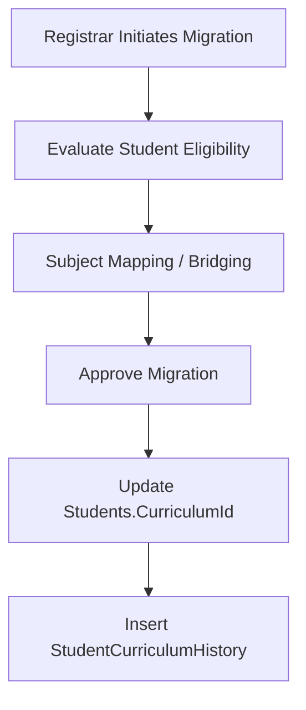

# Enrollment System Curriculum Architecture Specification

## Overview

This specification defines the curriculum assignment and resolution architecture for a university enrollment system.

The design follows a **cohort-based curriculum assignment model** while ensuring that curriculum ownership ultimately belongs to the student record for historical correctness and registrar flexibility.

This architecture is intended to support:

- Curriculum versioning
- Cohort-based curriculum assignment
- Irregular students
- Delayed students
- Returnees
- Curriculum migration
- Graduation audit
- Historical data integrity
- Registrar operations

---

# Core Principles

## 1. Curriculum is Historical

A student's curriculum must remain historically accurate throughout their academic lifecycle.

A curriculum should not automatically change when:

- the curriculum version changes,
- the student becomes delayed,
- the student becomes irregular,
- the student returns after absence.

---

## 2. Year Level is NOT Curriculum Identity

The system must not infer curriculum solely from Year Level.

This assumption is incorrect:

```text
Year Level == Cohort Progression
```

Real-world universities frequently encounter:

- delayed students,
- irregular students,
- shifted students,
- returnees,
- transferees,
- manually migrated students.

Because of this:

```text
Year Level != Cohort
```

Year Level should be treated as:

- display metadata,
- grouping metadata,
- sectioning metadata,
- tuition classification metadata.

It should NOT be the primary determinant of curriculum assignment.

---

## 3. Curriculum Ownership Belongs to the Student

The student's assigned curriculum should be explicitly stored.

This provides:

- deterministic curriculum resolution,
- accurate graduation audits,
- registrar override capability,
- support for curriculum migration,
- historical correctness.

---

# Architectural Overview

## High-Level Flow



---

# Database Design

# Core Tables

## Curriculums

Stores curriculum definitions and versions.

### Purpose

Defines:

- subjects,
- units,
- sequencing,
- prerequisite chains,
- curriculum revisions.

### Example

| Curriculum | Course | Version |
|---|---|---|
| BSCS-2023-X | BSCS | 2023 |
| BSCS-2025-A | BSCS | 2025 |

---

## CourseCurriculumAssignments

Maps a cohort to its default curriculum.

### Purpose

Defines the default curriculum used by incoming students for a given:

- Course
- Entry Academic Year

This table represents institutional curriculum policy.

---

### Table Structure

| Column | Type | Notes |
|---|---|---|
| Id | INT IDENTITY PK | Primary Key |
| CourseId | INT NOT NULL | FK → Courses(Id) |
| EntryAcademicYearId | INT NOT NULL | FK → AcademicYears(Id) |
| CurriculumId | INT NOT NULL | FK → Curriculums(Id) |
| CreatedAt | DATETIMEOFFSET | Default SYSDATETIMEOFFSET() |
| CreatedBy | INT NOT NULL | FK → Users(Id) |
| UpdatedAt | DATETIMEOFFSET NULL | |
| UpdatedBy | INT NULL | FK → Users(Id) |
| DeletedAt | DATETIMEOFFSET NULL | |
| DeletedBy | INT NULL | FK → Users(Id) |
| IsActive | BIT NOT NULL DEFAULT 1 | Soft delete flag |

---

### Constraints

#### Unique Active Assignment

```sql
UNIQUE (CourseId, EntryAcademicYearId)
WHERE IsActive = 1
```

Ensures only one active curriculum assignment exists per cohort.

---

### Required Indexes

| Index | Purpose |
|---|---|
| IX_CourseCurriculumAssignments_CourseId | Lookup by Course |
| IX_CourseCurriculumAssignments_EntryAcademicYearId | Lookup by Academic Year |
| IX_CourseCurriculumAssignments_CurriculumId | Lookup by Curriculum |

---

## Students

Students must explicitly store their assigned curriculum.

### Required Columns

| Column | Purpose |
|---|---|
| CourseId | Current Course |
| EntryAcademicYearId | Original cohort |
| CurriculumId | Assigned curriculum |

---

### Important Design Decision

The student's curriculum becomes authoritative after assignment.

All academic operations must primarily use:

```text
Students.CurriculumId
```

instead of dynamically deriving curriculum from Year Level.

---

## ClassSections

Class sections may optionally store cohort information.

### Recommended Columns

| Column | Purpose |
|---|---|
| CourseId | Associated course |
| AcademicYearId | Current academic year |
| IntendedYearLevel | Intended year level |
| EntryAcademicYearId | Intended cohort |
| CurriculumId | Intended curriculum |

---

# Entity Relationship Diagram



---

# Curriculum Resolution Process

# Admission / Initial Enrollment

## Step 1

Student selects:

- Course
- Entry Academic Year

---

## Step 2

System resolves default curriculum:

```text
(CourseId, EntryAcademicYearId)
→ CourseCurriculumAssignments
→ CurriculumId
```

---

## Step 3

System assigns:

```text
Students.CurriculumId
Students.EntryAcademicYearId
```

---

## Step 4

All succeeding academic operations use:

```text
Students.CurriculumId
```

---

# Enrollment Process

During enrollment:

- subject offerings,
- prerequisite validation,
- curriculum evaluation,
- deficiency checking

must resolve against:

```text
Students.CurriculumId
```

NOT:

```text
Current Year Level
```

---

# Why Dynamic Year-Level Derivation is Unsafe

The following logic is insufficient:

```text
EntryAcademicYear =
CurrentAcademicYear - (YearLevel - 1)
```

Although initially valid for ideal progression, it fails in real-world scenarios.

---

# Failure Scenarios

## Delayed Student

| AY | Status |
|---|---|
| 2025 | Year 1 |
| 2026 | Year 2 |
| 2027 | Failed Subjects |
| 2028 | Still Year 2 |

Dynamic derivation incorrectly resolves a later cohort.

---

## Irregular Student

An irregular student may simultaneously take:

- 1st year subjects,
- 2nd year subjects,
- 3rd year subjects.

Year Level becomes administrative metadata only.

---

## Returnee

A student may stop for several academic years and later return.

The original curriculum often remains applicable unless registrar policy explicitly migrates the student.

---

## Shifted Student

Students shifting programs may:

- receive subject crediting,
- undergo curriculum bridging,
- receive partial curriculum mapping.

Dynamic derivation becomes unreliable.

---

# Curriculum Migration

Curriculum migration is a registrar-controlled process where students are transferred from one curriculum version to another.

This is common when:

- a curriculum becomes obsolete,
- accreditation requirements change,
- CHED policies change,
- major curriculum revisions are introduced.

---

# Important Principle

Curriculum migration must NEVER occur automatically solely because a new curriculum exists.

Migration should be:

- explicit,
- registrar-controlled,
- auditable,
- historically traceable.

---

# Recommended Migration Architecture

## StudentCurriculumHistory

Recommended audit/history table.

### Suggested Structure

| Column | Purpose |
|---|---|
| Id | Primary Key |
| StudentId | Student |
| OldCurriculumId | Previous curriculum |
| NewCurriculumId | Migrated curriculum |
| EffectiveAcademicYearId | Effective migration year |
| Remarks | Migration notes |
| ApprovedBy | Registrar/Admin |
| CreatedAt | Audit timestamp |

---

# Curriculum Migration Workflow



---

# Migration Considerations

Migration may require:

- subject equivalency mapping,
- bridging subjects,
- manual registrar review,
- prerequisite reevaluation,
- deficiency recalculation.

---

# Important Architectural Impact

Because curriculum migration exists, curriculum assignment must be explicitly stored at the student level.

This is one of the strongest reasons why dynamic curriculum derivation is insufficient.

---

# Recommended Validation Rules

# Curriculum-Course Match Validation

The system must ensure:

```text
Curriculum.CourseId == Student.CourseId
```

and:

```text
Curriculum.CourseId == CourseCurriculumAssignments.CourseId
```

---

# Recommended Database Constraint

Instead of validating only:

```sql
FOREIGN KEY (CurriculumId)
REFERENCES Curriculums(Id)
```

prefer:

```sql
UNIQUE (Id, CourseId)
```

on Curriculums.

Then enforce:

```sql
FOREIGN KEY (CurriculumId, CourseId)
REFERENCES Curriculums(Id, CourseId)
```

This guarantees curriculum-course consistency at the database level.

---

# Recommended Operational Rules

## Rule 1

Curriculum changes must be auditable.

---

## Rule 2

Soft deletion should be used for assignment records.

---

## Rule 3

Historical curriculum records must never be physically deleted.

---

## Rule 4

Graduation audits must always use the student's assigned curriculum.

---

## Rule 5

Registrar must have controlled override capability.

---

# Recommended Future Enhancements

## Subject Equivalency Tables

Supports curriculum migration and subject crediting.

---

## Curriculum Effectivity Metadata

Optional fields:

| Column |
|---|
| EffectiveFromAcademicYearId |
| EffectiveToAcademicYearId |

Useful for:

- reporting,
- audits,
- registrar validation.

---

## Student Program History

Useful for:

- shifting,
- double degrees,
- major changes,
- transfer tracking.

---

# Final Architectural Recommendation

The recommended architecture is:

| Responsibility | Owner |
|---|---|
| Curriculum Definition | Curriculums |
| Default Cohort Mapping | CourseCurriculumAssignments |
| Actual Student Curriculum | Students |
| Migration History | StudentCurriculumHistory |

---

# Summary

This architecture provides:

- historical correctness,
- registrar flexibility,
- support for irregular students,
- support for curriculum migration,
- deterministic graduation audit,
- scalable academic operations,
- enterprise-grade curriculum management.

The most important principle is:

```text
Curriculum assignment should be explicit,
not inferred from Year Level.
```
