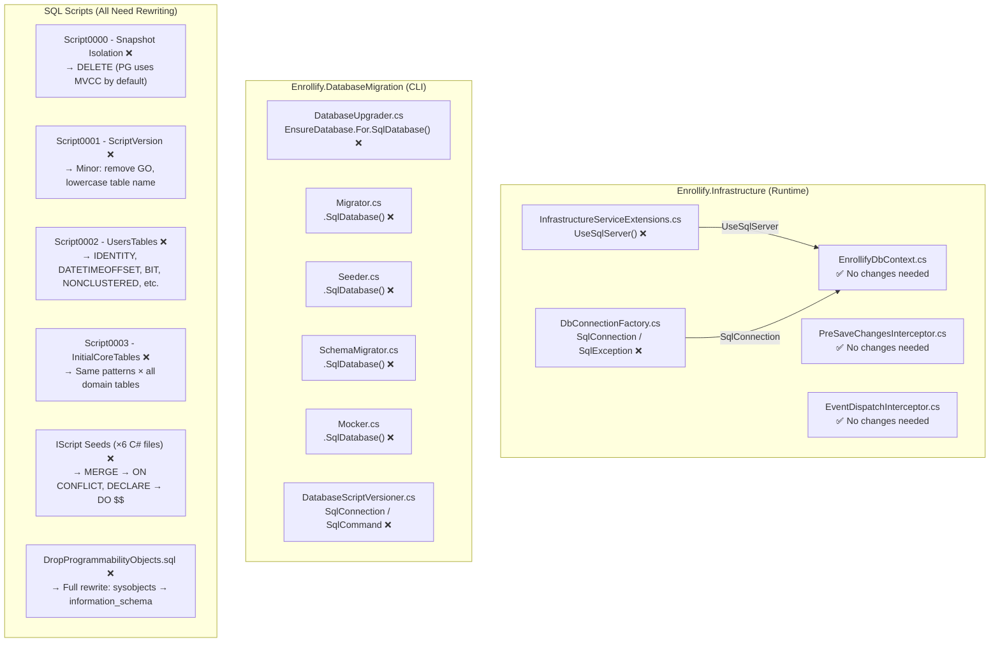

# Enrollify Backend: SQL Server → PostgreSQL Migration Guide

## Executive Summary

The Enrollify backend is **deeply coupled to Microsoft SQL Server** across six distinct layers: the EF Core provider registration, the Dapper connection factory, all four DbUp migration runners, the `DatabaseScriptVersioner` ADO.NET code, all SQL DDL scripts, and all six C# `IScript` seed files. The migration is significant but mechanical — no domain logic changes are required. The primary work involves: swapping three NuGet packages, updating five C# files in `Enrollify.Infrastructure`, updating five C# files in `Enrollify.DatabaseMigration`, and rewriting all SQL scripts to eliminate T-SQL syntax. Both `Ardalis.SmartEnum.EFCore` and `Vogen` are fully provider-agnostic and require **zero changes**.[^1][^2]

---

## Architecture Overview



---

## Confidence Assessment

| Finding | Confidence | Source |
|---|---|---|
| `UseSqlServer()` is the single EF Core registration | High | File read confirmed[^3] |
| `SqlConnectionFactory` is the only Dapper connection factory | High | File read confirmed[^4] |
| All 4 DbUp classes use `.SqlDatabase()` | High | File read confirmed[^5] |
| `DatabaseScriptVersioner` uses `SqlConnection` + T-SQL | High | File read confirmed[^6] |
| Zero `FromSqlRaw` / `ExecuteSqlRaw` usage | High | Exhaustive grep confirmed[^7] |
| Vogen + SmartEnum EFCore are provider-agnostic | High | Source code verified[^8] |
| `Npgsql.EntityFrameworkCore.PostgreSQL 10.0.1` supports EF Core 10 | High | NuGet manifest confirmed[^9] |
| `dbup-postgresql` uses `.PostgresqlDatabase()` API | High | GitHub source confirmed[^10] |
| `NpgsqlException.IsTransient` is built-in (replaces manual error list) | High | Npgsql source confirmed[^11] |
| `DateTimeOffset` offset is not preserved in `TIMESTAMPTZ` | High | PostgreSQL + Npgsql docs[^12] |

---

## Phase 1: NuGet Package Replacements

### `Enrollify.Infrastructure.csproj`

```xml
<!-- REMOVE -->
<PackageReference Include="Microsoft.EntityFrameworkCore.SqlServer" Version="10.0.5" />

<!-- ADD -->
<PackageReference Include="Npgsql.EntityFrameworkCore.PostgreSQL" Version="10.0.1" />
<PackageReference Include="Npgsql" Version="10.0.2" />
```

> **Note:** `Microsoft.Data.SqlClient` is an implicit transitive dependency of `Microsoft.EntityFrameworkCore.SqlServer`. After removing that package, add `Npgsql` explicitly for the Dapper connection factory.[^13]

### `Enrollify.DatabaseMigration.csproj`

```xml
<!-- REMOVE -->
<PackageReference Include="dbup-sqlserver" Version="7.2.0" />

<!-- ADD -->
<PackageReference Include="dbup-postgresql" Version="6.2.3" />
```

---

## Phase 2: C# File Changes — `Enrollify.Infrastructure`

### 2.1 `Data/DbConnectionFactory.cs` — Full Rewrite

**File:** `Enrollify.Infrastructure/Data/DbConnectionFactory.cs`[^4]

Replace the entire file:

```csharp
using Npgsql;
using Polly;

namespace Enrollify.Infrastructure.Data;

public interface IDbConnectionFactory
{
    NpgsqlConnection Create();
    NpgsqlConnection CreateOpen();
    Task<NpgsqlConnection> CreateOpenAsync(CancellationToken ct = default);
}

public sealed class NpgsqlConnectionFactory : IDbConnectionFactory
{
    private readonly string _connectionString;
    private readonly AsyncPolicy _retryPolicy;

    public NpgsqlConnectionFactory(string connectionString)
    {
        var builder = new NpgsqlConnectionStringBuilder(connectionString);
        if (builder.Timeout < 30)
        {
            builder.Timeout = 30;
        }
        _connectionString = builder.ConnectionString;

        _retryPolicy = Policy
            .Handle<NpgsqlException>(IsTransient)
            .Or<TimeoutException>()
            .WaitAndRetryAsync(
                retryCount: 3,
                sleepDurationProvider: attempt => TimeSpan.FromMilliseconds(500 * Math.Pow(2, attempt - 1)));
    }

    public NpgsqlConnection Create() => new NpgsqlConnection(_connectionString);

    public NpgsqlConnection CreateOpen()
    {
        var conn = new NpgsqlConnection(_connectionString);
        conn.Open();
        return conn;
    }

    public async Task<NpgsqlConnection> CreateOpenAsync(CancellationToken ct = default)
    {
        ct.ThrowIfCancellationRequested();
        NpgsqlConnection? conn = null;
        try
        {
            return await _retryPolicy.ExecuteAsync(async () =>
            {
                ct.ThrowIfCancellationRequested();
                if (conn != null) await conn.DisposeAsync().ConfigureAwait(false);
                conn = new NpgsqlConnection(_connectionString);
                using var timeoutCts = new CancellationTokenSource(TimeSpan.FromSeconds(30));
                using var linkedCts = CancellationTokenSource.CreateLinkedTokenSource(ct, timeoutCts.Token);
                try
                {
                    await conn.OpenAsync(linkedCts.Token).ConfigureAwait(false);
                    return conn;
                }
                catch (OperationCanceledException) when (ct.IsCancellationRequested) { throw; }
                catch (OperationCanceledException) when (timeoutCts.IsCancellationRequested)
                { throw new TimeoutException("Connection timeout while opening database connection"); }
            }).ConfigureAwait(false);
        }
        catch (Exception) when (conn != null)
        {
            await conn.DisposeAsync().ConfigureAwait(false);
            throw;
        }
    }

    // Npgsql 6+ has a built-in IsTransient property that covers all retryable states.
    // This replaces the 16 hard-coded SQL Server error numbers.
    private static bool IsTransient(NpgsqlException ex) => ex.IsTransient;
}
```

**Key changes:**
- `using Microsoft.Data.SqlClient` → `using Npgsql`
- `SqlConnection` → `NpgsqlConnection`
- `SqlConnectionStringBuilder` → `NpgsqlConnectionStringBuilder`
- `builder.ConnectTimeout` → `builder.Timeout` (Npgsql property name)
- `SqlException` → `NpgsqlException`
- Entire `IsTransient(SqlException ex)` method with 16 SQL Server error numbers → single line `return ex.IsTransient`[^11]

### 2.2 `InfrastructureServiceExtensions.cs` — Two Line Changes

**File:** `Enrollify.Infrastructure/InfrastructureServiceExtensions.cs`[^3]

```csharp
// Line 46 — CHANGE:
// Before:
services.AddTransient<IDbConnectionFactory>(sp =>
    new SqlConnectionFactory(connectionString));
// After:
services.AddTransient<IDbConnectionFactory>(sp =>
    new NpgsqlConnectionFactory(connectionString));

// Line 67 — CHANGE:
// Before:
options.UseSqlServer(connectionString);
// After:
options.UseNpgsql(connectionString, npgsqlOptions =>
{
    // Optional: use Npgsql's built-in retry resilience pipeline instead of Polly at the EF level
    npgsqlOptions.EnableRetryOnFailure(
        maxRetryCount: 3,
        maxRetryDelay: TimeSpan.FromSeconds(5),
        errorCodesToAdd: null);
});
```

> **Note:** The connection string priority chain (`"cleanarchitecture"` → `"DefaultConnection"` → `"SqliteConnection"`) can have `"SqliteConnection"` removed — it was a misleading entry since `UseSqlServer` was always called regardless.[^3]

### 2.3 No Changes Required

These files are fully provider-agnostic and require **zero modifications**:[^14]

- `Data/PreSaveChangesInterceptor.cs` — Pure EF Core `SaveChangesInterceptor`
- `Data/EventDispatchInterceptor.cs` — Pure EF Core domain event dispatcher
- `Data/EnrollifyDbContext.cs` — All entity configs, Vogen converters, SmartEnum, soft-delete filters
- `Data/Config/AggregateConfigs/**` — All 13 aggregate `IEntityTypeConfiguration<T>` files
- All `Repositories/**` — Pure EF Core LINQ via `Ardalis.Specification`

> **`UseIdentityColumn()`**: All 11 entity configs that call `UseIdentityColumn()` translate correctly with Npgsql's EF Core provider to `GENERATED ALWAYS AS IDENTITY`. The 2 configs using `ValueGeneratedOnAdd()` (`CollegeConfiguration`, `RoomConfiguration`) are already provider-agnostic.[^15]

> **`HasColumnType("decimal(3,2)")`**: The one occurrence in `CurriculumConfiguration.cs:151` using a raw SQL type string is compatible — PostgreSQL accepts `decimal(3,2)` as a synonym for `NUMERIC(3,2)`.[^15]

---

## Phase 3: C# File Changes — `Enrollify.DatabaseMigration`

### 3.1 `DatabaseUpgrader.cs` — One Line Change

**File:** `Enrollify.DatabaseMigration/DatabaseUpgrader.cs`[^16]

```csharp
// Add using:
using DbUp.Postgresql;  // (if required by dbup-postgresql package)

// Line 15 — CHANGE:
// Before:
EnsureDatabase.For.SqlDatabase(connectionString);
// After:
EnsureDatabase.For.PostgresqlDatabase(connectionString);
```

### 3.2 `Migrator.cs`, `Seeder.cs`, `SchemaMigrator.cs`, `Mocker.cs` — One Line Change Each

**All four files** follow the same pattern — replace one method call:[^5]

```csharp
// In ALL FOUR files, on the DeployChanges.To builder:
// Before:
.SqlDatabase(connectionString)
// After:
.PostgresqlDatabase(connectionString)
```

Full context for each file:

| File | Line to change | Other changes |
|------|---------------|---------------|
| `Migrator.cs` | `.SqlDatabase()` → `.PostgresqlDatabase()` | None |
| `Seeder.cs` | `.SqlDatabase()` → `.PostgresqlDatabase()` | None |
| `SchemaMigrator.cs` | `.SqlDatabase()` → `.PostgresqlDatabase()` | None |
| `Mocker.cs` | `.SqlDatabase()` → `.PostgresqlDatabase()` | None |

### 3.3 `DatabaseScriptVersioner.cs` — Full Rewrite

**File:** `Enrollify.DatabaseMigration/DatabaseScriptVersioner.cs`[^6]

Replace the entire class body (keep the `HashScriptResources()` method unchanged — it is provider-agnostic):

```csharp
// REMOVE:
using Microsoft.Data.SqlClient;
// ADD:
using Npgsql;
```

Replace `GetCurrentScriptVersionHash()`:

```csharp
private string? GetCurrentScriptVersionHash()
{
    var currentHash = string.Empty;
    try
    {
        // NpgsqlConnectionStringBuilder uses "Timeout" (not "ConnectTimeout")
        using var connection = new NpgsqlConnection(
            new NpgsqlConnectionStringBuilder(_connectionString)
            {
                Timeout = 1  // Fail fast
            }.ConnectionString);

        connection.Open();

        // PostgreSQL: use information_schema instead of T-SQL IF OBJECT_ID()
        using var command = new NpgsqlCommand(@"
SELECT CASE
    WHEN EXISTS (
        SELECT 1 FROM information_schema.tables
        WHERE table_name = 'scriptversion'
        AND table_schema = 'public'
    )
    THEN (SELECT hash FROM scriptversion LIMIT 1)
    ELSE ''
END AS hash;
", connection);

        var result = command.ExecuteScalar();
        currentHash = result?.ToString() ?? string.Empty;
    }
    catch (Exception ex)
    {
        Console.ForegroundColor = ConsoleColor.Red;
        Console.WriteLine("Failed to retrieve script version hash");
        Console.WriteLine(ex.Message);
        Console.ResetColor();
    }
    return currentHash;
}
```

Replace `UpdateScriptVersion()`:

```csharp
public void UpdateScriptVersion()
{
    using var connection = new NpgsqlConnection(_connectionString);
    connection.Open();

    try
    {
        using var command = new NpgsqlCommand("DELETE FROM scriptversion", connection);
        command.ExecuteNonQuery();
        command.CommandText = $"INSERT INTO scriptversion VALUES ('{_fileSystemVersion}')";
        command.ExecuteNonQuery();
    }
    catch (PostgresException ex) when (IsTableNotFoundScriptVersion(ex))
    {
        using var command = new NpgsqlCommand(
            "CREATE TABLE scriptversion (hash VARCHAR(64) NOT NULL)", connection);
        command.ExecuteNonQuery();
        command.CommandText = $"INSERT INTO scriptversion VALUES ('{_fileSystemVersion}')";
        command.ExecuteNonQuery();
    }
}

// SQL Server error 208 "Invalid object name" → PostgreSQL SQLSTATE "42P01" = "undefined_table"
private bool IsTableNotFoundScriptVersion(PostgresException ex) =>
    ex.SqlState == "42P01" ||
    ex.Message?.Contains("relation \"scriptversion\" does not exist") == true;
```

> **Important:** PostgreSQL uses case-insensitive lowercase identifiers by default. Use `scriptversion` (lowercase) consistently in all raw SQL in this file.[^17]

### 3.4 IScript Seed Files (×6) — Rewrite SQL Strings

All six `IScript` C# seed files generate T-SQL strings using `MERGE`, `DECLARE @var`, `SET IDENTITY_INSERT`, and `dbo.` prefixes. These are the most labor-intensive part of the migration.

**Pattern for all `MERGE` → `INSERT ... ON CONFLICT` rewrites:**

#### `Seed0001__Roles.cs`[^18] — Rewrite `ProvideScript`:

```csharp
public string ProvideScript(Func<IDbCommand> dbCommandFactory)
{
    var scriptBuilder = new StringBuilder();
    
    // Use PL/pgSQL DO block to capture the initial user ID
    scriptBuilder.AppendLine("DO $$");
    scriptBuilder.AppendLine("DECLARE v_initial_user_id INT;");
    scriptBuilder.AppendLine("BEGIN");
    scriptBuilder.AppendLine("  SELECT Id INTO v_initial_user_id FROM Users WHERE Email = 'system@enrollify.local';");
    
    foreach (var role in RolesEnum.List)
    {
        // Use INSERT ... ON CONFLICT for upsert; OVERRIDING SYSTEM VALUE to bypass GENERATED ALWAYS
        scriptBuilder.AppendLine($"""
            INSERT INTO Roles (Id, Name, Description, CreatedBy)
            VALUES ({role.Value}, '{EscapeSql(role.Name)}', '{EscapeSql(role.Description)}', v_initial_user_id)
            OVERRIDING SYSTEM VALUE
            ON CONFLICT (Id) DO UPDATE SET Name = EXCLUDED.Name, Description = EXCLUDED.Description;
            """);
    }
    
    scriptBuilder.AppendLine("END $$;");
    return scriptBuilder.ToString();
}

private static string EscapeSql(string value) => value.Replace("'", "''");
```

#### `Seed0003__PermissionScopes.cs`[^18] — Same pattern:

```csharp
public string ProvideScript(Func<IDbCommand> dbCommandFactory)
{
    var scriptBuilder = new StringBuilder();
    scriptBuilder.AppendLine("DO $$");
    scriptBuilder.AppendLine("DECLARE v_initial_user_id INT;");
    scriptBuilder.AppendLine("BEGIN");
    scriptBuilder.AppendLine("  SELECT Id INTO v_initial_user_id FROM Users WHERE Email = 'system@enrollify.local';");

    foreach (var scope in PermissionScopeEnum.List)
    {
        scriptBuilder.AppendLine($"""
            INSERT INTO PermissionScopes (Id, Name, CreatedBy)
            VALUES ({scope.Value}, '{EscapeSql(scope.Name)}', v_initial_user_id)
            OVERRIDING SYSTEM VALUE
            ON CONFLICT (Id) DO UPDATE SET Name = EXCLUDED.Name;
            """);
    }

    scriptBuilder.AppendLine("END $$;");
    return scriptBuilder.ToString();
}
```

#### `Seed0004__CurriculumStatuses.cs`[^18]:

```csharp
public string ProvideScript(Func<IDbCommand> dbCommandFactory)
{
    var scriptBuilder = new StringBuilder();
    scriptBuilder.AppendLine("DO $$");
    scriptBuilder.AppendLine("BEGIN");

    foreach (var status in CurriculumStatusEnum.List)
    {
        scriptBuilder.AppendLine($"""
            INSERT INTO CurriculumStatuses (Id, Name)
            VALUES ({status.Value}, '{EscapeSql(status.Name)}')
            OVERRIDING SYSTEM VALUE
            ON CONFLICT (Id) DO UPDATE SET Name = EXCLUDED.Name;
            """);
    }

    scriptBuilder.AppendLine("END $$;");
    return scriptBuilder.ToString();
}
```

#### `Seed0005__SuperAdminPermissions.cs`[^18] — Note the pre-existing role name bug (see §6):

```csharp
public string ProvideScript(Func<IDbCommand> dbCommandFactory)
{
    var scriptBuilder = new StringBuilder();
    scriptBuilder.AppendLine("DO $$");
    scriptBuilder.AppendLine("DECLARE v_role_id INT;");
    scriptBuilder.AppendLine("DECLARE v_initial_user_id INT;");
    scriptBuilder.AppendLine("BEGIN");
    // ⚠️ Fix the pre-existing bug: 'SystemAdmin' → 'SuperAdmin'
    scriptBuilder.AppendLine("  SELECT Id INTO v_role_id FROM Roles WHERE Name = 'SuperAdmin';");
    scriptBuilder.AppendLine("  SELECT Id INTO v_initial_user_id FROM Users WHERE Email = 'system@enrollify.local';");

    foreach (var scope in PermissionScopeEnum.List)
    {
        scriptBuilder.AppendLine($"""
            INSERT INTO RolePermissions (RoleId, PermissionScopeId, BitmaskPermission, CreatedBy)
            VALUES (v_role_id, {scope.Value}, {PermissionEnum.Full.Value}, v_initial_user_id)
            ON CONFLICT (RoleId, PermissionScopeId) DO UPDATE SET BitmaskPermission = EXCLUDED.BitmaskPermission;
            """);
    }

    scriptBuilder.AppendLine("END $$;");
    return scriptBuilder.ToString();
}
```

#### `Seed0006_StudentStatuses.cs`[^18]:

```csharp
public string ProvideScript(Func<IDbCommand> dbCommandFactory)
{
    var scriptBuilder = new StringBuilder();
    scriptBuilder.AppendLine("DO $$");
    scriptBuilder.AppendLine("DECLARE v_initial_user_id INT;");
    scriptBuilder.AppendLine("BEGIN");
    scriptBuilder.AppendLine("  SELECT Id INTO v_initial_user_id FROM Users WHERE Email = 'system@enrollify.local';");

    foreach (var status in Core.Constants.StudentStatusEnum.List)
    {
        scriptBuilder.AppendLine($"""
            INSERT INTO StudentStatuses (Id, Code, Name, Description, CreatedBy)
            VALUES ({status.Value}, '{EscapeSql(status.Code)}', '{EscapeSql(status.Name)}', '{EscapeSql(status.Description)}', v_initial_user_id)
            OVERRIDING SYSTEM VALUE
            ON CONFLICT (Id) DO UPDATE SET
                Code = EXCLUDED.Code,
                Name = EXCLUDED.Name,
                Description = EXCLUDED.Description,
                UpdatedBy = v_initial_user_id;
            """);
    }

    scriptBuilder.AppendLine("END $$;");
    return scriptBuilder.ToString();
}
```

---

## Phase 4: SQL Script Rewrites

### 4.1 `Script0000 - Turn on Snapshop trans level.sql` — DELETE

This script exists solely to enable SQL Server's Read Committed Snapshot Isolation (RCSI). **PostgreSQL uses MVCC by default**, which provides equivalent isolation semantics with no configuration needed. **Delete this file** and remove it from the `Enrollify.DatabaseMigration.csproj` embedded resources.[^19]

### 4.2 `Script0001__ScriptVersion.sql` — Minor Edit

**Before:**
```sql
CREATE TABLE ScriptVersion (Hash VARCHAR(64) NOT NULL)
GO;
```

**After:**
```sql
CREATE TABLE IF NOT EXISTS scriptversion (hash VARCHAR(64) NOT NULL);
```

Changes: remove `GO`, add `IF NOT EXISTS`, lowercase table/column names to match PostgreSQL's case-insensitive lowercase default.[^20]

### 4.3 `Script0002__UsersTables.sql` — Full Rewrite

Complete T-SQL → PostgreSQL DDL translation for all tables, indexes, and the system user seed:

```sql
-- ************************************
-- USERS TABLE
-- ************************************
CREATE TABLE Users
(
    Id    INT                NOT NULL GENERATED ALWAYS AS IDENTITY PRIMARY KEY,
    Email VARCHAR(255)       NOT NULL,
    FirstName VARCHAR(50)    NOT NULL,
    LastName VARCHAR(50)     NOT NULL,
    LastLoginAt TIMESTAMPTZ  NULL,

    IsActive  BOOLEAN        NOT NULL DEFAULT TRUE,
    CreatedAt TIMESTAMPTZ    DEFAULT NOW(),
    CreatedBy INT            NOT NULL,
    UpdatedAt TIMESTAMPTZ    NULL,
    UpdatedBy INT            NULL,
    DeletedAt TIMESTAMPTZ    NULL,
    DeletedBy INT            NULL,

    CONSTRAINT UQ_Users_Email UNIQUE (Email),
    CONSTRAINT CHK_Users_Email_NotEmpty    CHECK (LENGTH(TRIM(Email)) > 0),
    CONSTRAINT CHK_Users_FirstName_NotEmpty CHECK (LENGTH(TRIM(FirstName)) > 0),
    CONSTRAINT CHK_Users_LastName_NotEmpty  CHECK (LENGTH(TRIM(LastName)) > 0),
    CONSTRAINT FK_Users_CreatedBy FOREIGN KEY (CreatedBy) REFERENCES Users(Id),
    CONSTRAINT FK_Users_UpdatedBy FOREIGN KEY (UpdatedBy) REFERENCES Users(Id),
    CONSTRAINT FK_Users_DeletedBy FOREIGN KEY (DeletedBy) REFERENCES Users(Id)
);

-- ************************************
-- ROLES TABLE
-- ************************************
CREATE TABLE Roles
(
    Id   INT             NOT NULL GENERATED ALWAYS AS IDENTITY PRIMARY KEY,
    Name VARCHAR(50)     NOT NULL,
    Description TEXT     NOT NULL,

    IsActive  BOOLEAN    NOT NULL DEFAULT TRUE,
    CreatedAt TIMESTAMPTZ DEFAULT NOW(),
    CreatedBy INT        NOT NULL,
    UpdatedAt TIMESTAMPTZ NULL,
    UpdatedBy INT        NULL,
    DeletedAt TIMESTAMPTZ NULL,
    DeletedBy INT        NULL,

    CONSTRAINT UQ_Roles_Name UNIQUE (Name),
    CONSTRAINT CHK_Roles_Name_NotEmpty CHECK (LENGTH(TRIM(Name)) > 0),
    CONSTRAINT FK_Roles_CreatedBy FOREIGN KEY (CreatedBy) REFERENCES Users(Id),
    CONSTRAINT FK_Roles_UpdatedBy FOREIGN KEY (UpdatedBy) REFERENCES Users(Id),
    CONSTRAINT FK_Roles_DeletedBy FOREIGN KEY (DeletedBy) REFERENCES Users(Id)
);

-- ************************************
-- USER-ROLE MAPPING TABLE
-- ************************************
CREATE TABLE UserRolesAssignments
(
    UserId    INT          NOT NULL,
    RoleId    INT          NOT NULL,
    AssignedAt TIMESTAMPTZ DEFAULT NOW(),
    ExpiresAt  TIMESTAMPTZ NULL,

    IsActive  BOOLEAN      NOT NULL DEFAULT TRUE,
    CreatedAt TIMESTAMPTZ  DEFAULT NOW(),
    CreatedBy INT          NOT NULL,
    UpdatedAt TIMESTAMPTZ  NULL,
    UpdatedBy INT          NULL,
    DeletedAt TIMESTAMPTZ  NULL,
    DeletedBy INT          NULL,

    CONSTRAINT PK_UserRoleAssignments PRIMARY KEY (UserId, RoleId),
    CONSTRAINT FK_UserRolesAssignments_User      FOREIGN KEY (UserId)     REFERENCES Users(Id),
    CONSTRAINT FK_UserRolesAssignments_Role      FOREIGN KEY (RoleId)     REFERENCES Roles(Id),
    CONSTRAINT FK_UserRolesAssignments_CreatedBy FOREIGN KEY (CreatedBy)  REFERENCES Users(Id),
    CONSTRAINT FK_UserRolesAssignments_UpdatedBy FOREIGN KEY (UpdatedBy)  REFERENCES Users(Id),
    CONSTRAINT FK_UserRolesAssignments_DeletedBy FOREIGN KEY (DeletedBy)  REFERENCES Users(Id)
);

-- Unique partial index: one active role assignment per user
CREATE UNIQUE INDEX UIdx_UserRolesAssignments_User_Role_IsActive
ON UserRolesAssignments(UserId, RoleId)
WHERE IsActive = TRUE;

CREATE TABLE PermissionScopes
(
    Id   INT          NOT NULL GENERATED ALWAYS AS IDENTITY PRIMARY KEY,
    Name VARCHAR(100) NOT NULL,

    IsActive  BOOLEAN    NOT NULL DEFAULT TRUE,
    CreatedAt TIMESTAMPTZ DEFAULT NOW(),
    CreatedBy INT         NOT NULL,
    UpdatedAt TIMESTAMPTZ NULL,
    UpdatedBy INT         NULL,
    DeletedAt TIMESTAMPTZ NULL,
    DeletedBy INT         NULL,

    CONSTRAINT UQ_PermissionScopes_Name UNIQUE (Name),
    CONSTRAINT CHK_PermissionScopes_Name_NotEmpty CHECK (LENGTH(TRIM(Name)) > 0),
    CONSTRAINT FK_PermissionScopes_CreatedBy FOREIGN KEY (CreatedBy) REFERENCES Users(Id),
    CONSTRAINT FK_PermissionScopes_UpdatedBy FOREIGN KEY (UpdatedBy) REFERENCES Users(Id),
    CONSTRAINT FK_PermissionScopes_DeletedBy FOREIGN KEY (DeletedBy) REFERENCES Users(Id)
);

CREATE TABLE RolePermissions
(
    RoleId            INT NOT NULL,
    PermissionScopeId INT NOT NULL,
    BitmaskPermission INT NOT NULL,

    IsActive  BOOLEAN    NOT NULL DEFAULT TRUE,
    CreatedAt TIMESTAMPTZ DEFAULT NOW(),
    CreatedBy INT         NOT NULL,
    UpdatedAt TIMESTAMPTZ NULL,
    UpdatedBy INT         NULL,
    DeletedAt TIMESTAMPTZ NULL,
    DeletedBy INT         NULL,

    CONSTRAINT PK_RolePermissions PRIMARY KEY (RoleId, PermissionScopeId),
    CONSTRAINT FK_RolePermissions_Role            FOREIGN KEY (RoleId)            REFERENCES Roles(Id),
    CONSTRAINT FK_RolePermissions_PermissionScope FOREIGN KEY (PermissionScopeId) REFERENCES PermissionScopes(Id),
    CONSTRAINT FK_RolePermissions_CreatedBy       FOREIGN KEY (CreatedBy)         REFERENCES Users(Id),
    CONSTRAINT FK_RolePermissions_UpdatedBy       FOREIGN KEY (UpdatedBy)         REFERENCES Users(Id),
    CONSTRAINT FK_RolePermissions_DeletedBy       FOREIGN KEY (DeletedBy)         REFERENCES Users(Id)
);

CREATE UNIQUE INDEX UIdx_RolePermissions_Role_Permission_IsActive
ON RolePermissions(RoleId, PermissionScopeId)
WHERE IsActive = TRUE;

-- Indexes on foreign keys
CREATE INDEX IX_Users_CreatedBy    ON Users(CreatedBy);
CREATE INDEX IX_Users_UpdatedBy    ON Users(UpdatedBy);
CREATE INDEX IX_Users_DeletedBy    ON Users(DeletedBy);

CREATE INDEX IX_Roles_CreatedBy    ON Roles(CreatedBy);
CREATE INDEX IX_Roles_UpdatedBy    ON Roles(UpdatedBy);
CREATE INDEX IX_Roles_DeletedBy    ON Roles(DeletedBy);

CREATE INDEX IX_UserRolesAssignments_UserId     ON UserRolesAssignments(UserId);
CREATE INDEX IX_UserRolesAssignments_RoleId     ON UserRolesAssignments(RoleId);
CREATE INDEX IX_UserRolesAssignments_CreatedBy  ON UserRolesAssignments(CreatedBy);
CREATE INDEX IX_UserRolesAssignments_UpdatedBy  ON UserRolesAssignments(UpdatedBy);
CREATE INDEX IX_UserRolesAssignments_DeletedBy  ON UserRolesAssignments(DeletedBy);

CREATE INDEX IX_RolePermissions_RoleId            ON RolePermissions(RoleId);
CREATE INDEX IX_RolePermissions_BitmaskPermission ON RolePermissions(BitmaskPermission);
CREATE INDEX IX_RolePermissions_CreatedBy         ON RolePermissions(CreatedBy);
CREATE INDEX IX_RolePermissions_UpdatedBy         ON RolePermissions(UpdatedBy);
CREATE INDEX IX_RolePermissions_DeletedBy         ON RolePermissions(DeletedBy);

-- ====================================
-- Seed initial System user
-- PostgreSQL: use session_replication_role to bypass FK + OVERRIDING SYSTEM VALUE to bypass IDENTITY
-- ====================================
SET session_replication_role = replica;

INSERT INTO Users (Id, Email, FirstName, LastName, LastLoginAt, IsActive, CreatedAt, CreatedBy, UpdatedAt, UpdatedBy, DeletedAt, DeletedBy)
OVERRIDING SYSTEM VALUE
VALUES (1, 'system@enrollify.local', 'System', 'Account', NULL, TRUE, NOW(), 1, NULL, NULL, NULL, NULL);

SET session_replication_role = DEFAULT;

INSERT INTO Roles (Name, Description, CreatedBy) VALUES
('SuperAdmin', 'Full system access with all permissions', 1);
```

### 4.4 `Script0003__InitialCoreTables.sql` — Apply Same Patterns

Apply the same DDL pattern across all remaining domain tables. The full 34KB file is not reproduced here but every occurrence follows these replacements:[^21]

| T-SQL | PostgreSQL Replacement |
|---|---|
| `INT NOT NULL IDENTITY(1,1)` | `INT NOT NULL GENERATED ALWAYS AS IDENTITY` |
| `DATETIMEOFFSET` | `TIMESTAMPTZ` |
| `SYSDATETIMEOFFSET()` | `NOW()` |
| `BIT NOT NULL DEFAULT 1` | `BOOLEAN NOT NULL DEFAULT TRUE` |
| `BIT NOT NULL DEFAULT 0` | `BOOLEAN NOT NULL DEFAULT FALSE` |
| `LEN(TRIM(...))` | `LENGTH(TRIM(...))` |
| `CREATE NONCLUSTERED INDEX` | `CREATE INDEX` |
| `CREATE UNIQUE NONCLUSTERED INDEX ... WHERE IsActive = 1` | `CREATE UNIQUE INDEX ... WHERE IsActive = TRUE` |
| `CHAR(3)`, `CHAR(20)`, `CHAR(11)` | `CHAR(3)`, `CHAR(20)`, `CHAR(11)` (identical in PG) |
| `GO` | *(delete)* |

### 4.5 `Seeds/Seed0002__AssignRoleToInitialUser.sql` — Full Rewrite

**Before (T-SQL):**
```sql
DECLARE @InitialUserId INT = (SELECT Id FROM Users WHERE Email='system@enrollify.local');
DECLARE @RoleId INT = (SELECT Id FROM Roles WHERE Name='SystemAdmin');

MERGE [UserRolesAssignments] As [Target]
USING (VALUES(@RoleId, @InitialUserId)) AS [Source]([RoleId], [UserId])
    ON [Target].[UserId] = [Source].[UserId] AND [Target].[RoleId] = [Source].[RoleId]
WHEN NOT MATCHED THEN
    INSERT (UserId, RoleId, AssignedAt, CreatedBy) VALUES ([Source].[UserId], [Source].[RoleId], SYSDATETIMEOFFSET(), @InitialUserId);
```

**After (PostgreSQL) — also fixes the pre-existing `'SystemAdmin'` → `'SuperAdmin'` bug:**
```sql
DO $$
DECLARE
    v_initial_user_id INT;
    v_role_id INT;
BEGIN
    SELECT Id INTO v_initial_user_id FROM Users WHERE Email = 'system@enrollify.local';
    SELECT Id INTO v_role_id FROM Roles WHERE Name = 'SuperAdmin';

    INSERT INTO UserRolesAssignments (UserId, RoleId, AssignedAt, CreatedBy)
    VALUES (v_initial_user_id, v_role_id, NOW(), v_initial_user_id)
    ON CONFLICT (UserId, RoleId) DO NOTHING;
END $$;
```

### 4.6 `SchemaScripts/DropProgrammabilityObjects.sql` — Full Rewrite

**Before (T-SQL):** Uses `sysobjects`, `WHILE` loops, `EXEC (@SQL)`, `[dbo].[...]`, `PRINT`.

**After (PostgreSQL):**
```sql
-- Drop all stored procedures
DO $$
DECLARE r RECORD;
BEGIN
    FOR r IN SELECT routine_name FROM information_schema.routines
             WHERE routine_schema = 'public' AND routine_type = 'PROCEDURE'
    LOOP
        EXECUTE format('DROP PROCEDURE IF EXISTS %I CASCADE', r.routine_name);
        RAISE NOTICE 'Dropped Procedure: %', r.routine_name;
    END LOOP;
END $$;

-- Drop all views
DO $$
DECLARE r RECORD;
BEGIN
    FOR r IN SELECT table_name FROM information_schema.views
             WHERE table_schema = 'public'
    LOOP
        EXECUTE format('DROP VIEW IF EXISTS %I CASCADE', r.table_name);
        RAISE NOTICE 'Dropped View: %', r.table_name;
    END LOOP;
END $$;

-- Drop all functions
DO $$
DECLARE r RECORD;
BEGIN
    FOR r IN SELECT routine_name FROM information_schema.routines
             WHERE routine_schema = 'public' AND routine_type = 'FUNCTION'
    LOOP
        EXECUTE format('DROP FUNCTION IF EXISTS %I CASCADE', r.routine_name);
        RAISE NOTICE 'Dropped Function: %', r.routine_name;
    END LOOP;
END $$;
```

### 4.7 Mock SQL Files — Apply Same Patterns

The mock files (`MockDev0001__Users.sql` through `MockDev0006__AcademicYears_And_Terms.sql`) use `MERGE`, `#TempTable`, `GETUTCDATE()`, and `SYSDATETIMEOFFSET()`. Apply the same translation patterns:

| T-SQL | PostgreSQL |
|---|---|
| `CREATE TABLE #TempXxx (...)` | `CREATE TEMP TABLE temp_xxx (...) ON COMMIT DROP;` |
| `MERGE INTO target ... WHEN NOT MATCHED THEN INSERT` | `INSERT INTO target (...) VALUES (...) ON CONFLICT (...) DO NOTHING` |
| `MERGE INTO target ... WHEN MATCHED THEN UPDATE` | `INSERT INTO target (...) VALUES (...) ON CONFLICT (...) DO UPDATE SET ...` |
| `GETUTCDATE()` | `NOW()` |
| `SYSDATETIMEOFFSET()` | `NOW()` |

---

## Phase 5: Connection String Updates

### `Enrollify.WebAPI/appsettings.json`

```json
// Before (SQL Server):
"ConnectionStrings": {
    "DefaultConnection": "Server=localhost\\SQLEXPRESS;Database=EnrollifyDb;Trusted_Connection=True;TrustServerCertificate=True"
}

// After (PostgreSQL):
"ConnectionStrings": {
    "DefaultConnection": "Host=localhost;Port=5432;Database=EnrollifyDb;Username=postgres;Password=yourpassword"
}
```

### `Enrollify.DatabaseMigration/appsettings.json`

```json
// Before:
"ConnectionStrings": {
    "Default": "Server=localhost\\SQLEXPRESS;Database=EnrollifyDb;Trusted_Connection=True;TrustServerCertificate=True"
}

// After:
"ConnectionStrings": {
    "Default": "Host=localhost;Port=5432;Database=EnrollifyDb;Username=postgres;Password=yourpassword"
}
```

### Npgsql Connection String Parameter Mapping

| SQL Server (SqlClient) | PostgreSQL (Npgsql) |
|---|---|
| `Server=` | `Host=` |
| `Database=` | `Database=` (identical) |
| `Trusted_Connection=True` | `Username=` + `Password=` |
| `TrustServerCertificate=True` | `Trust Server Certificate=true` |
| `MultipleActiveResultSets=True` | N/A (Npgsql handles natively) |
| `Connection Timeout=30` | `Timeout=15` (default is 15 in Npgsql) |
| `Application Name=` | `Application Name=` (identical) |[^22]

---

## Phase 6: Complete T-SQL → PostgreSQL Quick Reference

This is the full inventory of every T-SQL construct found in the codebase:[^23]

| # | T-SQL Construct | Location(s) | PostgreSQL Replacement |
|---|---|---|---|
| 1 | `INT NOT NULL IDENTITY(1,1)` | Script0002 (×4), Script0003 (×all tables) | `INT NOT NULL GENERATED ALWAYS AS IDENTITY` |
| 2 | `DATETIMEOFFSET` | Script0002 (×22 cols), Script0003 | `TIMESTAMPTZ` |
| 3 | `SYSDATETIMEOFFSET()` | Script0002, Seed0002, MockDev0006 | `NOW()` |
| 4 | `SYSDATETIME()` | Script0002 (seed section) | `NOW()` |
| 5 | `GETUTCDATE()` | MockDev0006 | `NOW()` |
| 6 | `BIT NOT NULL DEFAULT 1` | Script0002 (×5 tables) | `BOOLEAN NOT NULL DEFAULT TRUE` |
| 7 | `LEN(TRIM(...)) > 0` | Script0002 CHECK constraints | `LENGTH(TRIM(...)) > 0` |
| 8 | `GO` | Script0000 (×4), Script0002 (×18) | *(delete entirely)* |
| 9 | `CREATE NONCLUSTERED INDEX` | Script0002 (×15 indexes) | `CREATE INDEX` (remove `NONCLUSTERED`) |
| 10 | `CREATE UNIQUE NONCLUSTERED INDEX ... WHERE IsActive = 1` | Script0002 (×2) | `CREATE UNIQUE INDEX ... WHERE IsActive = TRUE` |
| 11 | `ALTER TABLE ... NOCHECK CONSTRAINT` | Script0002:217 | `SET session_replication_role = replica` |
| 12 | `ALTER TABLE ... WITH CHECK CHECK CONSTRAINT` | Script0002:228 | `SET session_replication_role = DEFAULT` |
| 13 | `SET IDENTITY_INSERT ... ON/OFF` | Script0002, Seed0001, Seed0003 | `INSERT ... OVERRIDING SYSTEM VALUE` |
| 14 | `MERGE ... WHEN MATCHED ... WHEN NOT MATCHED` | Seed0001–Seed0006, Seed0002.sql, MockDevs | `INSERT ... ON CONFLICT (...) DO UPDATE SET ...` |
| 15 | `DECLARE @var INT = (SELECT ...)` | Seed0001–Seed0006 C# files | PL/pgSQL `DO $$ DECLARE v_var INT; BEGIN ... END $$` |
| 16 | `ALTER DATABASE ... SET READ_COMMITTED_SNAPSHOT ON` | Script0000 | *(not needed — PG uses MVCC by default)* |
| 17 | `ALTER DATABASE ... SET ALLOW_SNAPSHOT_ISOLATION ON` | Script0000 | *(not needed — delete Script0000 entirely)* |
| 18 | `sysobjects` system catalog | DropProgrammabilityObjects.sql (×3 blocks) | `information_schema.routines` / `information_schema.views` |
| 19 | `EXEC (@SQL)` | DropProgrammabilityObjects.sql (×3) | `EXECUTE format(...)` inside PL/pgSQL `DO $$` |
| 20 | `PRINT '...'` | DropProgrammabilityObjects.sql (×3) | `RAISE NOTICE '...'` inside PL/pgSQL |
| 21 | `[bracket]` identifier quoting | All SQL files | `"double-quote"` or lowercase unquoted |
| 22 | `dbo.` schema prefix | Seed0001, Seed0003, DropProgrammability | `public.` or omit (default schema) |
| 23 | `TOP 1 [name] FROM sysobjects` | DropProgrammabilityObjects.sql (×6) | `FOR r IN SELECT ...` PL/pgSQL cursor loop |
| 24 | `#TempTable` | MockDev0001, MockDev0006 | `CREATE TEMP TABLE temp_xxx (...) ON COMMIT DROP` |
| 25 | `IF OBJECT_ID('ScriptVersion', 'U') IS NOT NULL` | DatabaseScriptVersioner.cs | `SELECT 1 FROM information_schema.tables WHERE table_name = 'scriptversion'` |
| 26 | `SqlException.Number == 208` (invalid object name) | DatabaseScriptVersioner.cs | `PostgresException.SqlState == "42P01"` (undefined_table) |
| 27 | SQL Server error numbers in Polly retry | DbConnectionFactory.cs | `NpgsqlException.IsTransient` (built-in property) |

---

## Section 6: Pre-Existing Bugs to Fix During Migration

These bugs exist independently of the SQL Server → PostgreSQL migration but should be fixed at the same time:[^24]

| File | Bug | Fix |
|---|---|---|
| `Seed0002__AssignRoleToInitialUser.sql` | Queries `WHERE Name='SystemAdmin'` but the role was seeded as `'SuperAdmin'`. `@RoleId` = NULL → MERGE no-ops silently. | Change `'SystemAdmin'` → `'SuperAdmin'` |
| `Seed0005__SuperAdminPermissions.cs` | Same `'SystemAdmin'` vs `'SuperAdmin'` mismatch in generated SQL. All permissions silently not assigned. | Change `'SystemAdmin'` → `'SuperAdmin'` |
| `DropProgrammabilityObjects.sql` | Typo: `'Dropeed'` (×3 PRINT statements) | Change to `'Dropped'` (fixed automatically in the rewrite above) |
| `Seed0001–Seed0006` (all IScript files) | SQL strings built with `string.Format(...)` — a seed value containing `'` would break the SQL. | Use `EscapeSql(s)` helper (`s.Replace("'", "''")`) or parameterized queries |

---

## Section 7: Important Behavioral Considerations

### `DateTimeOffset` and UTC Normalization

`DATETIMEOFFSET` in SQL Server preserves the original timezone offset (e.g., `+08:00`). PostgreSQL `TIMESTAMPTZ` **always normalizes to UTC** and does not store the original offset.[^12]

**Impact:** If your application stores non-UTC `DateTimeOffset` values and then reads back the original offset, those offsets will be lost. All timestamps will come back as UTC (`Offset=0`).

**If you need to preserve offsets**, consider:
1. Storing offsets separately in dedicated `INT` or `VARCHAR` columns
2. Using the `Npgsql.NodaTime` package with `ZonedDateTime` type
3. Converting all timestamps to UTC throughout the application before storing

For Enrollify's use case (audit timestamps, login timestamps), UTC normalization is likely **acceptable** since all timestamps are informational and read-back offset doesn't matter.

### `EnsureDatabase.For.PostgresqlDatabase()` and Permissions

The PostgreSQL `EnsureDatabase.For.PostgresqlDatabase()` call attempts to create the database if it doesn't exist. The connection string user must have `CREATEDB` privilege on the PostgreSQL server. In production, it's common to pre-create the database and use a user with `CONNECT` privilege only — in which case pass `forceEnsureDatabase: false` to `RunDbUpgradeActivities`.

### Schema: `dbo` → `public`

All SQL Server `dbo.TableName` references become `public.TableName` in PostgreSQL (or just `TableName` unqualified, since `public` is in the default `search_path`).

---

## Complete Migration Checklist

```
Phase 1 — NuGet Packages (2 .csproj files)
☐ Enrollify.Infrastructure: Remove Microsoft.EntityFrameworkCore.SqlServer 10.0.5
☐ Enrollify.Infrastructure: Add Npgsql.EntityFrameworkCore.PostgreSQL 10.0.1
☐ Enrollify.Infrastructure: Add Npgsql 10.0.2
☐ Enrollify.DatabaseMigration: Remove dbup-sqlserver 7.2.0
☐ Enrollify.DatabaseMigration: Add dbup-postgresql 6.2.3

Phase 2 — Infrastructure C# Changes
☐ DbConnectionFactory.cs: Full rewrite (SqlConnection → NpgsqlConnection; SqlException → NpgsqlException; IsTransient manual list → ex.IsTransient)
☐ InfrastructureServiceExtensions.cs: SqlConnectionFactory → NpgsqlConnectionFactory (line 46)
☐ InfrastructureServiceExtensions.cs: UseSqlServer() → UseNpgsql() (line 67)
☐ InfrastructureServiceExtensions.cs: Remove misleading "SqliteConnection" fallback from priority chain

Phase 3 — DatabaseMigration C# Changes
☐ DatabaseUpgrader.cs: EnsureDatabase.For.SqlDatabase() → PostgresqlDatabase()
☐ Migrator.cs: .SqlDatabase() → .PostgresqlDatabase()
☐ Seeder.cs: .SqlDatabase() → .PostgresqlDatabase()
☐ SchemaMigrator.cs: .SqlDatabase() → .PostgresqlDatabase()
☐ Mocker.cs: .SqlDatabase() → .PostgresqlDatabase()
☐ DatabaseScriptVersioner.cs: SqlConnection/SqlCommand → NpgsqlConnection/NpgsqlCommand; T-SQL → PostgreSQL DDL; SqlException → PostgresException; error number 208 → SqlState "42P01"
☐ Seed0001__Roles.cs: MERGE + SET IDENTITY_INSERT + dbo. → DO $$ + INSERT ON CONFLICT OVERRIDING SYSTEM VALUE
☐ Seed0003__PermissionScopes.cs: Same as Seed0001
☐ Seed0004__CurriculumStatuses.cs: MERGE → INSERT ON CONFLICT
☐ Seed0005__SuperAdminPermissions.cs: MERGE → INSERT ON CONFLICT; fix 'SystemAdmin' → 'SuperAdmin' bug
☐ Seed0006_StudentStatuses.cs: MERGE → INSERT ON CONFLICT; wrap in DO $$

Phase 4 — SQL Script Rewrites
☐ Script0000: DELETE (SQL Server RCSI config — not needed for PostgreSQL)
☐ Script0001: Remove GO; add IF NOT EXISTS; lowercase table/column names
☐ Script0002: Full rewrite (IDENTITY, DATETIMEOFFSET, SYSDATETIMEOFFSET, BIT, NONCLUSTERED, LEN, GO, SET IDENTITY_INSERT, NOCHECK, WITH CHECK)
☐ Script0003: Apply same DDL patterns across all 20+ domain tables
☐ Seed0002__AssignRoleToInitialUser.sql: MERGE → DO $$ INSERT ON CONFLICT; fix 'SystemAdmin' → 'SuperAdmin'
☐ DropProgrammabilityObjects.sql: Full rewrite (sysobjects → information_schema; EXEC → EXECUTE; WHILE → FOR loop; PRINT → RAISE NOTICE; dbo. → public.)
☐ MockDev0001–MockDev0006: #TempTable → TEMP TABLE; MERGE → ON CONFLICT; GETUTCDATE()/SYSDATETIMEOFFSET() → NOW()

Phase 5 — Connection Strings
☐ Enrollify.WebAPI/appsettings.json: Update DefaultConnection to Npgsql format
☐ Enrollify.DatabaseMigration/appsettings.json: Update Default connection string

Phase 6 — Validation
☐ dotnet build (Infrastructure + DatabaseMigration projects)
☐ dotnet run --project Enrollify.DatabaseMigration -- -c "Host=localhost;..." (run migrations)
☐ dotnet run --project Enrollify.WebAPI (smoke test API)
☐ dotnet test (run application tests)
```

---

## Key Repositories

| Repository | Purpose |
|---|---|
| [npgsql/npgsql](https://github.com/npgsql/npgsql) | ADO.NET PostgreSQL driver — `NpgsqlConnection`, `NpgsqlException`, `PostgresException` |
| [npgsql/Npgsql.EntityFrameworkCore.PostgreSQL](https://github.com/npgsql/efcore.pg) | EF Core provider — `UseNpgsql()` |
| [DbUp/dbup-postgresql](https://github.com/DbUp/dbup-postgresql) | DbUp PostgreSQL extension — `.PostgresqlDatabase()` |

---

## Footnotes

[^1]: `Enrollify.Infrastructure/InfrastructureServiceExtensions.cs:67` — `options.UseSqlServer(connectionString)` hardcoded SQL Server provider
[^2]: `Enrollify.Infrastructure/InfrastructureServiceExtensions.cs:46` — `new SqlConnectionFactory(connectionString)` hardcoded SQL Server Dapper factory
[^3]: `Enrollify.Infrastructure/InfrastructureServiceExtensions.cs:40-72` — Connection string priority chain and EF Core provider registration
[^4]: `Enrollify.Infrastructure/Data/DbConnectionFactory.cs:1-122` — Full SQL Server ADO.NET connection factory with Polly retry policy
[^5]: `Enrollify.DatabaseMigration/Migrator.cs:12`, `Seeder.cs:13`, `SchemaMigrator.cs:11`, `Mocker.cs:28` — All four DbUp `.SqlDatabase()` calls
[^6]: `Enrollify.DatabaseMigration/DatabaseScriptVersioner.cs:1-114` — Full raw ADO.NET + T-SQL versioning logic
[^7]: Exhaustive grep for `FromSqlRaw`, `FromSql`, `ExecuteSqlRaw`, `ExecuteSqlInterpolated` — zero occurrences in C# application code
[^8]: [ardalis/SmartEnum:src/SmartEnum.EFCore/SmartEnumConverter.cs](https://github.com/ardalis/SmartEnum) — `ValueConverter<TEnum, TValue>` is provider-agnostic; [SteveDunn/Vogen:docs/site/Writerside/topics/how-to/efcore-tips.md](https://github.com/SteveDunn/Vogen) — `EfCoreValueConverter` is provider-agnostic
[^9]: [nuget.org/packages/Npgsql.EntityFrameworkCore.PostgreSQL](https://www.nuget.org/packages/Npgsql.EntityFrameworkCore.PostgreSQL) — version 10.0.1, requires `Microsoft.EntityFrameworkCore >= 10.0.4 && < 11.0.0`
[^10]: [DbUp/dbup-postgresql:src/dbup-postgresql/PostgresqlExtensions.cs](https://github.com/DbUp/dbup-postgresql) — `.PostgresqlDatabase(connectionString)` extension method
[^11]: [npgsql/npgsql:src/Npgsql/NpgsqlException.cs](https://github.com/npgsql/npgsql) + [npgsql/npgsql:src/Npgsql/PostgresException.cs:205-238](https://github.com/npgsql/npgsql) — `NpgsqlException.IsTransient` and `PostgresException.IsTransient` built-in properties
[^12]: PostgreSQL `TIMESTAMPTZ` stores UTC internally and does not preserve the original timezone offset; Npgsql maps `DateTimeOffset` → `TIMESTAMPTZ` with `Offset=0` on read-back
[^13]: `Enrollify.Infrastructure/Enrollify.Infrastructure.csproj:58-79` — Current package references listing all database-related NuGet packages
[^14]: `Enrollify.Infrastructure/Data/PreSaveChangesInterceptor.cs:1-37`; `Enrollify.Infrastructure/Data/EventDispatchInterceptor.cs:1-35` — zero SQL Server dependencies
[^15]: `Enrollify.Infrastructure/Data/Config/AggregateConfigs/**` — All 13 IEntityTypeConfiguration files; `CurriculumConfiguration.cs:151` — `HasColumnType("decimal(3,2)")`
[^16]: `Enrollify.DatabaseMigration/DatabaseUpgrader.cs:15` — `EnsureDatabase.For.SqlDatabase(connectionString)`
[^17]: PostgreSQL folds unquoted identifiers to lowercase; `ScriptVersion` → `scriptversion` for consistency with PostgreSQL conventions
[^18]: `Enrollify.DatabaseMigration/Seeds/Seed0001__Roles.cs`; `Seed0003__PermissionScopes.cs`; `Seed0004__CurriculumStatuses.cs`; `Seed0005__SuperAdminPermissions.cs`; `Seed0006_StudentStatuses.cs`
[^19]: `Enrollify.DatabaseMigration/Scripts/Script0000 - Turn on Snapshop trans level.sql` — full T-SQL `ALTER DATABASE SET READ_COMMITTED_SNAPSHOT ON` + SNAPSHOT ISOLATION configuration
[^20]: `Enrollify.DatabaseMigration/Scripts/Script0001__ScriptVersion.sql` — 2-line file with `GO;` terminator
[^21]: `Enrollify.DatabaseMigration/Scripts/Script0003__InitialCoreTables.sql` — 34.4KB, all domain table DDL
[^22]: [npgsql.org/doc/connection-string-parameters.html](https://www.npgsql.org/doc/connection-string-parameters.html)
[^23]: Consolidated from `Script0000–Script0003`, `Seed0001–Seed0006`, `MockDev0001–MockDev0006`, `DropProgrammabilityObjects.sql` analysis
[^24]: Pre-existing bugs found independently during migration analysis — `'SystemAdmin'` role name mismatch present in `Seed0002__AssignRoleToInitialUser.sql` and `Seed0005__SuperAdminPermissions.cs`
