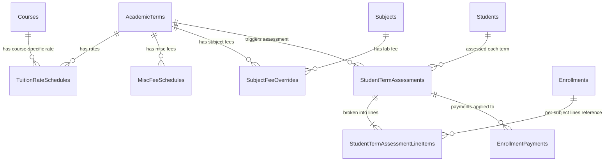

# Adding Costing to Class Section Subject Offerings in Enrollify

**Research Date:** 2026-05-08  
**Scope:** Designing fee/costing support for per-subject, per-semester, and per-student tuition computation in the Enrollify .NET backend, tailored to the Philippine HEI trimester context.

---

## Executive Summary

The Enrollify database currently has **no fee or tuition tables** — only a raw `EnrollmentPayments` ledger table (amount + payment method, no fee catalog or billing structure)[^1]. The domain model in `Enrollify.Core` is similarly blank on financials[^2]. This document presents **four options** for adding a costing layer — ranging from a simple denormalized approach to a full ERP-style billing engine — with concrete SQL table designs, computation queries, and an implementation roadmap for Enrollify's Clean Architecture (.NET/EF Core) stack. The **recommended approach is Option 3 (Fee Schedule Tables)**, which correctly models Philippine per-unit tuition with program-specific rates and requires minimal complexity for the system's current maturity level.

---

## Table of Contents

1. [Current Database State](#1-current-database-state)
2. [Philippine HEI Fee Context](#2-philippine-hei-fee-context)
3. [Option 1 — Fee Columns on Subjects/Offerings (Denormalized)](#3-option-1--fee-columns-on-subjectsofferings-denormalized)
4. [Option 2 — Subject-Level Fee Overrides with a Per-Unit Rate Table](#4-option-2--subject-level-fee-overrides-with-a-per-unit-rate-table)
5. [Option 3 — Fee Schedule Tables (Recommended)](#5-option-3--fee-schedule-tables-recommended)
6. [Option 4 — Full ERP-Style Fee Catalog + Student Invoice Assessment](#6-option-4--full-erp-style-fee-catalog--student-invoice-assessment)
7. [Comparison Matrix](#7-comparison-matrix)
8. [Enrollify Implementation Roadmap](#8-enrollify-implementation-roadmap)
9. [Confidence Assessment](#9-confidence-assessment)
10. [Footnotes](#10-footnotes)

---

## 1. Current Database State

### Relevant Tables (from `Script0003__InitialCoreTables.sql`)

```
AcademicYears
  └── AcademicTerms (TermNumber 1/2/3, StartDate, EndDate)
       └── ClassSections (Name, YearLevel, CourseId, AcademicTermId, AdviserId)
            └── ClassSectionSubjectOffering (SubjectId, TeacherId, ClassSectionId, RoomId, DayPattern)
                 └── ClassSchedules (DayOfWeek, StartTime, EndTime)

Subjects (Code, Title, Units DECIMAL(3,1), PreferRoomTypeId)
Courses (Code, Name, DurationYears, CollegeId)

Students (StudentNumber, CourseId, CurriculumId, YearLevel, Status)
  └── Enrollments (StudentId, ClassSectionId?, ClassSectionSubjectOfferingId, AcademicTermId, Status)
       └── EnrollmentPayments (EnrollmentId, Amount, PaymentDate, PaymentMethod, ReferenceNumber, PaymentStatus)
```

### Fee Gaps Identified

| What's Missing | Impact |
|---|---|
| No fee catalog/type tables | Cannot define what types of fees exist (tuition, lab, misc) |
| No per-unit tuition rate | Cannot compute `TuitionRate × Units` |
| No program-specific fee rates | All programs charged the same (unrealistic for PH HEIs) |
| No term-scoped rates | Fee increases between academic years cannot be modeled |
| No per-subject lab fee | Lab-tagged subjects cannot carry a surcharge |
| No invoice/assessment record | No snapshot of what a student was charged when enrolled |
| `EnrollmentPayments.PaymentStatus` is free-text `VARCHAR(50)` | No constraint on valid statuses |

**Key insight:** `Subjects.Units` (DECIMAL(3,1), CHK > 0 ≤ 12) and `Enrollments.ClassSectionSubjectOfferingId` are the two anchor points for any per-unit cost computation[^3][^4].

---

## 2. Philippine HEI Fee Context

Understanding how Philippine universities structure fees is essential for choosing the right data model.

### 2a. Fee Formula Used by Most Private PH HEIs

```
Total Assessment = Tuition + Miscellaneous + Subject/Lab Fees + Other Fees

  Tuition       = TuitionRatePerUnit × TotalEnrolledUnits
  Miscellaneous = Fixed per-term fees (Library, Athletic, Medical, SSG, etc.)
  Subject Fees  = Lab fee per lab-tagged subject enrolled
  Other         = NSTP fee (Year 1 only), ID fee (Year 1 only), etc.
```

#### Sample computation (Engineering student, 21 units):
```
Basic Tuition (₱2,000 × 21 units)         = ₱42,000.00
Physics Lab (1 lab subject)                =  ₱1,500.00
Computer Lab – Programming                 =  ₱1,000.00
Registration                               =    ₱350.00
Library                                    =    ₱850.00
Athletic                                   =    ₱250.00
Medical/Dental                             =    ₱200.00
Internet/Technology                        =    ₱500.00
Student Activity (SSG)                     =    ₱100.00
                                           ─────────────
TOTAL AMOUNT DUE                           = ₱46,750.00
```
[^5]

### 2b. Fee Differentiation Rules in PH HEIs

| Dimension | Differentiation? | Example |
|---|---|---|
| **By Program/Course** | ✅ YES — strongly differentiated | BSCS ₱1,350/unit vs BSE ₱750/unit[^6] |
| **By Year Level** | ✅ YES — partially | Freshmen: NSTP fee, ID fee; Seniors: Graduation fee |
| **By Subject Type** | ✅ YES — lab vs. lecture | Lab subjects carry a ₱500–₱3,000 surcharge[^7] |
| **By Academic Term** | ✅ YES — annual inflation adjustment | Rates change each AY with CHED approval |
| **By Scholarship** | ✅ YES | Academic Full (100% off tuition), Sibling (10%), etc.[^6] |

### 2c. Standard Philippine Miscellaneous Fee Categories

| Fee | Typical Range | Notes |
|---|---|---|
| Registration | ₱200–₱500 | Per enrollment transaction |
| Library | ₱200–₱1,500 | UP: ₱1,100/term |
| Athletic | ₱100–₱500 | UP: ₱75/term |
| Medical/Dental | ₱50–₱300 | UP: ₱50/term |
| Cultural/Development | ₱50–₱300 | UP: ₱50/term |
| Internet/Technology | ₱200–₱800 | Higher at tech-focused schools |
| Energy/Utilities | ₱0–₱500 | Common in private schools |
| Student Organization (SSG) | ₱50–₱200 | Mandatory |

[^8]

---

## 3. Option 1 — Fee Columns on Subjects/Offerings (Denormalized)

### 3a. Concept

Add fee columns directly to the `Subjects` table (for subject-type fees) and a `SubjectFeeRateConfigs` table for per-unit global rate. This is the simplest possible implementation.

### 3b. New Tables / Columns

```sql
-- ─────────────────────────────────────────────────────
-- Alter Subjects to carry per-subject lab/specialty fee
-- ─────────────────────────────────────────────────────
ALTER TABLE Subjects ADD COLUMN
    LabFee         DECIMAL(10, 2) NOT NULL DEFAULT 0.00,
    IsLabSubject   BIT NOT NULL DEFAULT 0;

-- ─────────────────────────────────────────────────────
-- Global system configuration for term-scoped rates
-- ─────────────────────────────────────────────────────
CREATE TABLE SystemFeeConfig
(
    Id              INT NOT NULL IDENTITY(1,1) PRIMARY KEY,
    AcademicTermId  INT NOT NULL,          -- fee rates in effect for this term
    TuitionPerUnit  DECIMAL(10, 2) NOT NULL,
    RegistrationFee DECIMAL(10, 2) NOT NULL DEFAULT 0,
    LibraryFee      DECIMAL(10, 2) NOT NULL DEFAULT 0,
    AthleticFee     DECIMAL(10, 2) NOT NULL DEFAULT 0,
    MedicalFee      DECIMAL(10, 2) NOT NULL DEFAULT 0,
    TechnologyFee   DECIMAL(10, 2) NOT NULL DEFAULT 0,
    CulturalFee     DECIMAL(10, 2) NOT NULL DEFAULT 0,
    StudentOrgFee   DECIMAL(10, 2) NOT NULL DEFAULT 0,
    OtherMiscFees   DECIMAL(10, 2) NOT NULL DEFAULT 0,
    CreatedAt       DATETIMEOFFSET DEFAULT SYSDATETIMEOFFSET(),
    CreatedBy       INT NOT NULL,
    CONSTRAINT FK_SystemFeeConfig_AcademicTerm FOREIGN KEY (AcademicTermId) REFERENCES AcademicTerms(Id),
    CONSTRAINT FK_SystemFeeConfig_CreatedBy FOREIGN KEY (CreatedBy) REFERENCES Users(Id),
    CONSTRAINT UQ_SystemFeeConfig_Term UNIQUE (AcademicTermId)
);
```

### 3c. How to Compute Per-Subject Cost

```sql
-- Cost of a single enrollment (one subject)
SELECT
    s.Title                                   AS SubjectName,
    s.Units,
    cfg.TuitionPerUnit,
    (s.Units * cfg.TuitionPerUnit)            AS TuitionCharge,
    CASE WHEN s.IsLabSubject = 1 THEN s.LabFee ELSE 0 END AS LabFee,
    (s.Units * cfg.TuitionPerUnit)
        + CASE WHEN s.IsLabSubject = 1 THEN s.LabFee ELSE 0 END AS SubjectTotal
FROM Enrollments e
JOIN ClassSectionSubjectOffering csso ON csso.Id = e.ClassSectionSubjectOfferingId
JOIN Subjects s ON s.Id = csso.SubjectId
JOIN ClassSections cs ON cs.Id = csso.ClassSectionId
JOIN AcademicTerms at ON at.Id = cs.AcademicTermId
JOIN SystemFeeConfig cfg ON cfg.AcademicTermId = at.Id
WHERE e.Id = :enrollmentId;
```

### 3d. How to Compute Total Semester Cost

```sql
-- Student's total assessment for one academic term
SELECT
    st.StudentNumber,
    at.TermNumber,
    SUM(s.Units)                              AS TotalUnits,
    SUM(s.Units) * MAX(cfg.TuitionPerUnit)    AS TuitionTotal,
    SUM(CASE WHEN s.IsLabSubject = 1 THEN s.LabFee ELSE 0 END) AS LabTotal,
    MAX(cfg.RegistrationFee + cfg.LibraryFee + cfg.AthleticFee
        + cfg.MedicalFee + cfg.TechnologyFee + cfg.CulturalFee
        + cfg.StudentOrgFee + cfg.OtherMiscFees) AS MiscTotal,
    -- Grand total
    (SUM(s.Units) * MAX(cfg.TuitionPerUnit))
        + SUM(CASE WHEN s.IsLabSubject = 1 THEN s.LabFee ELSE 0 END)
        + MAX(cfg.RegistrationFee + cfg.LibraryFee + cfg.AthleticFee
              + cfg.MedicalFee + cfg.TechnologyFee + cfg.CulturalFee
              + cfg.StudentOrgFee + cfg.OtherMiscFees) AS GrandTotal
FROM Enrollments e
JOIN Students st ON st.Id = e.StudentId
JOIN ClassSectionSubjectOffering csso ON csso.Id = e.ClassSectionSubjectOfferingId
JOIN Subjects s ON s.Id = csso.SubjectId
JOIN ClassSections cs ON cs.Id = csso.ClassSectionId
JOIN AcademicTerms at ON at.Id = cs.AcademicTermId
JOIN SystemFeeConfig cfg ON cfg.AcademicTermId = at.Id
WHERE e.StudentId = :studentId
  AND e.AcademicTermId = :termId
  AND e.IsActive = 1
GROUP BY st.StudentNumber, at.TermNumber;
```

### 3e. Pros and Cons

| ✅ Pros | ❌ Cons |
|---|---|
| Simplest implementation (2 tables/columns) | Single tuition rate for ALL programs — no BSCS vs BSE differentiation |
| Fast queries (minimal joins) | Adding new miscellaneous fee type requires `ALTER TABLE SystemFeeConfig` |
| Easy for a non-financial developer to understand | `LabFee` is frozen on Subject — changing it retroactively corrupts historical cost computation |
| Matches how very small Philippine schools (community colleges) operate | Cannot represent overload fees, NSTP fees, or year-level-specific charges |
| | No per-student customization (scholarship discount impossible) |

**Best for:** Early MVP, single-program institution, when fee complexity is intentionally minimal.

---

## 4. Option 2 — Subject-Level Fee Overrides with a Per-Unit Rate Table

### 4a. Concept

A `TuitionRateSchedules` table stores per-unit rates scoped by `CourseId × AcademicTermId`. A `SubjectFeeOverrides` table stores per-subject lab fees. A `MiscFeeSchedules` table stores the flat term fees. No per-student invoice record — computation is always on-the-fly at query time.

This maps closely to how medium-sized Philippine universities (FEU, Mapua, UST) structure their fee schedules, where the registrar publishes a fee schedule per program per academic year.

### 4b. New Tables

```sql
-- ─────────────────────────────────────────────────────────────────────
-- Tuition rate: per program (CourseId) × term, with rate history
-- ─────────────────────────────────────────────────────────────────────
CREATE TABLE TuitionRateSchedules
(
    Id              INT NOT NULL IDENTITY(1,1) PRIMARY KEY,
    AcademicTermId  INT NOT NULL,
    CourseId        INT NULL,            -- NULL = default rate (all courses)
    TuitionPerUnit  DECIMAL(10, 2) NOT NULL
        CONSTRAINT CHK_TuitionRateSchedules_Rate_Positive CHECK (TuitionPerUnit > 0),
    OverloadThresholdUnits INT NULL,     -- e.g., 21; NULL = no overload rule
    OverloadFeePerUnit DECIMAL(10, 2) NULL DEFAULT 0,  -- extra per overload unit

    CreatedAt DATETIMEOFFSET DEFAULT SYSDATETIMEOFFSET(),
    CreatedBy INT NOT NULL,
    UpdatedAt DATETIMEOFFSET NULL,
    UpdatedBy INT NULL,
    DeletedAt DATETIMEOFFSET NULL,
    DeletedBy INT NULL,
    IsActive  BIT NOT NULL DEFAULT 1,

    CONSTRAINT FK_TuitionRateSchedules_AcademicTerm FOREIGN KEY (AcademicTermId) REFERENCES AcademicTerms(Id),
    CONSTRAINT FK_TuitionRateSchedules_Course FOREIGN KEY (CourseId) REFERENCES Courses(Id),
    CONSTRAINT FK_TuitionRateSchedules_CreatedBy FOREIGN KEY (CreatedBy) REFERENCES Users(Id),
    CONSTRAINT FK_TuitionRateSchedules_UpdatedBy FOREIGN KEY (UpdatedBy) REFERENCES Users(Id),
    CONSTRAINT FK_TuitionRateSchedules_DeletedBy FOREIGN KEY (DeletedBy) REFERENCES Users(Id),
    CONSTRAINT UQ_TuitionRateSchedules UNIQUE (AcademicTermId, CourseId)
);

-- ─────────────────────────────────────────────────────────────────────
-- Miscellaneous fee schedule: fixed fees per term
-- One row per fee type per academic term
-- ─────────────────────────────────────────────────────────────────────
CREATE TABLE MiscFeeSchedules
(
    Id              INT NOT NULL IDENTITY(1,1) PRIMARY KEY,
    AcademicTermId  INT NOT NULL,
    FeeCode         VARCHAR(20) NOT NULL,   -- 'REGISTRATION', 'LIBRARY', 'ATHLETIC', etc.
    FeeName         VARCHAR(100) NOT NULL,
    Amount          DECIMAL(10, 2) NOT NULL DEFAULT 0
        CONSTRAINT CHK_MiscFeeSchedules_Amount_NonNeg CHECK (Amount >= 0),
    AppliesToTermNumber INT NULL,           -- NULL = all terms; 1 = 1st trimester only (e.g., ID fee)

    CreatedAt DATETIMEOFFSET DEFAULT SYSDATETIMEOFFSET(),
    CreatedBy INT NOT NULL,
    UpdatedAt DATETIMEOFFSET NULL,
    UpdatedBy INT NULL,
    DeletedAt DATETIMEOFFSET NULL,
    DeletedBy INT NULL,
    IsActive  BIT NOT NULL DEFAULT 1,

    CONSTRAINT FK_MiscFeeSchedules_AcademicTerm FOREIGN KEY (AcademicTermId) REFERENCES AcademicTerms(Id),
    CONSTRAINT FK_MiscFeeSchedules_CreatedBy FOREIGN KEY (CreatedBy) REFERENCES Users(Id),
    CONSTRAINT FK_MiscFeeSchedules_UpdatedBy FOREIGN KEY (UpdatedBy) REFERENCES Users(Id),
    CONSTRAINT FK_MiscFeeSchedules_DeletedBy FOREIGN KEY (DeletedBy) REFERENCES Users(Id),
    CONSTRAINT UQ_MiscFeeSchedules UNIQUE (AcademicTermId, FeeCode)
);

-- ─────────────────────────────────────────────────────────────────────
-- Subject fee overrides: per-subject lab or specialty fees
-- Can override or supplement the base tuition for a given term
-- ─────────────────────────────────────────────────────────────────────
CREATE TABLE SubjectFeeOverrides
(
    Id              INT NOT NULL IDENTITY(1,1) PRIMARY KEY,
    SubjectId       INT NOT NULL,
    AcademicTermId  INT NOT NULL,
    FeeCode         VARCHAR(20) NOT NULL,   -- 'LAB', 'STUDIO', 'CLINIC', etc.
    FeeName         VARCHAR(100) NOT NULL,
    Amount          DECIMAL(10, 2) NOT NULL DEFAULT 0
        CONSTRAINT CHK_SubjectFeeOverrides_Amount_NonNeg CHECK (Amount >= 0),

    CreatedAt DATETIMEOFFSET DEFAULT SYSDATETIMEOFFSET(),
    CreatedBy INT NOT NULL,
    UpdatedAt DATETIMEOFFSET NULL,
    UpdatedBy INT NULL,
    DeletedAt DATETIMEOFFSET NULL,
    DeletedBy INT NULL,
    IsActive  BIT NOT NULL DEFAULT 1,

    CONSTRAINT FK_SubjectFeeOverrides_Subject FOREIGN KEY (SubjectId) REFERENCES Subjects(Id),
    CONSTRAINT FK_SubjectFeeOverrides_AcademicTerm FOREIGN KEY (AcademicTermId) REFERENCES AcademicTerms(Id),
    CONSTRAINT FK_SubjectFeeOverrides_CreatedBy FOREIGN KEY (CreatedBy) REFERENCES Users(Id),
    CONSTRAINT FK_SubjectFeeOverrides_UpdatedBy FOREIGN KEY (UpdatedBy) REFERENCES Users(Id),
    CONSTRAINT FK_SubjectFeeOverrides_DeletedBy FOREIGN KEY (DeletedBy) REFERENCES Users(Id),
    CONSTRAINT UQ_SubjectFeeOverrides UNIQUE (SubjectId, AcademicTermId, FeeCode)
);
```

### 4c. How to Compute Per-Subject Cost

```sql
-- Per subject enrollment cost (subject tuition + subject lab fee)
SELECT
    s.Title                                          AS Subject,
    s.Units,
    COALESCE(
        courseRate.TuitionPerUnit,
        defaultRate.TuitionPerUnit,
        0
    )                                                AS TuitionPerUnit,
    s.Units * COALESCE(
        courseRate.TuitionPerUnit,
        defaultRate.TuitionPerUnit, 0
    )                                                AS TuitionCharge,
    ISNULL(SUM(sfo.Amount), 0)                       AS SubjectFees,
    (s.Units * COALESCE(courseRate.TuitionPerUnit, defaultRate.TuitionPerUnit, 0))
        + ISNULL(SUM(sfo.Amount), 0)                AS SubjectTotal
FROM Enrollments e
JOIN ClassSectionSubjectOffering csso ON csso.Id = e.ClassSectionSubjectOfferingId
JOIN Subjects s ON s.Id = csso.SubjectId
JOIN Students st ON st.Id = e.StudentId
-- Program-specific rate (preferred)
LEFT JOIN TuitionRateSchedules courseRate
    ON courseRate.AcademicTermId = e.AcademicTermId
    AND courseRate.CourseId = st.CourseId
    AND courseRate.IsActive = 1
-- Global default rate (fallback)
LEFT JOIN TuitionRateSchedules defaultRate
    ON defaultRate.AcademicTermId = e.AcademicTermId
    AND defaultRate.CourseId IS NULL
    AND defaultRate.IsActive = 1
-- Subject-specific fee overrides (e.g., lab fee)
LEFT JOIN SubjectFeeOverrides sfo
    ON sfo.SubjectId = s.Id
    AND sfo.AcademicTermId = e.AcademicTermId
    AND sfo.IsActive = 1
WHERE e.Id = :enrollmentId
GROUP BY s.Title, s.Units, courseRate.TuitionPerUnit, defaultRate.TuitionPerUnit;
```

### 4d. How to Compute Total Semester Cost

```sql
-- Full semester cost breakdown for a student
WITH EnrolledSubjects AS (
    SELECT
        e.StudentId,
        e.AcademicTermId,
        s.Id AS SubjectId,
        s.Units,
        COALESCE(courseRate.TuitionPerUnit, defaultRate.TuitionPerUnit, 0) AS EffectiveRate
    FROM Enrollments e
    JOIN ClassSectionSubjectOffering csso ON csso.Id = e.ClassSectionSubjectOfferingId
    JOIN Subjects s ON s.Id = csso.SubjectId
    JOIN Students st ON st.Id = e.StudentId
    LEFT JOIN TuitionRateSchedules courseRate
        ON courseRate.AcademicTermId = e.AcademicTermId AND courseRate.CourseId = st.CourseId AND courseRate.IsActive = 1
    LEFT JOIN TuitionRateSchedules defaultRate
        ON defaultRate.AcademicTermId = e.AcademicTermId AND defaultRate.CourseId IS NULL AND defaultRate.IsActive = 1
    WHERE e.StudentId = :studentId AND e.AcademicTermId = :termId AND e.IsActive = 1
),
TuitionCalc AS (
    SELECT
        StudentId, AcademicTermId,
        SUM(Units)                          AS TotalUnits,
        SUM(Units * EffectiveRate)          AS TuitionTotal
    FROM EnrolledSubjects
    GROUP BY StudentId, AcademicTermId
),
SubjectFeeCalc AS (
    SELECT es.StudentId, SUM(sfo.Amount) AS SubjectFeeTotal
    FROM EnrolledSubjects es
    JOIN SubjectFeeOverrides sfo
        ON sfo.SubjectId = es.SubjectId AND sfo.AcademicTermId = es.AcademicTermId AND sfo.IsActive = 1
    GROUP BY es.StudentId
),
MiscCalc AS (
    SELECT SUM(Amount) AS MiscTotal
    FROM MiscFeeSchedules
    WHERE AcademicTermId = :termId AND IsActive = 1
      AND (AppliesToTermNumber IS NULL OR AppliesToTermNumber = (
          SELECT TermNumber FROM AcademicTerms WHERE Id = :termId
      ))
)
SELECT
    tc.TotalUnits,
    tc.TuitionTotal,
    ISNULL(sfc.SubjectFeeTotal, 0)  AS SubjectFees,
    mc.MiscTotal,
    tc.TuitionTotal
        + ISNULL(sfc.SubjectFeeTotal, 0)
        + mc.MiscTotal              AS GrandTotal
FROM TuitionCalc tc
LEFT JOIN SubjectFeeCalc sfc ON sfc.StudentId = tc.StudentId
CROSS JOIN MiscCalc mc;
```

### 4e. Pros and Cons

| ✅ Pros | ❌ Cons |
|---|---|
| Handles program-specific per-unit rates (BSCS vs BSE) | No historical snapshot — if rates change mid-term, past computations shift |
| Per-subject lab fees properly modeled | "Total due" is always computed on the fly (no cached invoice) |
| Miscellaneous fees are data-driven (add new type without schema change) | Does not support per-student overrides (scholarships require a separate waiver table) |
| Rate history preserved by AcademicTermId scoping | Overload fee rule requires the `OverloadThresholdUnits` column logic to be in application code |
| Aligns cleanly with existing `AcademicTerms` and `Courses` tables | |

**Best for:** Most Philippine private universities with 1–5 programs, where the registrar sets a fee schedule per academic term and per program.

---

## 5. Option 3 — Fee Schedule Tables (Recommended)

**This extends Option 2** by adding a `StudentTermAssessment` snapshot table and a `StudentTermAssessmentLineItems` detail table. This is the critical addition that distinguishes a professional billing system from a fee-calculator: once a student's fees are **assessed** (locked in), subsequent rate changes don't affect what they owe.

This pattern mirrors the approach used by [Frappe/ERPNext Education](https://github.com/frappe/education)[^9] and documented [Ellucian Banner Student AR](https://www.ellucian.com/solutions/ellucian-banner)[^10] architectures.

### 5a. New Tables (builds on Option 2 tables)

```sql
-- ─────────────────────────────────────────────────────────────────────
-- The 3 tables from Option 2 are still required:
--   TuitionRateSchedules, MiscFeeSchedules, SubjectFeeOverrides
-- ─────────────────────────────────────────────────────────────────────

-- ─────────────────────────────────────────────────────────────────────
-- Student term assessment header (one per student per academic term)
-- Created when enrollment is confirmed; amounts LOCKED at creation time
-- ─────────────────────────────────────────────────────────────────────
CREATE TABLE StudentTermAssessments
(
    Id                  INT NOT NULL IDENTITY(1,1) PRIMARY KEY,
    StudentId           INT NOT NULL,
    AcademicTermId      INT NOT NULL,
    TotalUnitsEnrolled  DECIMAL(5, 2) NOT NULL DEFAULT 0,
    Subtotal            DECIMAL(10, 2) NOT NULL DEFAULT 0,
    TotalDiscounts      DECIMAL(10, 2) NOT NULL DEFAULT 0,
    NetPayable          DECIMAL(10, 2) NOT NULL DEFAULT 0,
    AmountPaid          DECIMAL(10, 2) NOT NULL DEFAULT 0,
    Status              INT NOT NULL DEFAULT 1,  -- FK to AssessmentStatuses (Draft/Issued/Partial/Paid/Cancelled)
    IssuedAt            DATETIMEOFFSET NULL,
    DueDate             DATE NULL,

    CreatedAt DATETIMEOFFSET DEFAULT SYSDATETIMEOFFSET(),
    CreatedBy INT NOT NULL,
    UpdatedAt DATETIMEOFFSET NULL,
    UpdatedBy INT NULL,
    DeletedAt DATETIMEOFFSET NULL,
    DeletedBy INT NULL,
    IsActive  BIT NOT NULL DEFAULT 1,

    CONSTRAINT FK_StudentTermAssessments_Student FOREIGN KEY (StudentId) REFERENCES Students(Id),
    CONSTRAINT FK_StudentTermAssessments_AcademicTerm FOREIGN KEY (AcademicTermId) REFERENCES AcademicTerms(Id),
    CONSTRAINT FK_StudentTermAssessments_CreatedBy FOREIGN KEY (CreatedBy) REFERENCES Users(Id),
    CONSTRAINT FK_StudentTermAssessments_UpdatedBy FOREIGN KEY (UpdatedBy) REFERENCES Users(Id),
    CONSTRAINT FK_StudentTermAssessments_DeletedBy FOREIGN KEY (DeletedBy) REFERENCES Users(Id),
    CONSTRAINT UQ_StudentTermAssessments UNIQUE (StudentId, AcademicTermId)
);

-- ─────────────────────────────────────────────────────────────────────
-- Assessment line items: each row is one charge on the student's bill
-- Locked snapshot — amounts stored at assessment time, not computed live
-- ─────────────────────────────────────────────────────────────────────
CREATE TABLE StudentTermAssessmentLineItems
(
    Id                          INT NOT NULL IDENTITY(1,1) PRIMARY KEY,
    AssessmentId                INT NOT NULL,
    FeeCode                     VARCHAR(20) NOT NULL,   -- 'TUITION', 'LAB', 'REGISTRATION', etc.
    FeeName                     VARCHAR(100) NOT NULL,
    FeeCategory                 VARCHAR(20) NOT NULL,   -- 'TUITION', 'LABORATORY', 'MISCELLANEOUS', 'SPECIAL'
    SourceType                  VARCHAR(20) NOT NULL,   -- 'PER_UNIT', 'FLAT', 'PER_SUBJECT'
    -- Linked reference (nullable — tuition line has no SubjectId, misc line has no SubjectId)
    EnrollmentId                INT NULL,               -- FK to Enrollments (for per-subject charges)
    -- Quantity and rate LOCKED at assessment time
    Quantity                    DECIMAL(8, 2) NOT NULL DEFAULT 1, -- units enrolled for tuition; 1 for flat
    UnitRate                    DECIMAL(10, 2) NOT NULL,
    LineTotal                   AS (Quantity * UnitRate) PERSISTED,  -- computed, always consistent
    -- Override (registrar manual adjustment)
    IsOverridden                BIT NOT NULL DEFAULT 0,
    OverrideAmount              DECIMAL(10, 2) NULL,
    OverrideReason              VARCHAR(500) NULL,
    OverrideBy                  INT NULL,
    -- Discount on this specific line (scholarship, waiver)
    DiscountType                VARCHAR(30) NULL,       -- 'SCHOLARSHIP', 'WAIVER', 'MANUAL'
    DiscountAmount              DECIMAL(10, 2) NOT NULL DEFAULT 0,
    NetLineTotal                AS (
        COALESCE(OverrideAmount, Quantity * UnitRate) - DiscountAmount
    ) PERSISTED,

    CreatedAt DATETIMEOFFSET DEFAULT SYSDATETIMEOFFSET(),
    CreatedBy INT NOT NULL,
    IsActive  BIT NOT NULL DEFAULT 1,

    CONSTRAINT FK_StudentTermAssessmentLineItems_Assessment FOREIGN KEY (AssessmentId) REFERENCES StudentTermAssessments(Id),
    CONSTRAINT FK_StudentTermAssessmentLineItems_Enrollment FOREIGN KEY (EnrollmentId) REFERENCES Enrollments(Id),
    CONSTRAINT FK_StudentTermAssessmentLineItems_OverrideBy FOREIGN KEY (OverrideBy) REFERENCES Users(Id),
    CONSTRAINT FK_StudentTermAssessmentLineItems_CreatedBy FOREIGN KEY (CreatedBy) REFERENCES Users(Id)
);

-- ─────────────────────────────────────────────────────────────────────
-- Assessment status lookup
-- ─────────────────────────────────────────────────────────────────────
CREATE TABLE AssessmentStatuses
(
    Id   INT NOT NULL PRIMARY KEY,
    Code VARCHAR(20) NOT NULL,   -- 'DRAFT', 'ISSUED', 'PARTIAL', 'PAID', 'CANCELLED'
    Name VARCHAR(50) NOT NULL,
    CONSTRAINT UQ_AssessmentStatuses_Code UNIQUE (Code)
);

INSERT INTO AssessmentStatuses (Id, Code, Name) VALUES
    (1, 'DRAFT',     'Draft'),
    (2, 'ISSUED',    'Issued'),
    (3, 'PARTIAL',   'Partially Paid'),
    (4, 'PAID',      'Fully Paid'),
    (5, 'CANCELLED', 'Cancelled');
```

### 5b. Assessment Generation Procedure

This stored procedure (or equivalent C# application service) generates the assessment when a student's enrollment is confirmed:

```sql
-- Called when student enrollment is confirmed for a term
-- Creates the StudentTermAssessments header + all line items
CREATE OR ALTER PROCEDURE GenerateStudentTermAssessment
    @StudentId      INT,
    @AcademicTermId INT,
    @CreatedBy      INT
AS
BEGIN
    SET NOCOUNT ON;

    DECLARE @AssessmentId INT;
    DECLARE @CourseId     INT;
    DECLARE @TuitionRate  DECIMAL(10,2);
    DECLARE @TotalUnits   DECIMAL(5,2);

    -- Get student's course
    SELECT @CourseId = CourseId FROM Students WHERE Id = @StudentId;

    -- Resolve tuition rate: course-specific first, then global default
    SELECT TOP 1 @TuitionRate = TuitionPerUnit
    FROM TuitionRateSchedules
    WHERE AcademicTermId = @AcademicTermId AND IsActive = 1
      AND (CourseId = @CourseId OR CourseId IS NULL)
    ORDER BY CASE WHEN CourseId = @CourseId THEN 0 ELSE 1 END;

    -- Total units enrolled this term
    SELECT @TotalUnits = SUM(s.Units)
    FROM Enrollments e
    JOIN ClassSectionSubjectOffering csso ON csso.Id = e.ClassSectionSubjectOfferingId
    JOIN Subjects s ON s.Id = csso.SubjectId
    WHERE e.StudentId = @StudentId AND e.AcademicTermId = @AcademicTermId AND e.IsActive = 1;

    -- Create assessment header
    INSERT INTO StudentTermAssessments (StudentId, AcademicTermId, TotalUnitsEnrolled,
        Subtotal, TotalDiscounts, NetPayable, AmountPaid, Status, CreatedBy)
    VALUES (@StudentId, @AcademicTermId, @TotalUnits, 0, 0, 0, 0, 1, @CreatedBy);

    SET @AssessmentId = SCOPE_IDENTITY();

    -- Line Item 1: Tuition (per unit)
    INSERT INTO StudentTermAssessmentLineItems
        (AssessmentId, FeeCode, FeeName, FeeCategory, SourceType, Quantity, UnitRate, CreatedBy)
    VALUES
        (@AssessmentId, 'TUITION', 'Tuition Fee', 'TUITION', 'PER_UNIT', @TotalUnits, @TuitionRate, @CreatedBy);

    -- Line Items 2+: Per-subject fees (lab, studio, etc.)
    INSERT INTO StudentTermAssessmentLineItems
        (AssessmentId, FeeCode, FeeName, FeeCategory, SourceType, EnrollmentId, Quantity, UnitRate, CreatedBy)
    SELECT
        @AssessmentId,
        sfo.FeeCode,
        sfo.FeeName,
        'LABORATORY',
        'PER_SUBJECT',
        e.Id,
        1,
        sfo.Amount,
        @CreatedBy
    FROM Enrollments e
    JOIN ClassSectionSubjectOffering csso ON csso.Id = e.ClassSectionSubjectOfferingId
    JOIN SubjectFeeOverrides sfo
        ON sfo.SubjectId = csso.SubjectId AND sfo.AcademicTermId = @AcademicTermId AND sfo.IsActive = 1
    WHERE e.StudentId = @StudentId AND e.AcademicTermId = @AcademicTermId AND e.IsActive = 1;

    -- Line Items 3+: Miscellaneous flat fees
    INSERT INTO StudentTermAssessmentLineItems
        (AssessmentId, FeeCode, FeeName, FeeCategory, SourceType, Quantity, UnitRate, CreatedBy)
    SELECT
        @AssessmentId,
        mfs.FeeCode,
        mfs.FeeName,
        'MISCELLANEOUS',
        'FLAT',
        1,
        mfs.Amount,
        @CreatedBy
    FROM MiscFeeSchedules mfs
    JOIN AcademicTerms at ON at.Id = @AcademicTermId
    WHERE mfs.AcademicTermId = @AcademicTermId AND mfs.IsActive = 1
      AND (mfs.AppliesToTermNumber IS NULL OR mfs.AppliesToTermNumber = at.TermNumber);

    -- Update assessment totals from computed lines
    UPDATE sta
    SET
        Subtotal   = (SELECT SUM(LineTotal) FROM StudentTermAssessmentLineItems WHERE AssessmentId = @AssessmentId AND IsActive = 1),
        NetPayable = (SELECT SUM(NetLineTotal) FROM StudentTermAssessmentLineItems WHERE AssessmentId = @AssessmentId AND IsActive = 1)
    FROM StudentTermAssessments sta
    WHERE sta.Id = @AssessmentId;

END;
```

### 5c. Per-Subject Cost Query

```sql
-- Cost breakdown for a specific enrollment (per subject)
SELECT
    s.Code                  AS SubjectCode,
    s.Title                 AS SubjectName,
    s.Units,
    ili.FeeCode,
    ili.FeeName,
    ili.FeeCategory,
    ili.Quantity,
    ili.UnitRate,
    ili.LineTotal,
    ili.DiscountAmount,
    ili.NetLineTotal
FROM StudentTermAssessmentLineItems ili
LEFT JOIN Enrollments e ON e.Id = ili.EnrollmentId
LEFT JOIN ClassSectionSubjectOffering csso ON csso.Id = e.ClassSectionSubjectOfferingId
LEFT JOIN Subjects s ON s.Id = csso.SubjectId
WHERE ili.AssessmentId = :assessmentId
ORDER BY ili.FeeCategory, ili.FeeCode;
```

### 5d. Total Semester Cost Query

```sql
-- Student total assessment summary for a term
SELECT
    sta.Id                      AS AssessmentId,
    st.StudentNumber,
    at.TermNumber,
    ay.StartDate, ay.EndDate,
    sta.TotalUnitsEnrolled,
    SUM(CASE WHEN ili.FeeCategory = 'TUITION'       THEN ili.LineTotal ELSE 0 END) AS TuitionTotal,
    SUM(CASE WHEN ili.FeeCategory = 'LABORATORY'    THEN ili.LineTotal ELSE 0 END) AS LabTotal,
    SUM(CASE WHEN ili.FeeCategory = 'MISCELLANEOUS' THEN ili.LineTotal ELSE 0 END) AS MiscTotal,
    SUM(CASE WHEN ili.FeeCategory = 'SPECIAL'       THEN ili.LineTotal ELSE 0 END) AS SpecialTotal,
    SUM(ili.LineTotal)           AS Subtotal,
    SUM(ili.DiscountAmount)      AS TotalDiscounts,
    SUM(ili.NetLineTotal)        AS NetPayable,
    sta.AmountPaid,
    sta.NetPayable - sta.AmountPaid AS Balance,
    ast.Name                     AS AssessmentStatus
FROM StudentTermAssessments sta
JOIN Students st ON st.Id = sta.StudentId
JOIN AcademicTerms at ON at.Id = sta.AcademicTermId
JOIN AcademicYears ay ON ay.Id = at.AcademicYearId
JOIN StudentTermAssessmentLineItems ili ON ili.AssessmentId = sta.Id AND ili.IsActive = 1
JOIN AssessmentStatuses ast ON ast.Id = sta.Status
WHERE sta.StudentId = :studentId
  AND sta.AcademicTermId = :termId
GROUP BY sta.Id, st.StudentNumber, at.TermNumber, ay.StartDate, ay.EndDate,
         sta.TotalUnitsEnrolled, sta.AmountPaid, sta.NetPayable, ast.Name;
```

### 5e. Pros and Cons

| ✅ Pros | ❌ Cons |
|---|---|
| **Rate changes never affect past assessments** (amounts locked at issue time) | More complex to implement (stored proc / domain service to generate assessment) |
| Full audit trail: who assessed, when, what rates were used | More tables to maintain |
| Per-line overrides and discounts supported natively | Assessment must be regenerated if student changes their enrolled subjects |
| Matches Frappe/ERPNext Education, Ellucian Banner, PeopleSoft CS patterns[^9][^10][^11] | Requires clear business rule: "when does an assessment become locked?" |
| Easy to answer "what did student owe in Term 2 AY 2023–2024?" | |
| `EnrollmentPayments` table can be linked to `StudentTermAssessments` for payment tracking | |

**Best for:** Any school that needs an audit trail, discount/scholarship management, and clear financial records per student per term. **This is the recommended option for Enrollify.**

---

## 6. Option 4 — Full ERP-Style Fee Catalog + Student Invoice Assessment

### 6a. Concept

This is the fully normalized ERP approach used by [Frappe/ERPNext Education](https://github.com/frappe/education)[^9], [Oracle PeopleSoft Campus Solutions](https://docs.oracle.com/cd/E92519_02/pt856pbr3/eng/pt/index.html)[^11], and [Ellucian Banner](https://www.ellucian.com/solutions/ellucian-banner)[^10]. A `FeeCatalog` master table defines all possible fees. A `FeeSchedule` table stores term-scoped rates. A separate `StudentTermInvoice` + `InvoiceLineItems` structure captures the per-student assessment snapshot.

The key distinction from Option 3 is the **abstract fee catalog** layer: instead of baking `FeeCode VARCHAR(20)` directly into line items, fees reference a master catalog row that carries metadata like calculation basis, GL account codes, and whether the fee is program-specific.

### 6b. New Tables (Abbreviated)

```sql
-- Fee Catalog: master registry of every possible fee item
CREATE TABLE FeeCatalog
(
    Id                  INT NOT NULL IDENTITY(1,1) PRIMARY KEY,
    FeeCode             VARCHAR(30) NOT NULL,  -- 'TUITION', 'LAB', 'NSTP', 'ID'
    FeeName             VARCHAR(150) NOT NULL,
    FeeCategory         VARCHAR(20) NOT NULL   -- 'TUITION','LABORATORY','MISCELLANEOUS','REGISTRATION','SPECIAL'
        CONSTRAINT CHK_FeeCatalog_Category_Valid
            CHECK (FeeCategory IN ('TUITION','LABORATORY','MISCELLANEOUS','REGISTRATION','SPECIAL')),
    CalculationBasis    VARCHAR(25) NOT NULL   -- 'per_unit','flat_per_term','per_subject','per_overload_unit'
        CONSTRAINT CHK_FeeCatalog_Basis_Valid
            CHECK (CalculationBasis IN ('per_unit','flat_per_term','per_subject','per_overload_unit','percentage_of_tuition')),
    IsProgramSpecific   BIT NOT NULL DEFAULT 0,
    IsYearLevelSpecific BIT NOT NULL DEFAULT 0,
    IsOptional          BIT NOT NULL DEFAULT 0,
    AppliesToTrimester  VARCHAR(10) NOT NULL DEFAULT 'ALL',  -- 'ALL','T1','T2','T3','SUMMER'
    GLAccountCode       VARCHAR(30) NULL,
    Notes               VARCHAR(500) NULL,

    CreatedAt DATETIMEOFFSET DEFAULT SYSDATETIMEOFFSET(),
    CreatedBy INT NOT NULL,
    IsActive  BIT NOT NULL DEFAULT 1,

    CONSTRAINT UQ_FeeCatalog_FeeCode UNIQUE (FeeCode),
    CONSTRAINT FK_FeeCatalog_CreatedBy FOREIGN KEY (CreatedBy) REFERENCES Users(Id)
);

-- Fee Schedule: term × program × year level rate table
CREATE TABLE FeeScheduleRates
(
    Id              INT NOT NULL IDENTITY(1,1) PRIMARY KEY,
    FeeCatalogId    INT NOT NULL,
    AcademicTermId  INT NOT NULL,
    CourseId        INT NULL,           -- NULL = all courses
    YearLevel       INT NULL,           -- NULL = all year levels
    Rate            DECIMAL(10, 2) NOT NULL,
    MaxUnits        INT NULL,           -- for overload threshold
    EffectiveFrom   DATE NOT NULL,
    EffectiveTo     DATE NULL,

    CreatedAt DATETIMEOFFSET DEFAULT SYSDATETIMEOFFSET(),
    CreatedBy INT NOT NULL,
    IsActive  BIT NOT NULL DEFAULT 1,

    CONSTRAINT FK_FeeScheduleRates_FeeCatalog FOREIGN KEY (FeeCatalogId) REFERENCES FeeCatalog(Id),
    CONSTRAINT FK_FeeScheduleRates_AcademicTerm FOREIGN KEY (AcademicTermId) REFERENCES AcademicTerms(Id),
    CONSTRAINT FK_FeeScheduleRates_Course FOREIGN KEY (CourseId) REFERENCES Courses(Id),
    CONSTRAINT FK_FeeScheduleRates_CreatedBy FOREIGN KEY (CreatedBy) REFERENCES Users(Id),
    CONSTRAINT UQ_FeeScheduleRates UNIQUE (FeeCatalogId, AcademicTermId, CourseId, YearLevel)
);

-- Student invoices and line items (same structure as Option 3 StudentTermAssessments
-- but references FeeCatalogId instead of raw FeeCode strings)
-- ...see Option 3 for line item structure, replace FeeCode/FeeName columns with FeeCatalogId FK
```

### 6c. Pros and Cons

| ✅ Pros | ❌ Cons |
|---|---|
| Maximum flexibility — unlimited fee types without schema change | Highest implementation complexity |
| GL account codes enable direct accounting integration | Requires a dedicated Fee Administration UI |
| Program + year level intersection rates are first-class citizens | Overkill for most small-to-medium Philippine HEIs |
| Matches full ERP vendor implementations | Over-engineering risk: YAGNI principle may apply |
| Supports complex rules: percentage_of_tuition, per_overload_unit, trimester-specific fees | |

**Best for:** Large multi-campus universities, systems needing GL integration, or when the institution plans to integrate with accounting software (QuickBooks, SAP, Oracle Financials).

---

## 7. Comparison Matrix

| Criterion | Option 1 (Columns) | Option 2 (Fee Schedules) | Option 3 ⭐ (Schedule + Snapshot) | Option 4 (Full ERP) |
|---|:---:|:---:|:---:|:---:|
| Implementation effort | ⭐ (Easy) | ⭐⭐ (Moderate) | ⭐⭐⭐ (Moderate–High) | ⭐⭐⭐⭐ (High) |
| Per-unit tuition by program | ❌ | ✅ | ✅ | ✅ |
| Historical rate preservation | ❌ | ❌ (compute-only) | ✅ (snapshot) | ✅ (snapshot) |
| Per-subject lab fees | Partial | ✅ | ✅ | ✅ |
| Miscellaneous fee types | Fixed columns | Data-driven | Data-driven | Fully catalogued |
| Scholarship/discount support | ❌ | Bolt-on waiver | Native line item | Native + scope |
| Overload fee support | ❌ | Partial | ✅ | ✅ |
| Year-level fee differentiation | ❌ | ✅ | ✅ | ✅ |
| Audit trail of assessments | ❌ | ❌ | ✅ | ✅ |
| Schema changes for new fee type | Required | Not required | Not required | Not required |
| Philippine HEI suitability | Small schools | ⭐⭐⭐⭐ | ⭐⭐⭐⭐⭐ | Large multi-campus |
| Aligns with Enrollify's arch | ⭐ | ⭐⭐⭐ | ⭐⭐⭐⭐⭐ | ⭐⭐⭐ |

---

## 8. Enrollify Implementation Roadmap

### 8a. Recommended Option: Option 3

**Rationale:** Enrollify's existing schema already has `AcademicTerms`, `Courses`, `Subjects.Units`, and `Enrollments` — all the anchor points for Option 3. The system is trimester-based (3 terms/year)[^12], which aligns with Philippine private HEI fee differentiation by term. Option 3's snapshot assessment model prevents retroactive rate-change issues and matches patterns from the most widely used open-source SIS (Frappe/ERPNext)[^9].

### 8b. Migration Script (DbUp `Script0004__FeeTables.sql`)

Add as a new DbUp script in `Enrollify.DatabaseMigration/Scripts/`:

```sql
-- Script0004__FeeTables.sql
-- Adds fee schedule and student assessment tables for costing

-- Assessment status lookup
CREATE TABLE AssessmentStatuses (...);  -- as shown in Option 3

-- Fee schedule tables
CREATE TABLE TuitionRateSchedules (...);
CREATE TABLE MiscFeeSchedules (...);
CREATE TABLE SubjectFeeOverrides (...);

-- Student assessment snapshot
CREATE TABLE StudentTermAssessments (...);
CREATE TABLE StudentTermAssessmentLineItems (...);

-- Seed assessment statuses
INSERT INTO AssessmentStatuses (Id, Code, Name) VALUES
    (1,'DRAFT','Draft'),(2,'ISSUED','Issued'),(3,'PARTIAL','Partially Paid'),(4,'PAID','Fully Paid'),(5,'CANCELLED','Cancelled');
```

### 8c. C# Domain Aggregates to Add

Following the existing Enrollify aggregate pattern[^13]:

```csharp
// Enrollify.Core/Aggregates/FeeAggregate/TuitionRateSchedule.cs
public class TuitionRateSchedule : EntityBase<TuitionRateSchedule, TuitionRateScheduleId>, IAggregateRoot, IAuditable
{
    public AcademicTermId AcademicTermId { get; private set; }
    public CourseId? CourseId { get; private set; }   // null = applies to all programs
    public decimal TuitionPerUnit { get; private set; }
    public int? OverloadThresholdUnits { get; private set; }
    public decimal? OverloadFeePerUnit { get; private set; }
    // ...
}

// Enrollify.Core/Aggregates/FeeAggregate/MiscFeeSchedule.cs
public class MiscFeeSchedule : EntityBase<MiscFeeSchedule, MiscFeeScheduleId>, IAggregateRoot, IAuditable
{
    public AcademicTermId AcademicTermId { get; private set; }
    public string FeeCode { get; private set; }    // Vogen: MiscFeeCode
    public string FeeName { get; private set; }
    public decimal Amount { get; private set; }
    public int? AppliesToTermNumber { get; private set; }
    // ...
}

// Enrollify.Core/Aggregates/SubjectFeeAggregate/SubjectFeeOverride.cs
public class SubjectFeeOverride : EntityBase<SubjectFeeOverride, SubjectFeeOverrideId>, IAggregateRoot, IAuditable
{
    public SubjectId SubjectId { get; private set; }
    public AcademicTermId AcademicTermId { get; private set; }
    public string FeeCode { get; private set; }
    public string FeeName { get; private set; }
    public decimal Amount { get; private set; }
    // ...
}

// Enrollify.Core/Aggregates/StudentFinancialAggregate/StudentTermAssessment.cs
public class StudentTermAssessment : EntityBase<StudentTermAssessment, StudentTermAssessmentId>, IAggregateRoot, IAuditable
{
    public StudentId StudentId { get; private set; }
    public AcademicTermId AcademicTermId { get; private set; }
    public decimal TotalUnitsEnrolled { get; private set; }
    public decimal Subtotal { get; private set; }
    public decimal TotalDiscounts { get; private set; }
    public decimal NetPayable { get; private set; }
    public decimal AmountPaid { get; private set; }
    public AssessmentStatusEnum Status { get; private set; }

    private readonly List<AssessmentLineItem> _lineItems = [];
    public IReadOnlyCollection<AssessmentLineItem> LineItems => _lineItems.AsReadOnly();

    public void AddLineItem(AssessmentLineItem item) { ... }
    public void Issue() { Status = AssessmentStatusEnum.Issued; RegisterDomainEvent(...); }
    public void RecordPayment(decimal amount) { AmountPaid += amount; ... }
}
```

### 8d. Permission Scope

Add to `PermissionScopeEnum.cs` in `Enrollify.Core`:

```csharp
public static readonly PermissionScopeEnum FeeSchedules = new PermissionScopeEnum("FeeSchedules", 15);
public static readonly PermissionScopeEnum StudentAssessments = new PermissionScopeEnum("StudentAssessments", 16);
```

### 8e. Management Pages (Frontend)

Following the management page pattern[^14]:

| Page | Route | Description |
|---|---|---|
| Tuition Rate Schedules | `/fee-schedules/tuition-rates` | Set per-unit rates per course per term |
| Miscellaneous Fees | `/fee-schedules/misc-fees` | Configure flat term fees |
| Subject Fee Overrides | `/fee-schedules/subject-fees` | Set lab/specialty fees per subject |
| Student Assessments | `/students/:id/assessment/:termId` | View/issue student term invoice |

### 8f. Connecting `EnrollmentPayments` to Assessments

The existing `EnrollmentPayments` table can be extended with an optional FK to `StudentTermAssessments`:

```sql
ALTER TABLE EnrollmentPayments ADD AssessmentId INT NULL;
ALTER TABLE EnrollmentPayments ADD CONSTRAINT FK_EnrollmentPayments_Assessment 
    FOREIGN KEY (AssessmentId) REFERENCES StudentTermAssessments(Id);

-- Also: convert PaymentStatus from VARCHAR(50) to INT (FK to a PaymentStatuses lookup table)
```

### 8g. ERD Overview



---

## 9. Confidence Assessment

| Claim | Confidence | Basis |
|---|---|---|
| No fee/costing tables exist in the current DB | **High (Verified)** | Full read of Script0003 (925 lines)[^1] |
| `Subjects.Units DECIMAL(3,1)` is the right anchor for per-unit computation | **High (Verified)** | DDL confirmed in Script0003:248–273[^3] |
| Philippine HEIs use per-unit × rate formula | **High (Documented)** | UP Diliman[^15], DLSU, Ateneo public fee schedules[^8] |
| Option 3 pattern aligns with Frappe/ERPNext Education | **High (Verified)** | Frappe/education GitHub schema confirmed[^9] |
| Enrollify uses DDD aggregate + CQRS pattern with Mediator | **High (Verified)** | SubjectRepository, domain entities confirmed[^13] |
| DbUp (not EF Migrations) manages schema changes | **High (Verified)** | InfrastructureServiceExtensions.cs confirmed[^16] |
| ClassSection/Enrollment aggregate does NOT yet exist in C# | **High (Verified)** | No C# class found; only authorization scaffolding[^2] |
| Fee amounts in Option 3 seed data represent real PH values | **Medium** | Sourced from Philippine SMS GitHub repo seed data[^6] |

---

## 10. Footnotes

[^1]: Script0003 lines 898–919 — `EnrollmentPayments` DDL; no `FeeCatalog`, `TuitionFee`, or `FeeSchedule` tables found anywhere in 4 migration scripts.

[^2]: `Enrollify.Core` — zero financial domain types found; only `ClassSections` authorization handlers exist in WebAPI.

[^3]: `Script0003__InitialCoreTables.sql:248–273` — `Subjects` table DDL including `Units DECIMAL(3,1) NOT NULL` with `CHK_Subjects_Units_Valid CHECK (Units > 0 AND Units <= 12)`.

[^4]: `Script0003__InitialCoreTables.sql:817–841` — `Enrollments` table DDL linking `StudentId`, `ClassSectionSubjectOfferingId`, `AcademicTermId`.

[^5]: Philippine HEI fee computation formula — derived from standard practice documented across multiple PH university fee schedules (FEU, Mapua, UST).

[^6]: `Regiiix/Student-Management-System:database/data.sql:457–502` — Verified PHP peso seed data for fee catalog and program-specific tuition rates.

[^7]: Philippine laboratory fee ranges — documented across verified PH university fee schedules; range ₱500–₱3,000 per lab subject per semester.

[^8]: UP Diliman Miscellaneous Fee Breakdown — [upd.edu.ph/student-fees](https://www.upd.edu.ph/student-fees/) (Last Updated: 02 Feb 2023); also FEU fee schedules at [feu.edu.ph/tuition-details](https://www.feu.edu.ph/tuition-details/).

[^9]: `frappe/education` GitHub — Fee Category, Fee Structure, Fee Component, Fees (assessment), and Fee Schedule table schemas verified from `frappe/education:education/education/doctype/fee_*/fee_*.json`.

[^10]: Ellucian Banner Student AR — `TBBDETC` (Detail Code), `TSRTABL` (Rate Table), `TSRTMPL` (Template/Trigger), `TSADETL` (Student Transaction) table architecture from published Ellucian training documentation.

[^11]: Oracle PeopleSoft Campus Solutions — `PS_ITEM_TYPE_TBL`, `PS_ASSESS_DEFN`, `PS_CALC_CRSE_FEES`, `PS_ITEM_SF` table architecture from Oracle CS published documentation and community knowledge base.

[^12]: `Enrollify.Core/AcademicCoreSettings.cs` — hardcoded `TermSystem = AcademicTermSystems.Trimester` (3 terms/year).

[^13]: `Enrollify.Core/Aggregates/SubjectAggregate/Subject.cs` — canonical aggregate pattern (EntityBase + IAggregateRoot + IAuditable); `Enrollify.Infrastructure/Repositories/SubjectRepository.cs` — reference repository implementation.

[^14]: `src/system/enrollify-frontend/src/page-components/subjects-management-page/` — canonical management page pattern referenced by the enrollify-management-page skill.

[^15]: UP Diliman Student Fees — [upd.edu.ph/student-fees](https://www.upd.edu.ph/student-fees/) — confirms tuition per unit rates and miscellaneous fee breakdown.

[^16]: `Enrollify.Infrastructure/InfrastructureServiceExtensions.cs:29-98` — DbUp-based schema versioning (not EF Migrations); new schema changes require a new `Script000N__*.sql` file in `Enrollify.DatabaseMigration/Scripts/`.
