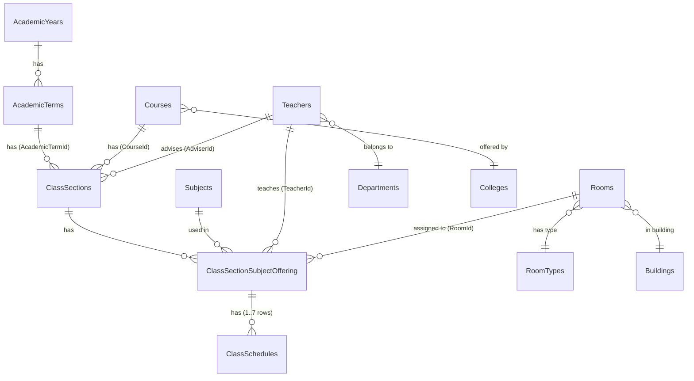
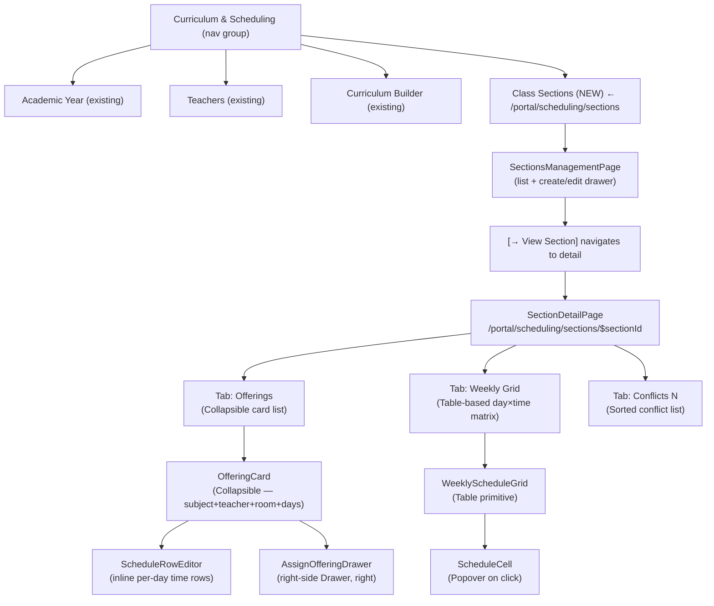
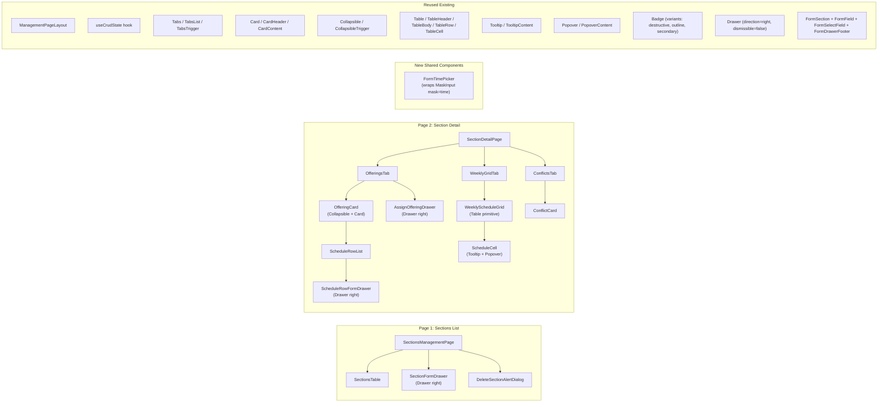

# Appropriate UI for Class Scheduling — Enrollify

**Research Date:** 2026-05-04  
**Scope:** `ClassSections`, `ClassSectionSubjectOffering`, `ClassSchedules` tables  
**Database Source:** `Script0003__InitialCoreTables.sql`  
**Note:** No backend exists yet for scheduling. This report defines the UI design and the API contracts the frontend will expect.

---

## Executive Summary

The Enrollify scheduling module maps to a **three-level hierarchy**: a `ClassSection` (the group of students in a course-term) contains one or more `ClassSectionSubjectOffering` records (each binding a Subject + Teacher + Room together), and each Offering has one or more `ClassSchedules` rows (one per day of week, holding the actual start/end times). The appropriate UI mirrors this hierarchy with **two main pages**: a standard `SectionsManagementPage` (list + create/edit drawer) following the existing management page pattern, and a `SectionDetailPage` using the `Tabs` pattern (line variant) with three tabs — **Offerings**, **Weekly Grid**, and **Conflicts**. The Offerings tab uses a `Collapsible`-card pattern (borrowed from the curriculum builder's card grid) where each offering card expands to show its schedule rows and an inline schedule editor. The Weekly Grid tab renders a `Table`-based day-vs-time matrix using existing `table.tsx` primitives, with cells color-coded by subject. Conflict detection is surfaced inline (red badges, disabled save buttons) rather than via modal dialogs. A new `FormTimePicker` component wrapping the existing `MaskInput mask="time"` is the only new shared component needed.

**Confidence:** High on page structure and patterns (all grounded in existing codebase). Medium on specific backend API shape (no backend exists yet — endpoints described are recommended contracts). Low on conflict hard-block vs warn-override policy (explicitly unresolved in `ZZ-clarifications.md`).

---

## 1. Database Schema — The Three Core Tables

### 1.1 ClassSections
```sql
CREATE TABLE ClassSections (
    Id              INT IDENTITY(1,1) PRIMARY KEY,
    Name            VARCHAR(50)  NOT NULL,         -- e.g. "BSCS-1A"
    YearLevel       INT          NOT NULL,          -- CHECK: 1–6
    CourseId        INT          NOT NULL,          -- FK → Courses
    AcademicTermId  INT          NOT NULL,          -- FK → AcademicTerms
    AdviserId       INT          NOT NULL,          -- FK → Teachers
    StudentCapacity INT          NOT NULL,          -- CHECK: > 0
    ...audit columns, IsActive BIT DEFAULT 1
);
```
**Key constraints:** `YearLevel BETWEEN 1 AND 6`, `StudentCapacity > 0`[^1]

### 1.2 ClassSectionSubjectOffering
```sql
CREATE TABLE ClassSectionSubjectOffering (
    Id                   INT IDENTITY(1,1) PRIMARY KEY,
    SubjectId            INT             NOT NULL,  -- FK → Subjects
    TeacherId            INT             NOT NULL,  -- FK → Teachers
    ClassSectionId       INT             NOT NULL,  -- FK → ClassSections
    RoomId               INT             NOT NULL,  -- FK → Rooms (required at creation)
    DayPattern           VARCHAR(10)     NULL,       -- 'MW', 'TTh', 'MWF', 'MTWTHF'
    DaysPerWeek          INT             NULL,
    HoursPerDay          DECIMAL(3,1)    NULL,
    MaxNumberOfStudents  INT             NULL,       -- soft override on room capacity
    ...audit columns, IsActive BIT DEFAULT 1
);
```
**Key note:** `RoomId` is NOT NULL — a room must be assigned at offering creation, no "TBD" support at the DB level.[^2]

### 1.3 ClassSchedules
```sql
CREATE TABLE ClassSchedules (
    Id                              INT IDENTITY(1,1) PRIMARY KEY,
    ClassSectionSubjectOfferingId   INT      NOT NULL,  -- FK → ClassSectionSubjectOffering
    DayOfWeek                       CHAR(3)  NOT NULL,  -- CHECK: 'MON','TUE','WED','THU','FRI','SAT','SUN'
    StartTime                       TIME     NOT NULL,
    EndTime                         TIME     NOT NULL,
    CreatedAt  DATETIMEOFFSET DEFAULT SYSDATETIMEOFFSET(),
    UpdatedAt  DATETIMEOFFSET NULL,
    IsActive   BIT NOT NULL DEFAULT 1,
    CONSTRAINT CHK_ClassSchedules_Time_Valid CHECK (StartTime < EndTime),
    CONSTRAINT UQ_ClassSchedules_Offering_Day UNIQUE (ClassSectionSubjectOfferingId, DayOfWeek)
);
```
**Notable:** No `CreatedBy`/`DeletedBy` audit columns (unlike every other table). The `UNIQUE (OfferingId, DayOfWeek)` constraint enforces one schedule row per offering per day.[^3]

---

## 2. Data Model Relationships (ERD)



The three-level hierarchy (`ClassSections → ClassSectionSubjectOffering → ClassSchedules`) is the core scheduling model. A single subject offering (e.g., CS101 taught by Dr. Santos in Rm101) has **multiple schedule rows**, one per day it meets (e.g., MON + WED each with StartTime=09:00, EndTime=10:30).[^4]

---

## 3. UI Architecture Overview



---

## 4. Page 1 — Class Sections Management Page

### 4.1 Route & URL
```
/portal/curriculum-and-scheduling/sections
```
Added to the "Curriculum & Scheduling" nav group alongside Academic Year, Teachers, and Curriculum.[^5]

### 4.2 Pattern
Follows **exactly** the same pattern as `CoursesManagementPage` / `DepartmentsManagementPage` / `TeachersManagementPage` — the standard Enrollify management page:[^6]

```tsx
// src/routes/portal/curriculum-and-scheduling/sections.tsx
export const Route = createFileRoute("/portal/curriculum-and-scheduling/sections")({
  component: SectionsManagementPage,
  validateSearch: createStandardSchemaV1(searchParams, { partialOutput: true }),
  loader: (): RouteLoaderData => ({ crumb: "Class Sections" }),
  beforeLoad: async ({ context: { authorization } }) => {
    const canAccess = await authorization.checkPolicy("canViewClassSections");
    if (!canAccess) throw redirect({ to: "/portal/home" });
  },
});
```

### 4.3 Page Component Structure
```tsx
// src/page-components/sections-management-page/index.tsx
export default function SectionsManagementPage() {
  const { isFormOpen, entityToEdit, entityToDelete,
          handleEdit, handleDelete, handleFormOpenChange,
          handleDeleteDialogOpenChange, openCreateForm } = useCrudState<ClassSection>();

  const { data } = useSuspenseQuery(filterSectionsPaginatedOptions(...));

  return (
    <ManagementPageLayout
      title="Class Sections"
      description="Manage class sections and their subject offerings"
      icon={<ModuleIcons.sections className="size-9 text-primary" />}
      createNewItemButton={
        <SectionFormDrawer
          key={entityToEdit?.id ?? "new"}
          isOpen={isFormOpen}
          onOpenChange={handleFormOpenChange}
          sectionToEdit={entityToEdit}
        />
      }
    >
      <SectionsTable
        data={data}
        onEdit={handleEdit}
        onDelete={handleDelete}
        onView={(section) => navigate({ to: "/portal/scheduling/sections/$sectionId",
                                        params: { sectionId: section.id.toString() } })}
      />
      <DeleteSectionAlertDialog
        sectionToDelete={entityToDelete}
        isOpen={!!entityToDelete}
        onOpenChange={handleDeleteDialogOpenChange}
      />
    </ManagementPageLayout>
  );
}
```

### 4.4 Sections Table Columns

| Column | Display Name | Filterable | Sortable |
|--------|-------------|------------|---------|
| `name` | Section Name | ✅ iLike | ✅ |
| `course.name` | Course/Program | ✅ iLike | ✅ |
| `yearLevel` | Year Level | ✅ eq/range | ✅ |
| `academicTerm` | Academic Term | ✅ | ✅ |
| `adviser.fullName` | Adviser | ✅ iLike | ✅ |
| `studentCapacity` | Capacity | ✅ range | ✅ |
| `offeringCount` | Offerings | ❌ | ✅ |
| actions | — | ❌ | ❌ |

**Actions column:** `[👁 View]` (primary, navigates to detail), `[✏ Edit]` (ghost/blue), `[🗑 Delete]` (ghost/destructive). The **View** button is the primary action — it navigates to the Section Detail Page.[^7]

### 4.5 Section Form Drawer

```tsx
// Zod schema
const sectionFormSchema = z.object({
  name:             z.string().min(1).max(50),
  yearLevel:        z.number().int().min(1).max(6),
  courseId:         z.number().int().min(1),
  academicTermId:   z.number().int().min(1),
  adviserId:        z.number().int().min(1),
  studentCapacity:  z.number().int().min(1),
});
```

**Form layout using `FormSection`:[^8]**
```
┌─ DrawerHeader ────────────────────────────────────────┐
│  New / Update Class Section                            │
│  Fill in the section details below.                   │
└────────────────────────────────────────────────────────┘
┌─ FormSection: "Section Details" ──────────────────────┐
│  Name*           [FormField type="text"  max=50]       │
│  Year Level*     [FormField type="number" 1–6]         │
│  Student Capacity* [FormField type="number" min=1]     │
└────────────────────────────────────────────────────────┘
┌─ FormSection: "Assignment" ────────────────────────────┐
│  Course / Program* [FormSelectField searchable]        │
│  Academic Term*    [FormSelectField searchable]        │
│  Adviser*          [FormSelectField searchable]        │
└────────────────────────────────────────────────────────┘
┌─ DrawerFooter ────────────────────────────────────────┐
│  [Cancel]              [Save & Add Another] [Create]  │
└────────────────────────────────────────────────────────┘
```

---

## 5. Page 2 — Section Detail Page

### 5.1 Route
```
/portal/curriculum-and-scheduling/sections/$sectionId
```
A dynamic segment route. `$sectionId` is the integer section ID (or obfuscated via `sqids` for consistency with the Curriculum Builder pattern).[^9]

### 5.2 Page Shell

The page uses `ManagementPageLayout` with a `Tabs` (line variant), mirroring the Academic Year Management Page pattern where tab state is persisted in `sessionStorage`:[^10]

```tsx
export default function SectionDetailPage() {
  const { sectionId } = useParams();
  const [activeTab, setActiveTab] = useState(
    () => sessionStorage.getItem(`section-${sectionId}-tab`) ?? "offerings",
  );
  const { data: section } = useSuspenseQuery(getSectionWithOfferingsOptions(sectionId));

  const handleTabChange = (value: string) => {
    setActiveTab(value);
    sessionStorage.setItem(`section-${sectionId}-tab`, value);
  };

  return (
    <ManagementPageLayout
      title={section.name}
      description={`${section.course.name} · Year ${section.yearLevel} · ${section.academicTerm.name}`}
      icon={<ModuleIcons.sections className="size-9 text-primary" />}
      createNewItemButton={
        <AssignOfferingButton sectionId={section.id} />  {/* shown only on "offerings" tab */}
      }
    >
      <Tabs value={activeTab} onValueChange={handleTabChange} className="min-h-0 flex-1 space-y-6">
        <TabsList variant="line">
          <TabsTrigger value="offerings">
            <BookOpen className="size-4" />
            Offerings ({section.offerings.length})
          </TabsTrigger>
          <TabsTrigger value="grid">
            <LayoutGrid className="size-4" />
            Weekly Grid
          </TabsTrigger>
          <TabsTrigger value="conflicts">
            <AlertTriangle className="size-4" />
            Conflicts
            {conflictCount > 0 && (
              <Badge variant="destructive" className="ml-1 h-5 px-1.5 text-[10px]">
                {conflictCount}
              </Badge>
            )}
          </TabsTrigger>
        </TabsList>

        <TabsContent value="offerings">
          <OfferingsTab section={section} />
        </TabsContent>
        <TabsContent value="grid">
          <WeeklyGridTab section={section} />
        </TabsContent>
        <TabsContent value="conflicts">
          <ConflictsTab section={section} />
        </TabsContent>
      </Tabs>
    </ManagementPageLayout>
  );
}
```

---

## 6. Tab 1 — Offerings Tab

### 6.1 Layout

The Offerings tab uses a **vertical card list** where each `OfferingCard` is a `Collapsible` (using the existing `collapsible.tsx` primitive[^11]). This mirrors the curriculum builder's subject card pattern, adapted for the schedule domain.

```
┌─ OfferingCard: CS101 – Programming 1 ──────────────── [▼ expand] ──┐
│  👤 Dr. Santos   🚪 Room 101, Main Building   ⏱ MW · 3h/wk         │
│  Status: ✅ 2 schedules                                             │
│  [✏ Edit]  [🗑 Remove]                                              │
└────────────────────────────────────────────────────────────────────┘
  ↓ expanded:
┌─ Schedule Rows ────────────────────────────────────────────────────┐
│  ┌── Mon ──┬──────────────────────────────────────────────────────┐│
│  │  MON    │ 09:00 – 10:30   Room 101   [✏] [🗑]                  ││
│  │  WED    │ 09:00 – 10:30   Room 101   [✏] [🗑]                  ││
│  └─────────┴──────────────────────────────────────────────────────┘│
│  [+ Add Schedule Row]                                              │
└────────────────────────────────────────────────────────────────────┘

┌─ OfferingCard: MATH101 – Calculus ──────────────────── [▼ expand] ┐
│  👤 Prof. Reyes   🚪 Room 202, Science Bldg   ⏱ TTh · 3h/wk       │
│  Status: ⚠ Conflict                                               │
└────────────────────────────────────────────────────────────────────┘

[ + Assign New Offering ]  ← dashed border button at bottom
```

### 6.2 OfferingCard Component

```tsx
// src/page-components/section-detail-page/offering-card.tsx
function OfferingCard({ offering, onEdit, onDelete }: OfferingCardProps) {
  const [isOpen, setIsOpen] = useState(false);

  const hasConflicts = offering.conflicts && offering.conflicts.length > 0;

  return (
    <Collapsible open={isOpen} onOpenChange={setIsOpen}>
      <Card className={cn(
        "border transition-colors",
        hasConflicts && "border-amber-300 bg-amber-50/30 dark:bg-amber-950/10"
      )}>
        <CardHeader>
          <div className="flex items-start justify-between gap-4">
            {/* Left: subject info */}
            <div className="flex items-center gap-3">
              <div className="flex h-9 w-9 shrink-0 items-center justify-center
                              rounded-lg bg-primary/10 text-xs font-bold text-primary">
                {offering.subject.code.slice(0, 3)}
              </div>
              <div>
                <p className="text-sm font-semibold">
                  {offering.subject.code} – {offering.subject.title}
                </p>
                <div className="flex items-center gap-3 mt-0.5 text-xs text-muted-foreground">
                  <span className="flex items-center gap-1">
                    <UserIcon className="size-3" />
                    {offering.teacher.fullName}
                  </span>
                  <span className="flex items-center gap-1">
                    <DoorOpen className="size-3" />
                    {offering.room.roomNumber}
                  </span>
                  {offering.dayPattern && (
                    <span className="flex items-center gap-1">
                      <Clock className="size-3" />
                      {offering.dayPattern} · {offering.hoursPerDay}h
                    </span>
                  )}
                </div>
              </div>
            </div>
            {/* Right: status + actions */}
            <div className="flex items-center gap-2 shrink-0">
              {hasConflicts ? (
                <Badge variant="outline"
                       className="border-amber-400 text-amber-600 bg-amber-50">
                  ⚠ {offering.conflicts.length} Conflict
                </Badge>
              ) : (
                <Badge variant="secondary" className="text-xs">
                  {offering.schedules.length} schedules
                </Badge>
              )}
              <Button variant="ghost" size="icon" className="size-7 text-blue-600"
                      onClick={() => onEdit(offering)}>
                <Pencil className="size-3.5" />
              </Button>
              <Button variant="ghost" size="icon" className="size-7 text-destructive"
                      onClick={() => onDelete(offering)}>
                <Trash2 className="size-3.5" />
              </Button>
              <CollapsibleTrigger asChild>
                <Button variant="ghost" size="icon" className="size-7">
                  <ChevronDown className={cn("size-4 transition-transform",
                                            isOpen && "rotate-180")} />
                </Button>
              </CollapsibleTrigger>
            </div>
          </div>
        </CardHeader>

        <CollapsibleContent>
          <CardContent className="border-t pt-4">
            <ScheduleRowList offering={offering} />
          </CardContent>
        </CollapsibleContent>
      </Card>
    </Collapsible>
  );
}
```

### 6.3 Schedule Row Editor (inside OfferingCard)

Each schedule row in the expanded card shows the day, time range, and room. Editing a row opens a small inline form or triggers the `ScheduleRowFormDrawer`.

```tsx
function ScheduleRowList({ offering }: { offering: OfferingWithSchedules }) {
  const { isFormOpen, entityToEdit, handleEdit, handleFormOpenChange } =
    useCrudState<ClassSchedule>();

  return (
    <div className="space-y-2">
      <p className="text-xs font-semibold uppercase tracking-widest text-muted-foreground">
        Schedule Rows
      </p>

      <div className="grid gap-1.5">
        {offering.schedules.map((schedule) => (
          <div key={schedule.id}
               className="group flex items-center justify-between rounded-lg border
                          bg-card px-3 py-2.5 transition-colors hover:bg-accent/40">
            <div className="flex items-center gap-3">
              {/* Day chip — same style as AcademicTerms term number chip */}
              <span className="flex h-7 w-12 shrink-0 items-center justify-center
                               rounded-md bg-primary/10 text-xs font-bold text-primary">
                {schedule.dayOfWeek}  {/* "MON", "WED", etc. */}
              </span>
              <div className="space-y-0.5">
                <p className="text-sm font-medium leading-none">
                  {schedule.startTime} – {schedule.endTime}
                </p>
                <p className="text-xs text-muted-foreground">
                  {offering.room.roomNumber}, {offering.room.building.name}
                </p>
              </div>
            </div>
            {/* Hover-reveal actions */}
            <div className="flex gap-1 opacity-0 transition-opacity group-hover:opacity-100">
              <Button variant="ghost" size="icon" className="size-7 text-blue-600"
                      onClick={() => handleEdit(schedule)}>
                <Pencil className="size-3" />
              </Button>
              <Button variant="ghost" size="icon" className="size-7 text-destructive"
                      onClick={() => onDeleteSchedule(schedule)}>
                <Trash2 className="size-3" />
              </Button>
            </div>
          </div>
        ))}
      </div>

      {/* Add row button */}
      <button
        onClick={() => handleEdit(undefined)}
        className="flex w-full items-center justify-center gap-2 rounded-lg border
                   border-dashed py-2 text-sm text-muted-foreground
                   transition-colors hover:border-primary hover:text-primary">
        <Plus className="size-4" />
        Add Schedule Row
      </button>

      <ScheduleRowFormDrawer
        isOpen={isFormOpen}
        onOpenChange={handleFormOpenChange}
        scheduleToEdit={entityToEdit}
        offeringId={offering.id}
        existingDays={offering.schedules.map(s => s.dayOfWeek)}
      />
    </div>
  );
}
```

---

## 7. Assign Offering Drawer

### 7.1 Design

The "Assign New Offering" drawer is a right-side `Drawer` (direction="right") with three `FormSection` groups. It is the most complex form in the scheduling module because it captures data for both `ClassSectionSubjectOffering` **and** the initial `ClassSchedules` rows in a single flow.

```
┌─ DrawerHeader ─────────────────────────────────────────┐
│  Assign Subject Offering                               │
│  Select a subject, teacher, and room for this section.│
└────────────────────────────────────────────────────────┘

┌─ FormSection: "Subject" ───────────────────────────────┐
│  Subject*      [SearchableSelect — code + title]       │
│  Hint: Shows subject units and preferred room type     │
└────────────────────────────────────────────────────────┘

┌─ FormSection: "Assignment" ────────────────────────────┐
│  Teacher*      [SearchableSelect — full name + dept]   │
│                 ⚠ Shows teacher's current load (units) │
│  Room*         [SearchableSelect — room# + building]   │
│                 ⚠ Shows room capacity vs max students  │
│  Max Students  [FormField type="number", nullable]     │
└────────────────────────────────────────────────────────┘

┌─ FormSection: "Day Pattern" ───────────────────────────┐
│  Day Pattern   [FormSelectField: MW, TTh, MWF, etc.]   │
│  Days/Week     [FormField type="number", nullable]     │
│  Hours/Day     [FormField type="number", nullable]     │
└────────────────────────────────────────────────────────┘

┌─ FormSection: "Initial Schedule Rows" ─────────────────┐
│  [inline ScheduleRowBuilder — see §8]                  │
└────────────────────────────────────────────────────────┘

┌─ DrawerFooter ─────────────────────────────────────────┐
│  [Cancel]                              [Assign Offering]│
└────────────────────────────────────────────────────────┘
```

### 7.2 Availability Hints (US-013 Requirement)

Per the user story: _"Provide teacher and room availability hints using ClassSchedules."_[^12] When a teacher is selected, a small inline hint below the field shows:

```tsx
{selectedTeacher && (
  <p className="text-xs text-muted-foreground mt-0.5">
    Current load: {selectedTeacher.currentUnits}/{selectedTeacher.maxUnits} units
    {teacherHasConflict && (
      <span className="text-destructive font-medium ml-2">
        ⚠ Conflict on selected days
      </span>
    )}
  </p>
)}
```

This requires a `GET /api/teachers/{id}/schedule-availability?termId=X` endpoint (or embedding in the teacher list response).

---

## 8. Schedule Row Form (Inline + Drawer)

### 8.1 Schedule Row Drawer

```
┌─ DrawerHeader ────────────────────────────────────────┐
│  Add Schedule Row                                     │
│  Choose a day and time window for this offering.     │
└────────────────────────────────────────────────────────┘

┌─ FormSection: "Schedule" ──────────────────────────────┐
│  Day of Week*    [FormSelectField]                     │
│                  Options: MON / TUE / WED / THU / FRI │
│                           / SAT / SUN                 │
│                  Disabled: days already assigned      │
│                            for this offering          │
│  Start Time*     [FormTimePicker]  ← HH:MM, 24h       │
│  End Time*       [FormTimePicker]  ← HH:MM, 24h       │
│                  Error: "End time must be after start" │
└────────────────────────────────────────────────────────┘

┌─ Conflict Preview ─────────────────────────────────────┐
│  (renders after both times are filled)                │
│  ✅ No conflicts detected                              │
│  — or —                                               │
│  ⛔ Teacher Dr. Santos: already teaching CS201         │
│     on MON 09:00–10:30 (BSCS-2A)                      │
│  ⛔ Room 101: already assigned to MATH101               │
│     on MON 09:00–11:00                                │
└────────────────────────────────────────────────────────┘

┌─ DrawerFooter ────────────────────────────────────────┐
│  [Cancel]                           [Save Schedule Row]│
│                (disabled if hard conflicts exist)     │
└────────────────────────────────────────────────────────┘
```

### 8.2 FormTimePicker — New Shared Component

No time picker exists in the codebase.[^13] Build a thin wrapper around the existing `MaskInput mask="time"` component:[^14]

```tsx
// src/components/form/form-time-picker.tsx
import type { AnyFieldApi } from "@tanstack/react-form";
import { MaskInput } from "@/components/ui/mask-input";
import { Label } from "@/components/ui/label";

interface FormTimePickerProps {
  field: AnyFieldApi;
  label: string;
  required?: boolean;
  hint?: string;
  disabled?: boolean;
}

export function FormTimePicker({ field, label, required, hint, disabled }: FormTimePickerProps) {
  const errorMessage = field.state.meta.errors
    .map((e) => (typeof e === "string" ? e : e?.message))
    .join(", ");
  const hasError = !field.state.meta.isValid && errorMessage;

  return (
    <div className="grid w-full items-center gap-1.5">
      <Label htmlFor={field.name}>
        {label}
        {required && <span className="text-destructive ml-0.5">*</span>}
      </Label>
      <MaskInput
        id={field.name}
        mask="time"                         // "##:##" with HH:MM 24h validation
        value={field.state.value ?? ""}
        onChange={(unmasked) => field.handleChange(unmasked)}
        onBlur={field.handleBlur}
        placeholder="HH:MM"
        disabled={disabled}
        className={hasError ? "border-destructive" : ""}
      />
      <div className="flex items-center justify-between">
        {hint && !hasError && <p className="text-xs text-muted-foreground">{hint}</p>}
        {hasError && <p role="alert" className="text-xs text-destructive">{errorMessage}</p>}
      </div>
    </div>
  );
}
```

**MaskInput `mask="time"` behavior** (already implemented in `mask-input.tsx:249-258`):[^14]
- Pattern: `##:##`
- Validates: `hours ≤ 23 && minutes ≤ 59`
- Returns unmasked value (digits only, 4 chars: `"0900"`) OR masked value (`"09:00"`) depending on which handler is used

> **Recommendation:** Store times as `"HH:MM"` strings (masked format) to match the SQL `TIME` type format and simplify display. The Zod schema should validate the pattern:
> ```ts
> z.string().regex(/^\d{2}:\d{2}$/).refine(s => {
>   const [h, m] = s.split(":").map(Number);
>   return h <= 23 && m <= 59;
> }, "Invalid time")
> ```

---

## 9. Tab 2 — Weekly Grid Tab

### 9.1 Design

A `Table`-based grid using the existing `table.tsx` primitives.[^15] Days are rows (Y-axis), time slots are columns (X-axis). Each cell contains the offering that occupies that time block, color-coded by subject.

```
         7:00   8:00   9:00   10:00  11:00  12:00  1:00   ...
┌──────┬──────┬──────┬──────┬──────┬──────┬──────┬──────┐
│ MON  │      │      │CS101 │      │MATH  │      │      │
│      │      │      │Dr.   │      │Prof  │      │      │
│      │      │      │Sant. │      │Reyes │      │      │
├──────┼──────┼──────┼──────┼──────┼──────┼──────┼──────┤
│ TUE  │      │ENG1  │      │      │      │      │      │
├──────┼──────┼──────┼──────┼──────┼──────┼──────┼──────┤
│ WED  │      │      │CS101 │      │      │      │      │  ← same block Mon
├──────┼──────┼──────┼──────┼──────┼──────┼──────┼──────┤
│ THU  │      │ENG1  │      │      │      │      │      │
├──────┼──────┼──────┼──────┼──────┼──────┼──────┼──────┤
│ FRI  │      │      │      │PE101 │      │      │      │
└──────┴──────┴──────┴──────┴──────┴──────┴──────┴──────┘
```

### 9.2 Component Structure

```tsx
// src/page-components/section-detail-page/weekly-schedule-grid.tsx

const DAYS: DayOfWeek[] = ["MON", "TUE", "WED", "THU", "FRI", "SAT", "SUN"];
const TIME_SLOTS = generateTimeSlots("07:00", "21:00", 60); // 30-min or 60-min slots

export function WeeklyScheduleGrid({ scheduleEntries }: WeeklyScheduleGridProps) {
  return (
    <ScrollArea className="w-full">
      <Table className="min-w-[900px]">
        <TableHeader>
          <TableRow>
            <TableHead className="sticky left-0 z-20 w-16 bg-background">Day</TableHead>
            {TIME_SLOTS.map(slot => (
              <TableHead key={slot} className="min-w-[80px] text-center text-xs">
                {slot}
              </TableHead>
            ))}
          </TableRow>
        </TableHeader>
        <TableBody>
          {DAYS.map(day => (
            <TableRow key={day}>
              <TableCell className="sticky left-0 z-10 font-semibold bg-background
                                    text-xs text-muted-foreground">
                {day}
              </TableCell>
              {TIME_SLOTS.map(slot => {
                const entry = getEntryForDaySlot(scheduleEntries, day, slot);
                return (
                  <ScheduleCell
                    key={`${day}-${slot}`}
                    entry={entry}
                    hasConflict={entry?.hasConflict}
                  />
                );
              })}
            </TableRow>
          ))}
        </TableBody>
      </Table>
    </ScrollArea>
  );
}
```

### 9.3 ScheduleCell

Each occupied cell uses a `Tooltip` (existing `tooltip.tsx`[^16]) to show full details on hover, and a `Popover` (existing `popover.tsx`[^17]) on click for editing:

```tsx
function ScheduleCell({ entry, hasConflict }: ScheduleCellProps) {
  if (!entry) {
    return <TableCell className="border-r last:border-r-0 min-h-[60px]" />;
  }

  return (
    <TableCell className={cn(
      "border-r p-0 min-h-[60px] relative",
      hasConflict ? "bg-red-50 dark:bg-red-950/20" : "bg-primary/5",
    )}>
      <Tooltip>
        <TooltipTrigger asChild>
          <div className={cn(
            "absolute inset-0.5 rounded flex flex-col p-1 cursor-pointer",
            "transition-colors hover:ring-2 hover:ring-primary/40",
            hasConflict
              ? "bg-red-100 border border-red-300 dark:bg-red-900/30"
              : "bg-primary/10 border border-primary/20",
          )}>
            <span className="text-[10px] font-bold leading-none truncate">
              {entry.subject.code}
            </span>
            <span className="text-[9px] text-muted-foreground truncate">
              {entry.teacher.lastName}
            </span>
            {hasConflict && (
              <AlertTriangle className="size-3 text-red-500 absolute top-1 right-1" />
            )}
          </div>
        </TooltipTrigger>
        <TooltipContent side="top" className="max-w-[200px]">
          <p className="font-semibold">{entry.subject.title}</p>
          <p className="text-xs">{entry.teacher.fullName}</p>
          <p className="text-xs">{entry.room.roomNumber}</p>
          <p className="text-xs">{entry.startTime} – {entry.endTime}</p>
          {hasConflict && (
            <p className="text-xs text-red-400 mt-1">⚠ {entry.conflictMessage}</p>
          )}
        </TooltipContent>
      </Tooltip>
    </TableCell>
  );
}
```

### 9.4 View Mode Toggle

A small `Select` above the grid allows switching perspective:

```tsx
<div className="flex items-center justify-between mb-4">
  <p className="text-sm font-medium">
    Showing schedule for: <strong>{section.name}</strong>
  </p>
  <Select value={viewMode} onValueChange={setViewMode}>
    <SelectTrigger className="w-[180px]">
      <SelectValue />
    </SelectTrigger>
    <SelectContent>
      <SelectItem value="section">This Section</SelectItem>
      <SelectItem value="teacher">By Teacher</SelectItem>
      <SelectItem value="room">By Room</SelectItem>
    </SelectContent>
  </Select>
</div>
```

- **Section view** (default): shows all offerings for this section
- **Teacher view**: shows all offerings across all sections for the selected adviser
- **Room view**: shows room occupancy for the selected room

---

## 10. Tab 3 — Conflicts Tab

### 10.1 Conflict Types

| Type | Severity | UI Treatment | Block Save? |
|------|----------|-------------|-------------|
| `TEACHER_DOUBLE_BOOKED` | Error | Red card + disabled Save | Yes (hard) |
| `ROOM_DOUBLE_BOOKED` | Error | Red card + disabled Save | Yes (hard) |
| `SECTION_OVERLAP` | Warning | Amber card + allowed Save | No (soft) |
| `TEACHER_OVERLOAD` | Info | Blue chip on teacher picker | No |

> **Note:** The exact behavior (hard block vs warn-and-override for teacher conflicts) is **explicitly unresolved** in `docs/user-stories/ZZ-clarifications.md` item #2.[^18] The table above represents the recommended default; this must be confirmed by the project stakeholder.

### 10.2 Conflicts Tab Layout

```tsx
function ConflictsTab({ conflicts }: { conflicts: ConflictResult[] }) {
  if (conflicts.length === 0) {
    return (
      <div className="flex flex-col items-center justify-center py-24 gap-5 text-center">
        <div className="flex h-20 w-20 items-center justify-center rounded-2xl
                        bg-muted/60 border border-dashed">
          <CheckCircle className="h-9 w-9 text-muted-foreground/60" />
        </div>
        <div className="space-y-1.5">
          <h3 className="text-base font-semibold tracking-tight">No Conflicts</h3>
          <p className="text-sm text-muted-foreground max-w-xs">
            All schedules for this section are conflict-free.
          </p>
        </div>
      </div>
    );
  }

  const hardConflicts = conflicts.filter(c => c.severity === "error");
  const softConflicts = conflicts.filter(c => c.severity === "warning");

  return (
    <div className="space-y-5 max-w-3xl">
      {hardConflicts.length > 0 && (
        <div className="space-y-3">
          <p className="text-xs font-semibold uppercase tracking-widest
                        text-destructive px-0.5">
            Hard Conflicts — Must Resolve
          </p>
          <div className="grid gap-2">
            {hardConflicts.map(c => <ConflictCard key={c.id} conflict={c} />)}
          </div>
        </div>
      )}
      {softConflicts.length > 0 && (
        <div className="space-y-3">
          <p className="text-xs font-semibold uppercase tracking-widest
                        text-amber-600 px-0.5">
            Warnings — Review Recommended
          </p>
          <div className="grid gap-2">
            {softConflicts.map(c => <ConflictCard key={c.id} conflict={c} />)}
          </div>
        </div>
      )}
    </div>
  );
}
```

### 10.3 ConflictCard Component

```tsx
function ConflictCard({ conflict }: { conflict: ConflictResult }) {
  const isHard = conflict.severity === "error";

  return (
    <div className={cn(
      "flex items-start justify-between rounded-lg border px-4 py-3",
      isHard
        ? "border-destructive/40 bg-destructive/5 text-destructive"
        : "border-amber-300/40 bg-amber-50/30 text-amber-700 dark:text-amber-400",
    )}>
      <div className="flex items-start gap-3">
        <span className={cn(
          "flex h-7 w-7 shrink-0 items-center justify-center rounded-md text-xs font-bold",
          isHard ? "bg-destructive/10" : "bg-amber-100 dark:bg-amber-900/30",
        )}>
          {isHard ? "⛔" : "⚠"}
        </span>
        <div className="space-y-0.5">
          <p className="text-sm font-medium leading-none">{conflict.message}</p>
          <p className="text-xs text-muted-foreground">
            {conflict.day} · {conflict.startTime} – {conflict.endTime}
          </p>
          {conflict.affectedOfferings.map(o => (
            <p key={o.id} className="text-xs">↳ {o.subject.code} ({o.section.name})</p>
          ))}
        </div>
      </div>
      <Button variant="ghost" size="sm" className="shrink-0 text-xs"
              onClick={() => navigateToOffering(conflict.affectedOfferings[0])}>
        View →
      </Button>
    </div>
  );
}
```

---

## 11. Component Architecture



---

## 12. Navigation & Routing Integration

### 12.1 New Routes

| Route | File | Page |
|-------|------|------|
| `/portal/curriculum-and-scheduling/sections` | `sections.tsx` | SectionsManagementPage |
| `/portal/curriculum-and-scheduling/sections/$sectionId` | `sections.$sectionId.tsx` | SectionDetailPage |

### 12.2 Navigation Config Addition

Add to the `"Curriculum & Scheduling"` group in `navigation-config.ts`:[^19]

```ts
{
  title: "Class Sections",
  url: "/portal/curriculum-and-scheduling/sections",
  icon: LayoutGridIcon,   // or CalendarClock from lucide-react
  policies: ["canViewClassSections"],
}
```

### 12.3 Module Icons Addition

Add to `module-icons.ts`:[^20]

```ts
import { CalendarClock, LayoutGrid } from "lucide-react";

export const ModuleIcons = {
  // ... existing icons ...
  sections:  CalendarClock,  // for Class Sections nav + page header
  offerings: LayoutGrid,     // for weekly grid tab
} as const satisfies Record<string, LucideIcon>;
```

### 12.4 New Policy Names

Add to `PolicyNames.ts`:[^21]

```ts
export const PolicyNames = {
  // ... existing ...
  canViewClassSections:    "canViewClassSections",
  canCreateClassSection:   "canCreateClassSection",
  canUpdateClassSection:   "canUpdateClassSection",
  canDeleteClassSection:   "canDeleteClassSection",

  canViewOfferings:        "canViewOfferings",
  canCreateOffering:       "canCreateOffering",
  canUpdateOffering:       "canUpdateOffering",
  canDeleteOffering:       "canDeleteOffering",

  canViewSchedules:        "canViewSchedules",
  canCreateSchedule:       "canCreateSchedule",
  canDeleteSchedule:       "canDeleteSchedule",
} as const;
```

---

## 13. Backend API Contracts (Frontend Expectations)

Since no backend exists yet, the following API endpoints are what the frontend will expect. These should be built following the same FastEndpoints + paginated filter pattern as teachers/subjects.[^22]

### Class Sections
| Method | Endpoint | Description |
|--------|----------|-------------|
| `GET` | `/api/sections/filter/{page}/{pageSize}` | Paginated + filtered list |
| `GET` | `/api/sections/{id}` | Single section with offerings + schedules (detail page) |
| `POST` | `/api/sections` | Create section |
| `PUT` | `/api/sections/{id}` | Update section |
| `DELETE` | `/api/sections/{id}` | Soft-delete section |

### Subject Offerings
| Method | Endpoint | Description |
|--------|----------|-------------|
| `GET` | `/api/offerings?sectionId={id}` | All offerings for a section (with schedules) |
| `POST` | `/api/offerings` | Create offering (with initial schedule rows) |
| `PUT` | `/api/offerings/{id}` | Update offering metadata |
| `DELETE` | `/api/offerings/{id}` | Soft-delete offering |

### Schedule Rows
| Method | Endpoint | Description |
|--------|----------|-------------|
| `GET` | `/api/offerings/{id}/schedules` | All schedule rows for an offering |
| `POST` | `/api/offerings/{id}/schedules` | Add a schedule row (with conflict check) |
| `DELETE` | `/api/offerings/{id}/schedules/{scheduleId}` | Remove a schedule row |

### Conflict Detection (Response shape)

```ts
// POST /api/offerings/{id}/schedules
// 201 Created on success
// 409 Conflict with body:
{
  "conflicts": [
    {
      "type": "TEACHER_DOUBLE_BOOKED",
      "severity": "error",
      "message": "Dr. Santos is already teaching CS201 on MON 09:00–10:30 in BSCS-2A",
      "day": "MON",
      "startTime": "09:00",
      "endTime": "10:30",
      "affectedOfferings": [
        { "id": 42, "subject": { "code": "CS201", "title": "..." }, "section": { "name": "BSCS-2A" } }
      ]
    }
  ]
}
```

---

## 14. API Model (Zod Schemas)

```ts
// src/api/models/class-section.ts
export const ClassSectionSchema = z.object({
  id:              z.number(),
  name:            z.string(),
  yearLevel:       z.number().int().min(1).max(6),
  studentCapacity: z.number().int().min(1),
  course:          z.object({ id: z.number(), code: z.string(), name: z.string() }),
  academicTerm:    z.object({ id: z.number(), termNumber: z.number(), name: z.string() }),
  adviser:         z.object({ id: z.number(), firstName: z.string(), lastName: z.string() }),
}).merge(AuditInfoSchema);

export const ClassSectionWithOfferingsSchema = ClassSectionSchema.extend({
  offerings: z.array(OfferingWithSchedulesSchema),
});

// src/api/models/offering.ts
export const OfferingSchema = z.object({
  id:                  z.number(),
  subject:             SubjectSummarySchema,
  teacher:             TeacherSummarySchema,
  room:                RoomSummarySchema,
  dayPattern:          z.string().nullable(),
  daysPerWeek:         z.number().nullable(),
  hoursPerDay:         z.number().nullable(),
  maxNumberOfStudents: z.number().nullable(),
}).merge(AuditInfoSchema);

export const OfferingWithSchedulesSchema = OfferingSchema.extend({
  schedules:  z.array(ClassScheduleSchema),
  conflicts:  z.array(ConflictResultSchema).optional(),
});

// src/api/models/class-schedule.ts
export const ClassScheduleSchema = z.object({
  id:                           z.number(),
  classeSectionSubjectOfferingId: z.number(),
  dayOfWeek:                    z.enum(["MON","TUE","WED","THU","FRI","SAT","SUN"]),
  startTime:                    z.string().regex(/^\d{2}:\d{2}$/),
  endTime:                      z.string().regex(/^\d{2}:\d{2}$/),
  isActive:                     z.boolean(),
});
```

---

## 15. File Structure (New Files to Create)

```
src/
├── api/
│   ├── collections/
│   │   ├── section-collection.ts           ← NEW
│   │   └── offering-collection.ts          ← NEW
│   └── models/
│       ├── class-section.ts                ← NEW
│       ├── offering.ts                     ← NEW
│       └── class-schedule.ts               ← NEW
├── components/
│   └── form/
│       └── form-time-picker.tsx            ← NEW (wraps MaskInput)
├── config/
│   └── module-icons.ts                     ← EDIT (add CalendarClock, LayoutGrid)
├── infrastructure/
│   └── authorization/
│       └── models/PolicyNames.ts           ← EDIT (add scheduling policies)
├── page-components/
│   ├── sections-management-page/           ← NEW directory
│   │   ├── index.tsx
│   │   ├── sections-table.tsx
│   │   ├── section-form-drawer.tsx
│   │   ├── delete-section-alert-dialog.tsx
│   │   └── searchParams.ts
│   └── section-detail-page/               ← NEW directory
│       ├── index.tsx
│       ├── offerings-tab.tsx
│       ├── weekly-grid-tab.tsx
│       ├── conflicts-tab.tsx
│       ├── offering-card.tsx
│       ├── schedule-row-list.tsx
│       ├── schedule-row-form-drawer.tsx
│       ├── assign-offering-drawer.tsx
│       ├── weekly-schedule-grid.tsx
│       ├── schedule-cell.tsx
│       └── conflict-card.tsx
└── routes/
    └── portal/
        └── curriculum-and-scheduling/
            ├── sections.tsx                ← NEW
            └── sections.$sectionId.tsx     ← NEW
```

---

## 16. Confidence Assessment

| Claim | Confidence | Basis |
|-------|-----------|-------|
| Three-level schema hierarchy | ✅ High | Verified from `Script0003__InitialCoreTables.sql`[^1] |
| Sections list as standard management page | ✅ High | Matches identical pattern in 8+ existing pages[^6] |
| Section detail as Tabs page | ✅ High | Academic Year and Rooms pages use this exact pattern[^10] |
| OfferingCard as Collapsible + Card | ✅ High | Collapsible exists in codebase[^11]; Card pattern established |
| WeeklyGrid using Table primitive | ✅ High | Table component exists[^15]; pattern from timetablely research |
| MaskInput `mask="time"` for time fields | ✅ High | Confirmed in `mask-input.tsx:249-258`[^14] |
| No alert.tsx — use Card+Tailwind for conflict warnings | ✅ High | Confirmed missing from `src/components/ui/`[^13] |
| @dnd-kit installed (optional DnD future) | ✅ High | Confirmed in `package.json`[^23] |
| Conflict hard-block vs warn policy | ⚠ Medium | US-014 AC#3 says "blocks or warns" — unresolved in ZZ-clarifications |
| Exact API endpoint shapes | ⚠ Medium | No backend exists; recommended contracts based on existing patterns |
| Teacher availability API endpoint | ⚠ Medium | Required by US-013 UI note; endpoint design is recommendation only |
| `DayPattern` enum values | ✅ High | Confirmed in SQL comment and ga-integration-requirements.md |

---

## Footnotes

[^1]: `Script0003__InitialCoreTables.sql:562-587` — ClassSections table definition with CHECK constraints.
[^2]: `Script0003__InitialCoreTables.sql:609-635` — ClassSectionSubjectOffering table; `RoomId INT NOT NULL`.
[^3]: `Script0003__InitialCoreTables.sql:657-681` — ClassSchedules table; UNIQUE (OfferingId, DayOfWeek), no CreatedBy/DeletedBy.
[^4]: `docs/sql-notes/class-schedule-design-explanation.md` — "Solution 2: Normalized two-table design" rationale with example data.
[^5]: `src/components/navigation/navigation-config.ts:24-125` — "Curriculum & Scheduling" nav group definition.
[^6]: `src/page-components/teachers-management-page/`, `src/page-components/courses-management-page/` — standard management page pattern exemplars.
[^7]: `src/page-components/subjects-management-page/subjects-table.tsx` — Actions column pattern with Edit + Delete ghost buttons gated by `useTablePermissions()`.
[^8]: `src/components/form/form-section.tsx:1-29` — `FormSection` renders `<fieldset>` + `<legend>` for semantic grouping.
[^9]: `src/routes/portal/curriculum-and-scheduling/curriculum.{-$curriculumId}.tsx:1-37` — `sqids` obfuscation pattern for detail page URL params (can be adopted or dropped for simpler int param).
[^10]: `src/page-components/academic-year-management-page/index.tsx:25-27, 39-42` — `sessionStorage.getItem("academic-year-tab")` for persistent tab state; `TabsList variant="line"`.
[^11]: `src/components/ui/collapsible.tsx:1-31` — `Collapsible`, `CollapsibleTrigger`, `CollapsibleContent` from `@radix-ui/react-collapsible`.
[^12]: `docs/user-stories/13-high-subject-offering-management.md` — "Special UI Note: Provide teacher and room availability hints using ClassSchedules."
[^13]: Confirmed via search: no `alert.tsx`, no `TimePicker`, no `type="time"` inputs exist anywhere in `src/system/enrollify-frontend/src/`.
[^14]: `src/components/ui/mask-input.tsx:249-258` — `time` mask: pattern `##:##`, validates `hours ≤ 23 && minutes ≤ 59`.
[^15]: `src/components/ui/table.tsx:1-114` — `Table`, `TableHeader`, `TableBody`, `TableRow`, `TableHead`, `TableCell` primitives.
[^16]: `src/components/ui/tooltip.tsx:1-59` — `Tooltip`, `TooltipTrigger`, `TooltipContent`, `TooltipProvider` with `delayDuration=0`.
[^17]: `src/components/ui/popover.tsx:1-89` — `Popover`, `PopoverTrigger`, `PopoverContent` with portal rendering.
[^18]: `docs/user-stories/ZZ-clarifications.md` — "Question #2: Teacher schedule conflict policy — block save vs warn and allow override by Registrar?" — explicitly unresolved.
[^19]: `src/components/navigation/navigation-config.ts:24-125` — `NavSubItemConfig` array structure for adding new routes.
[^20]: `src/config/module-icons.ts:1-26` — `ModuleIcons` record mapping entity names to Lucide icon components.
[^21]: `src/infrastructure/authorization/models/PolicyNames.ts` — `PolicyNames` object used by `AuthorizeView` and `useTablePermissions`.
[^22]: `src/system/EnrollifyBackend/Enrollify.WebAPI/Features/Teachers/FilterTeachersPaginatedEndpoint.cs:71-74` — paginated filter endpoint pattern for reference.
[^23]: `package.json:20-23` — `@dnd-kit/core@^6.3.1`, `@dnd-kit/sortable@^10.0.0`, `@dnd-kit/modifiers@^9.0.0` installed.
